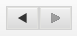
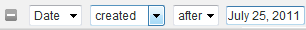

# 배너 정보 {#about-banners}

배너를 사용하여 웹 사이트에 있는 배너 광고를 관리할 수 있습니다.

## 배너 사용 {#concept_5BBE01FEC6134393B43CC917C8CC64DA}

<!-- 

c_about_banners.xml

 -->

웹 사이트에 배너 광고를 추가하는 데는 두 가지 방법이 있습니다.

첫 번째 방법은 Target, Search &amp; Promote을 통해 배너를 추가하는 것입니다. 배너는 고객이 웹 사이트를 검색할 때 표시되는 HTML 코드 조각입니다. 배너에는 텍스트 또는 이미지를 GIF, JPEG 또는 PNG 포맷으로 포함하거나 두 가지 조합을 포함할 수 있습니다. 사전 설정 크기 중에서 선택하거나 페이지에 맞게 사용자 정의 차원을 정의할 수 있습니다. 배너를 표시하는 데 사용하는 HTML 코드에서는 사용할 글꼴 스타일 및 테두리와 같은 것도 지정할 수 있습니다. 배너를 추가하는 이 방법은 기본 기능을 제공하며 추가 소프트웨어가 필요하지 않습니다.

두 번째 방법은 다이내믹 미디어 관리 및 게시 서비스인 Adobe Dynamic Media Classic을 사용하는 것입니다. 유효한 Adobe Dynamic Media Classic 계정을 사용하면 Dynamic Media Classic을 사용하여 배너 컨텐츠를 관리하고 Target, Search &amp; Promote에 직접 전달할 수 있습니다. 사이트 검색/머천다이징에서 Dynamic Media Classic 계정에 대한 액세스 권한을 구성합니다. 그런 다음 Dynamic Media Classic 미디어 브라우저를 열고 배너로 사용할 다이내믹 미디어 자산을 선택합니다.

>[!NOTE]
>
>다이내믹 미디어 자산을 사이트 검색/머천다이징의 배너로 사용하려면 먼저 자산이 업로드되고 Scene7 Publishing System에 게시되도록 준비됩니다. 사이트 검색/머천다이징 내에서 자산을 업로드하여 Scene7 Publishing System에서 자동으로 게시할 수 있도록 준비할 수 있습니다. 또는 Scene7 Publishing System 내에서 자산을 업로드하고 게시할 수 있습니다.

## Adobe Scene7 Publishing System과 배너 통합 {#section_D4D7ADEA6A6348E68EDA138E184FE579}

이미지 템플릿 또는 Flash 템플릿과 같은 이미지, 동적 배너, 템플릿 등 사이트 검색/머천다이징에서 배너로 Dynamic Media Classic 자산 유형을 사용할 수 있습니다.

템플릿은 Adobe Photoshop®과 같은 이미지 편집 애플리케이션에서 레이어로 구성된 파일과 같은 레이어로 구성된 이미지 파일을 동적으로 만들고 주소 지정할 수 있는 레이어로 구성된 이미지 파일로 만들어집니다. 정적 이미지 파일과 달리 템플릿에는 매개 변수가 포함될 수 있습니다. 매개 변수를 통해 변수 이미지 속성과 이미지 내용을 사용자 정의할 수 있습니다.

>[!NOTE]
>
>또한 Scene7 Publishing System의 템플릿 게시 및 Adobe Illustrator 및 Adobe InDesign의 파일을 사용하여 레이아웃 기반 디자인에서 템플릿을 만들 수 있습니다.

Dynamic Media [Classic](https://help.adobe.com/en_US/scene7/using/WSFBFBAD30-2694-4b18-B7CE-894F9FC5CDDF.html) (Scene7) 사용 안내서의 템플릿 게시를 참조하십시오.

템플릿에는 원하는 수의 이미지 레이어와 텍스트 레이어가 포함될 수 있습니다. 레이어로 구성된 PSD 파일과 같은 레이어가 포함된 정적 파일을 템플릿으로 변환하거나 Dynamic Media Classic에서 템플릿을 만들 수 있습니다. Scene7 Publishing System에 업로드한 글꼴을 사용하여 템플릿에서 텍스트 레이어를 만들 수 있습니다. 템플릿에 텍스트를 추가한 후 정렬, 글꼴, 글꼴 크기 및 색상을 변경하여 서식을 지정할 수 있습니다.

Dynamic Media Classic의 [매개 변수] 화면을 사용하여 템플릿의 모든 측면을 주소 지정 가능한 매개 변수로 변환할 수 있습니다. 이렇게 하면 사용할 레이어 이미지 또는 템플릿에서 사용할 텍스트 값을 변경할 수 있습니다. 매개 변수는 URL 문자열과 함께 전달되므로 이미지 서버에서 생성된 회신 이미지를 동적으로 사용자 정의할 수 있도록 모든 매개 변수를 변경할 수 있습니다.

배너에서 사용할 수 있도록 Dynamic Media Classic을 사용하여 템플릿을 만들고 레이어의 속성을 매개 변수화하는 방법에 대해 자세히 알아볼 수 있습니다.

Dynamic Media [Classic](https://help.adobe.com/en_US/scene7/using/WS60B68844-9054-4099-BF69-3DC998A04D3C.html) (Scene7) 사용 안내서의 템플릿 기본 사항을 참조하십시오.

**자산 업로드 및 게시**

사이트 검색/머천다이징의 배너에 자산을 사용하려면 먼저 Dynamic Media Classic에서 자산을 업로드하고 게시해야 합니다. 이 사전 요구 사항에는 이미지 템플릿 또는 Flash 템플릿에서 사용하는 모든 자산도 포함됩니다. Dynamic Media Classic 계정을 사용하여 디지털 자산을 업로드하고 게시합니다. 또는 사이트 검색/머천다이징을 사용하여 디지털 자산을 업로드한 다음 Dynamic Media Classic에서 업로드 설정에 따라 자동으로 게시하도록 할 수 있습니다. 아직 업로드 및 게시되지 않은 자산을 선택하려고 하면, 계속하기 전에 사용자 인터페이스에 알림이 표시되고 업로드 옵션이 제공됩니다.

Scene7 Publishing System을 사용하여 디지털 자산을 업로드하고 게시하는 방법에 대해 자세히 알아볼 수 있습니다.

Dynamic Media [Classic](https://help.adobe.com/en_US/scene7/using/WS3673AD39-098B-4f08-8A24-CA51261B7366.html) (Scene7) 사용자 안내서의 자산 업로드 및 게시를 참조하십시오.

>[!NOTE]
>
>Dynamic Media Classic 자산 뷰어에서 업로드 기능을 사용하려면 사용하는 Dynamic Media Classic 계정의 &quot;SPS 회사 관리&quot; 역할이 이미 설정되어 있는지 확인하십시오.

Dynamic Media [Classic](https://help.adobe.com/en_US/scene7/using/WS662101DF-D697-47a7-A7D8-B52FD8E94438.html) (Scene7) 사용 안내서의 관리 설정을 참조하십시오.

**비즈니스 규칙을 사용하여 배너의 Dynamic Media Classic 템플릿 매개 변수 변경**

Dynamic Media Classic 에셋을 배너로 추가한 경우 에서 [!DNL Visual Rule Builder] 를 사용하여 웹 사이트의 배너 영역 [!DNL Business Rules] 에 추가할 수 있습니다. 예를 들어 다른 배너와 마찬가지로 검색 결과 페이지에 배너를 추가합니다. 특정 요구에 맞게 사용자 정의하여 Dynamic Media Classic 템플릿의 기본 매개 변수 값을 재정의할 수도 있습니다. 이러한 종류의 기능을 사용하면 다른 마케팅 메시지와 다른 엔드포인트에 대한 하이퍼링크를 사용하여 Dynamic Media Classic 템플릿을 사용자 지정할 수 있습니다.

새 [비즈니스 규칙 추가를 참조하십시오](../c-about-rules-menu/c-about-business-rules.md#task_BD3B31ED48BB4B1B8F1DCD3BFA2528E7).

비즈니스 [규칙 편집을 참조하십시오](../c-about-rules-menu/c-about-business-rules.md#task_375CFA75D1D94D9E92A35DE1228E5087).

## 배너 추가 {#task_549D02B5F73B4158B105A94E39D937B7}

배너 광고 [!DNL Banners] 와 배너 광고가 웹 사이트에 배치되는 위치를 관리하는 데 사용할 수 있습니다. 배너를 추가하면 외부에서 검색 시 표시되는 HTML 코드 조각을 통해 이미지를 참조합니다.

<!-- 

t_adding_a_new_banner.xml

 -->

유효한 Adobe Dynamic Media Classic 계정이 있는 경우, Scene7 Publishing System을 통해 배너 광고를 추가할 수 있습니다.

Adobe [Dynamic Media Classic을 사용하여 배너 추가를 참조하십시오](../c-about-design-menu/c-about-banners.md#task_AD1E0C00A9E04B1FA819EB93288786B3).

Adobe [Dynamic Media Classic 계정에 대한 액세스 권한 구성을 참조하십시오](../c-about-settings-menu/c-about-account-options-menu.md#task_CEFF88C2033D41D0B2FE86C435EDAC6D).

**배너를 추가하려면**

1. 제품 메뉴에서 **[!UICONTROL Design]** > 를 클릭합니다 **[!UICONTROL Banners]**.
1. 페이지의 [!DNL Banners] 드롭다운 **[!UICONTROL Add Banner]** 목록에서 선택합니다 **[!UICONTROL HTML code]**.
1. 대화 [!DNL Add Banner] 상자에서 원하는 옵션을 설정합니다.

   <table> 
    <thead> 
      <tr> 
      <th colname="col1" class="entry"> 
옵션 
 </th> 
      <th colname="col2" class="entry"> 
설명 
 </th> 
      </tr> 
    </thead>
    <tbody> 
      <tr> 
      <td colname="col1"> 
이름 
 </td> 
      <td colname="col2"> 
필수. 배너 이름을 식별합니다. 비즈니스 규칙의 시각적 규칙 빌더에서 배너를 추가할 때 배너를 참조하는 데 사용됩니다. 이름이 배너 자체에 표시되지 않습니다. 
 
새 비즈니스 규칙 <a href="../c-about-rules-menu/c-about-business-rules.md#task_BD3B31ED48BB4B1B8F1DCD3BFA2528E7" type="task" format="dita" scope="local"> 추가를 참조하십시오.</a> 
 </td> 
      </tr> 
      <tr> 
      <td colname="col1"> 
배너 HTML 
 </td> 
      <td colname="col2"> 
 배너와 연결된 HTML 코드를 붙여넣을 수 있습니다. 
 
태그로 둘러싸인 CSS 코드 또는 태그로 둘러싸인 JavaScript 코드 등 모든 HTML 코드를 사용할 수 <code>
          &lt;style&gt; 
        </code> <code>
          &lt;script&gt; 
        </code> 있습니다. 예를 들어 다음 코드 블록은 Horizontal top 형식의 텍스트 배너에 사용됩니다. <code> &lt;div&nbsp;style="width:&nbsp;684px;&nbsp;background-image:&nbsp;url('https://www.brough.com/blackb.gif');&nbsp; 
          padding-top:&nbsp;10px;&nbsp;padding-bottom:&nbsp;10px;&nbsp;color:&nbsp;white;&nbsp;font-family:&nbsp;verdana;&nbsp; 
          text-align:&nbsp;center;&nbsp;font-size:&nbsp;20px;"&gt;&nbsp;Sound&nbsp;Study&nbsp;ships&nbsp;free!&nbsp;&lt;/div&gt; </code>다음 예에서 코드 블록은 전체 시작 이미지를 위한 것입니다. <code> &lt;img&amp;nbsp;src='https://geometrixx.com/images/GEOAds/geometrixx-beauty-home-01.jpg'&amp;nbsp;border="0"&amp;nbsp;/&gt; </code> 
 </td> 
      </tr> 
      <tr> 
      <td colname="col1"> 
유형 
 </td> 
      <td colname="col2"> 
다음 유형의 배너를 지정합니다. 
        <ul id="ul_6423AEDB9E664049989EB529D63C4A62"> 
          <li id="li_BF6CD60B3ED748D49CFFB9C5D607661C">  [새 유형]  
크기 및 이름을 포함하여 원하는 배너 유형을 지정할 수 있습니다. 
 </li> 
          <li id="li_1A29AB22AD644E60A12298187B5E898E">  Full splash  
이 유형의 배너의 세트 크기는 680픽셀, 높이 650픽셀입니다. 유형 이름을 선택적으로 지정하거나 배너 유형 자체의 이름인 기본 이름을 사용할 수 있습니다. 
 </li> 
          <li id="li_2BE06D013CB54DDE851051BFC038BB57">  가로 위쪽  
 배너는 웹 사이트의 상단 영역에 배치됩니다. 이 유형은 배너의 왼쪽 또는 오른쪽에 하이퍼링크를 추가하려는 경우에 유용합니다. 이 유형의 배너의 세트 크기는 468픽셀 너비와 60픽셀입니다. 유형 이름을 선택적으로 지정하거나 배너 유형 자체의 이름인 기본 이름을 사용할 수 있습니다. 
 </li> 
          <li id="li_EC35AB92234749F08AA8A9BD26D0EA8D">  가로 위쪽 - 전체 너비  
이 유형은 새 배너를 추가할 때의 기본값입니다. 배너는 웹 사이트의 상단 영역에 배치되며 페이지의 전체 너비를 차지합니다. 이 유형의 배너의 세트 크기는 670픽셀 너비와 150픽셀입니다. 유형 이름을 선택적으로 지정하거나 배너 유형 자체의 이름인 기본 이름을 사용할 수 있습니다. 
 </li> 
        </ul> 
 </td> 
      </tr> 
      <tr> 
      <td colname="col1"> 
태그 
 </td> 
      <td colname="col2"> 
배너와 연결할 태그 또는 "키워드"를 추가합니다. 많은 배너를 사용하는 경우 태그를 추가하면 배너 검색을 더욱 세밀하게 조정할 수 있으므로 필요한 배너만 신속하게 찾을 수 있습니다. 추가한 태그를 삭제할 수도 있습니다. 
 </td> 
      </tr> 
    </tbody> 
    </table>

1. 클릭 **[!UICONTROL Save]**.
1. (선택 사항) 다음 중 하나를 수행합니다.

   * 변경 사항 **[!UICONTROL History]** 을 되돌리려면 을 클릭합니다.

      작업 내역 [옵션 사용을 참조하십시오](../t-using-the-history-option.md#task_70DD3F87A67242BBBD2CB27156F43002).

   * 클릭 **[!UICONTROL Live]**.

      라이브 [설정 보기를 참조하십시오](../c-about-staging.md#task_401A0EBDB5DB4D4CA933CBA7BECDC10F).

   * 클릭 **[!UICONTROL Push Live]**.

      스테이지 [설정 푸시를 라이브로](../c-about-staging.md#task_44306783B4C0408AAA58B471DAF2D9A4)참조하십시오.

## 배너 편집 {#task_D4081083BE7B40F5A003D1A2F1435AEA}

배너 이름, 배너 HTML, 배너 유형 및 관련 태그와 같은 사항을 변경하는 데 [!DNL Edit Banner] 사용합니다.

<!-- 

t_editing_a_banner.xml

 -->

사이트 검색/머천다이징을 사용하여 배너를 추가한 경우 Adobe Dynamic Media Classic을 사용하여 배너도 편집할 수 있습니다.

Adobe [Dynamic Media Classic을 사용하여 배너 편집을 참조하십시오](../c-about-design-menu/c-about-banners.md#task_C3E782477FBF428ABEA220751781ACA9).

**배너를 편집하려면**

1. 제품 메뉴에서 **[!UICONTROL Design]** > 를 클릭합니다 **[!UICONTROL Banners]**.
1. 페이지에서 [!DNL Banners] 을 클릭합니다 .

   편집할 배너 축소판 위에 있습니다.
1. 페이지에서 원하는 옵션을 [!DNL Edit Banner] 설정합니다.

   배너 추가 아래의 옵션 표 [를 참조하십시오](../c-about-design-menu/c-about-banners.md#task_549D02B5F73B4158B105A94E39D937B7).
1. 배너 편집이 끝나면 을 클릭합니다 **[!UICONTROL Save]**.
1. (선택 사항) 다음 중 하나를 수행합니다.

   * 변경 사항 **[!UICONTROL History]** 을 되돌리려면 을 클릭합니다.

      작업 내역 [옵션 사용을 참조하십시오](../t-using-the-history-option.md#task_70DD3F87A67242BBBD2CB27156F43002).

   * 클릭 **[!UICONTROL Live]**.

      라이브 [설정 보기를 참조하십시오](../c-about-staging.md#task_401A0EBDB5DB4D4CA933CBA7BECDC10F).

   * 클릭 **[!UICONTROL Push Live]**.

      스테이지 [설정 푸시를 라이브로](../c-about-staging.md#task_44306783B4C0408AAA58B471DAF2D9A4)참조하십시오.

## Adobe Dynamic Media Classic을 사용하여 배너 추가 {#task_AD1E0C00A9E04B1FA819EB93288786B3}

웹 사이트 [!DNL Banners] 에서 배너 광고를 관리하는 데 사용할 수 있습니다. Adobe Dynamic Media Classic을 사용하여 배너를 추가하는 경우 Scene7 Publishing System에 업로드한 모든 디지털 자산 중에서 선택할 수 있습니다.

<!-- 

t_adding_a_banner_using_adobe_scene7.xml

 -->

Adobe Dynamic Media Classic을 사용하여 배너를 추가하려면 유효한 Dynamic Media Classic 계정에 대한 액세스를 구성했는지 확인하십시오.

Adobe [Dynamic Media Classic 계정에 대한 액세스 권한 구성을 참조하십시오](../c-about-settings-menu/c-about-account-options-menu.md#task_CEFF88C2033D41D0B2FE86C435EDAC6D).

**Adobe Dynamic Media Classic을 사용하여 배너를 추가하려면**

1. 제품 메뉴에서 **[!UICONTROL Design]** > **[!UICONTROL Banners.]**
1. 페이지 [!DNL Banners] 의 **[!UICONTROL Add Banner]** 드롭다운 목록에서 을 클릭합니다 **[!UICONTROL Adobe Scene7]**.
1. 왼쪽 창의 [!DNL Pick an Asset] 대화 상자에서 사용자 인터페이스의 탐색 옵션을 사용하여 배너에 사용할 디지털 자산이 포함된 폴더를 찾습니다.

   자산 탐색 옵션을 제외한 모든 다른 옵션은 추가 또는 편집하도록 선택한 디지털 자산에 따라 달라집니다.

   자산 탐색 옵션을 사용하여 사이트 검색/머천다이징에서 새 배너에 사용할 자산을 찾습니다. 탐색 옵션은 선택한 모든 유형의 디지털 자산에 적용됩니다.

   >[!NOTE]
   >
   >대화 상자에서 배너를 편집할 때는 자산 탐색 옵션이 [!DNL Change Parameters] 나타나지 않습니다.

   Adobe [Dynamic Media Classic을 사용하여 배너 편집을 참조하십시오](../c-about-design-menu/c-about-banners.md#task_C3E782477FBF428ABEA220751781ACA9).

   **자산 탐색 옵션**

   <table> 
    <thead> 
      <tr> 
      <th colname="col1" class="entry"> 
탐색 옵션 
 </th> 
      <th colname="col2" class="entry"> 
설명 
 </th> 
      </tr> 
    </thead>
    <tbody> 
      <tr> 
      <td colname="col1"> 
  
 </td> 
      <td colname="col2"> 
드롭다운 목록에서 특정 회사에 대한 Dynamic Media Classic 계정을 선택하고 해당 계정 내의 디지털 자산 폴더를 탐색할 수 있습니다. 
 
폴더를 선택하면 [자산 선택] 대화 상자의  오른쪽 창에 해당 폴더 내에 포함된 사용 가능한 모든 디지털  자산이 표시됩니다. 
 </td> 
      </tr> 
      <tr> 
      <td colname="col1"> 
  
 </td> 
      <td colname="col2"> 
폴더 탐색 내역을 앞뒤로 이동할 수 있습니다. 
 </td> 
      </tr> 
      <tr> 
      <td colname="col1"> 
  
 </td> 
      <td colname="col2"> 
선택한 폴더에 대해 표시되는 디지털 자산 목록을 새로 고칩니다. 
 
[작업] 드롭다운 목록을 사용하여 선택한 자산을 이동, 삭제 또는 이름을 변경하는 경우 이 컨트롤을 클릭해야 할 수   있습니다. 
 </td> 
      </tr> 
      <tr> 
      <td colname="col1"> 
  
 </td> 
      <td colname="col2"> 
목록 보기로 디지털 자산을 표시합니다. 목록에는 각 자산의 관련 아이콘 또는 축소판 이미지, 파일 이름, 디지털 자산 유형, 차원(해당되는 경우) 및 마지막으로 편집한 날짜가 표시됩니다. 
 
격자 보기는 선택한 폴더의 디지털 자산을 아이콘, 축소판 또는 둘 다로 표시합니다. 
 </td> 
      </tr> 
      <tr> 
      <td colname="col1"> 
  
 </td> 
      <td colname="col2"> 
목록 보기에서 선택한 디지털 자산을 이동하거나, 삭제하거나, 이름을 변경할 수 있습니다. 
 
격자 보기에서는 하나 이상의 선택된 디지털 자산을 이동하거나 삭제할 수 있습니다. 
 </td> 
      </tr> 
      <tr> 
      <td colname="col1"> 
  
 </td> 
      <td colname="col2"> 
데스크탑이나 외부 서버에서 선택한 디지털 자산을 업로드하여 배너로 사용할 수 있는 [  업로드]  대화 상자를 엽니다. 
 
자산을 업로드하면 Scene7 Publishing System에서 게시 작업이 자동으로 예약됩니다. 
 
Adobe Dynamic Media Classic을 사용하여 배너 <a href="../c-about-design-menu/c-about-banners.md#task_AD1E0C00A9E04B1FA819EB93288786B3" type="reference" format="dita" scope="local"> 추가의 옵션 표를 참조하십시오 </a>. 
 
Scene7 Publishing System을 사용하여 디지털 자산을 업로드하고 게시하는 방법에 대해 자세히 알아볼 수 있습니다. 
 
Scene7 <a href="https://help.adobe.com/en_US/scene7/using/WS3673AD39-098B-4f08-8A24-CA51261B7366.html" scope="external" format="html"> Publishing System 사용 안내서 </a> 의 자산 업로드 및 게시를 참조하십시오. 
 </td> 
      </tr> 
      <tr> 
      <td colname="col1"> 
  
 </td> 
      <td colname="col2"> 
디지털 자산을 키워드로 검색하거나 선택한 폴더 및 관련 하위 폴더 내의 파일 위치별로 검색할 수 있습니다. 
 
검색 필드를 클릭하면 선택적 필터 필드가 자동으로 추가됩니다. 
 </td> 
      </tr> 
      <tr> 
      <td colname="col1"> 
  
 </td> 
      <td colname="col2"> 
다른 자산 필터를 추가하여 표시되는 디지털 자산 목록을 유형별로 또는 특정 날짜별로 더 세분화할 수 있습니다. 
 </td> 
      </tr> 
      <tr> 
      <td colname="col1"> 
  
 </td> 
      <td colname="col2"> 
표시되는 디지털 자산 목록을 세분화하여 Flash, 이미지, 템플릿 또는 임의 같은 특정 유형의 자산만 표시합니다. 
 
검색  에서 필터를 삭제하려면 클릭합니다. 
 </td> 
      </tr> 
      <tr> 
      <td colname="col1"> 
  
 </td> 
      <td colname="col2"> 
표시된 디지털 자산 목록을 세분화하여 특정 날짜 이전 또는 특정 날짜 이후에 만들거나 편집한 것만 표시합니다. 
 
검색  에서 필터를 삭제하려면 클릭합니다. 
 </td> 
      </tr> 
      <tr> 
      <td colname="col1"> 
  
 </td> 
      <td colname="col2"> 
슬라이더를 왼쪽 또는 오른쪽으로 드래그하여 디지털 자산 창의 전체 보기를 각각 줄이거나 늘릴 수 있습니다. 
 </td> 
      </tr> 
    </tbody> 
    </table>

   **속성 옵션**

   Flash 템플릿, 이미지 템플릿 또는 이미지를 선택한 경우 속성 옵션이 나타납니다. 선택한 디지털 자산에 따라 일부 옵션을 사용할 수 없습니다.

   <table> 
    <thead> 
      <tr> 
      <th colname="col1" class="entry"> 
속성 옵션 
 </th> 
      <th colname="col2" class="entry"> 
설명 
 </th> 
      </tr> 
    </thead>
    <tbody> 
      <tr> 
      <td colname="col1"> 
이름 
 </td> 
      <td colname="col2"> 
빈 공백이 없는 템플릿 또는 이미지의 설명형 이름입니다. 선택적으로 이름에 이미지 크기 사양을 포함시켜 사용자가 자산을 더 쉽게 식별할 수 있도록 할 수도 있습니다. 
 </td> 
      </tr> 
      <tr> 
      <td colname="col1"> 
형식 
 </td> 
      <td colname="col2"> 
이미지 또는 이미지 템플릿의 형식을 식별합니다. 
 
다음 형식 중에서 선택할 수 있습니다. 
 
        <ul id="ul_9A19421BCC424CF585645049DCB87F10"> 
        <li id="li_A4913D783BD547F9AFA1A259C56EC2B3">jpeg </li> 
        <li id="li_66237D7BE8754FB0B0088CE5A02C0214">png </li> 
        <li id="li_4EDDFD7C8AB04677BEC20EFC9AEBBF1F">png-alpha </li> 
        <li id="li_4FCB03C29AE647ACBAF5105016DF7579">gif </li> 
        <li id="li_B884BD7DFF1845FAA9C58EF09B888A77">gif-alpha </li> 
        </ul> 
이 옵션은 Flash 템플릿에 적용되지 않습니다. 
 </td> 
      </tr> 
      <tr> 
      <td colname="col1"> 
품질 
 </td> 
      <td colname="col2"> 
JPEG 또는 GIF 형식 이미지의 압축 수준을 제어합니다. 이 설정은 파일 크기와 이미지 품질 모두에 영향을 줍니다. 품질 척도는 1-100입니다. 
 
슬라이더를 왼쪽 또는 오른쪽으로 드래그하면 품질 변경 사항을 반영하도록 미리 보기 창의 이미지가 업데이트됩니다. 
 
이 옵션은 Flash 템플릿에 적용되지 않습니다. 
 </td> 
      </tr> 
      <tr> 
      <td colname="col1"> 
너비 
 </td> 
      <td colname="col2"> 
디지털 자산의 너비를 픽셀 단위로 지정합니다. 이 차원은 웹 사이트를 방문하는 고객이 자산을 볼 수 있는 폭입니다. 
 
이 옵션은 Flash 템플릿에 적용되지 않습니다. 
 </td> 
      </tr> 
      <tr> 
      <td colname="col1"> 
높이 
 </td> 
      <td colname="col2"> 
디지털 자산의 높이를 픽셀 단위로 지정합니다. 이 차원은 웹 사이트를 방문하는 고객이 자산을 볼 수 있는 높이입니다. 
 
이 옵션은 Flash 템플릿에 적용되지 않습니다. 
 </td> 
      </tr> 
    </tbody> 
    </table>

   **배너 링크 옵션**

   배너 링크 옵션은 배너의 이미지 또는 이미지 템플릿을 선택한 경우에만 나타납니다.

   <table> 
    <thead> 
      <tr> 
      <th colname="col1" class="entry"> 
배너 링크 옵션 
 </th> 
      <th colname="col2" class="entry"> 
설명 
 </th> 
      </tr> 
    </thead>
    <tbody> 
      <tr> 
      <td colname="col1"> 
링크 URL 
 </td> 
      <td colname="col2"> 
고객이 이미지를 클릭할 때 배너가 연결되도록 할 URL 주소를 지정합니다. 
 
배너가 어떤 것에 링크되지 않도록 하려면 [링크 URL] 필드를 비워 두십시오. 
 </td> 
      </tr> 
      <tr> 
      <td colname="col1"> 
Target 
 </td> 
      <td colname="col2"> 
새 브라우저 창 또는 새 탭과 같은 연결된 배너를 열 위치를 지정합니다. 
 </td> 
      </tr> 
    </tbody> 
    </table>

   **링크 수정 옵션**

   링크 수정 옵션은 배너의 Flash 템플릿을 선택한 경우에만 나타납니다.

   <table> 
    <thead> 
      <tr> 
      <th colname="col1" class="entry"> 
링크 수정 옵션 
 </th> 
      <th colname="col2" class="entry"> 
설명 
 </th> 
      </tr> 
    </thead>
    <tbody> 
      <tr> 
      <td colname="col1"> 
  
 </td> 
      <td colname="col2"> 
Flash 템플릿에서 사용되는 URL 링크 필드를 편집할 수 있습니다. 
 </td> 
      </tr> 
    </tbody> 
    </table>

   **텍스트 바꾸기 옵션**

   텍스트 대체 옵션은 편집 가능한 텍스트 레이어가 있는 배너의 Flash 템플릿을 선택한 경우에만 나타납니다.

   Flash 템플릿에서 텍스트를 변경하면 미리 보기 창에 변경 사항이 반영됩니다.

   >[!NOTE]
   >
   >검색 및 바꾸기 명령을 추가하여 &quot;cow&quot;를 &quot;apple&quot;으로 바꾼 다음 두 번째 명령을 만들어 &quot;apple&quot;을 &quot;orange&quot;로 대체하면 두 번째 명령은 영향을 받지 않습니다.

   <table> 
    <thead> 
      <tr> 
      <th colname="col1" class="entry"> 
텍스트 바꾸기 옵션 
 </th> 
      <th colname="col2" class="entry"> 
설명 
 </th> 
      </tr> 
    </thead>
    <tbody> 
      <tr> 
      <td colname="col1"> 
  
 </td> 
      <td colname="col2"> 
검색 및 바꾸기 필드를 추가합니다. 
 </td> 
      </tr> 
      <tr> 
      <td colname="col1"> 
  
 </td> 
      <td colname="col2"> 
검색 및 바꾸기 필드를 삭제하고 이전에 사용한 텍스트를 복원합니다. 
 </td> 
      </tr> 
      <tr> 
      <td colname="col1"> 
검색 
 </td> 
      <td colname="col2"> 
Flash 템플릿의 레이어 내에 연결되지 않은 텍스트에 대한 검색어를 입력할 수 있습니다. 
 </td> 
      </tr> 
      <tr> 
      <td colname="col1"> 
바꾸기 
 </td> 
      <td colname="col2"> 
검색하는 텍스트 대신 삽입할 텍스트를 지정할 수 있습니다. 
 
이 필드  에서 Enter 키  를 누르면 미리 보기 창이 대체 텍스트로 업데이트됩니다. 
 </td> 
      </tr> 
    </tbody> 
    </table>

   **매개 변수 옵션**

   매개 변수 옵션은 배너의 이미지 템플릿 또는 Flash 템플릿을 선택한 경우에만 나타납니다. 실제 매개 변수 옵션은 Scene7 Publishing System에서 템플릿을 만들고 매개 변수화한 방법에 따라 다릅니다. 예를 들어 텍스트, 글꼴 스타일, 가격, 무료 배송에 사용되는 특수 코드, 배너 내의 이미지 크기, 또는 다른 이미지를 검색할 수 있는 매개 변수가 있는 필드를 템플릿에 추가할 수 있습니다.

   >[!NOTE]
   >
   >매개 변수에 대한 모든 변경 사항은 비즈니스 규칙으로 무시할 수 있습니다. 비즈니스 규칙이 만들어지지 않고 매개 변수를 변경하는 경우에만 매개 변수가 기본값으로 사용됩니다.

   새 [비즈니스 규칙 추가를 참조하십시오](../c-about-rules-menu/c-about-business-rules.md#task_BD3B31ED48BB4B1B8F1DCD3BFA2528E7).

   See [Editing a business rule](../c-about-rules-menu/c-about-business-rules.md#task_375CFA75D1D94D9E92A35DE1228E5087).

   **레이어 가시성 전환 옵션**

   [레이어 가시성 전환] 옵션은 배너의 Flash 템플릿을 선택한 경우에만 적용됩니다.

   <table> 
    <thead> 
      <tr> 
      <th colname="col1" class="entry"> 
레이어 가시성 전환 옵션 
 </th> 
      <th colname="col2" class="entry"> 
설명 
 </th> 
      </tr> 
    </thead>
    <tbody> 
      <tr> 
      <td colname="col1"> 
  
 </td> 
      <td colname="col2"> 
Flash 템플릿 파일을 구성하는 다양한 레이어의 가시성을 켜거나 끌 수 있습니다. 
 
레이어의 가시성을 켜거나 끌 때마다 미리 보기 창이 새로 고쳐져 디스플레이가 업데이트됩니다. 
 </td> 
      </tr> 
    </tbody> 
    </table>

   (선택 사항) 배너에 사용할 디지털 자산을 선택한 폴더에서 사용할 수 없는 경우 업로드해야 할 수 있습니다. 을 **[!UICONTROL Upload]**&#x200B;클릭한 다음 원하는 파일과 옵션을 선택합니다. 파일이 선택한 폴더에 업로드됩니다.

   >[!NOTE]
   >
   >Scene7 자산 뷰어에서 업로드 기능을 사용하려면 사용하는 Scene7 계정의 &quot;SPS 회사 관리&quot; 역할이 이미 설정되어 있어야 합니다.

   Scene7 [Publishing](https://help.adobe.com/en_US/scene7/using/WS662101DF-D697-47a7-A7D8-B52FD8E94438.html) System 사용 안내서의 관리 설정을 참조하십시오.

   **기본 옵션**

   <table> 
    <thead> 
      <tr> 
      <th colname="col1" class="entry"> 
옵션 
 </th> 
      <th colname="col2" class="entry"> 
설명 
 </th> 
      </tr> 
    </thead>
    <tbody> 
      <tr> 
      <td colname="col1"> 
찾아보기 
 </td> 
      <td colname="col2"> 
 업로드하고 게시한 다음 배너로 사용할 파일을 찾을 수 있습니다. 
 </td> 
      </tr> 
      <tr> 
      <td colname="col1"> 
 덮어쓰기 
 </td> 
      <td colname="col2"> 
업로드한 파일은 선택한 폴더 내의 기존 파일을 동일한 파일 이름으로 대체합니다. 
 </td> 
      </tr> 
      <tr> 
      <td colname="col1"> 
이메일 기본 설정 
 </td> 
      <td colname="col2"> 
 업로드할 이메일 알림을 선택하거나 업로드 작업과 관련된 어떠한 것도 알림을 받지 않도록 선택할 수 있습니다. 
 </td> 
      </tr> 
    </tbody> 
    </table>

   **고급 옵션**

   EPS(PostScript) 또는 Illustrator(AI) 이미지 파일을 업로드할 때 다양한 방법으로 형식을 지정할 수 있습니다. 파일을 래스터화하고, 템플릿 게시를 위한 FXG로 변환하고, 투명한 배경을 유지하고, 해상도를 선택하고, 색상 공간을 선택할 수 있습니다.

   PSD(Photoshop 문서 파일)는 Dynamic Media Classic에서 템플릿을 만드는 데 가장 많이 사용됩니다. PSD 파일을 업로드할 때 파일에서 자동으로 Dynamic Media Classic 템플릿을 만들 수 있습니다(옵션 선택 **[!UICONTROL Create Template]** ).

   Scene7 Publishing System은 파일을 사용하여 템플릿을 만드는 경우 레이어가 포함된 PSD 파일에서 여러 이미지를 생성합니다.각 레이어에 대해 하나의 이미지를 만듭니다.

   <table> 
    <thead> 
      <tr> 
      <th colname="col1" class="entry"> 
옵션 그룹 이름 
 </th> 
      <th colname="col02" class="entry"> 
옵션 
 </th> 
      <th colname="col2" class="entry"> 
설명 
 </th> 
      </tr> 
    </thead>
    <tbody> 
      <tr> 
      <td colname="col1"> 
색상 프로파일 옵션 
 </td> 
      <td colname="col02"> 
색상 프로필 
 </td> 
      <td colname="col2"> 
 다음 옵션 중에서 선택할 수 있습니다. 
 
        <ul id="ul_6927BC08CA2647EDB2C85DAD2B82AE31"> 
        <li id="li_CA3F44FF9C0F4CE987DCB0AF9303C2E4">  SRGB로 변환  
SRGB로 변환합니다(표준 빨강 녹색 파랑). SRGB는 웹 페이지에 이미지를 표시하는 데 권장되는 색상 공간입니다. 
 </li> 
        <li id="li_FCCEE6B14CCD4246ADA152932010ABF1">  원본 색상 공간 유지  
원래 색상 공간을 유지합니다. 
 </li> 
        </ul> </td> 
      </tr> 
      <tr> 
      <td colname="col1"> 
이미지 편집 옵션 
 </td> 
      <td colname="col02"> 
클리핑 패스에서 마스크 만들기 
 </td> 
      <td colname="col2"> 
클리핑 패스 정보를 기반으로 이미지의 마스크를 만듭니다. 이 옵션은 클리핑 패스를 만든 이미지 편집 응용 프로그램으로 만든 이미지에 적용됩니다. 
 </td> 
      </tr> 
      <tr> 
      <td colname="col1"> 
PostScript 옵션 
 
Illustrator 옵션 
 </td> 
      <td colname="col02"> 
처리 중 
 </td> 
      <td colname="col2"> 
  래스터화  옵션은 파일의 벡터 그래픽을 비트맵 포맷으로 변환합니다. 
 </td> 
      </tr> 
      <tr> 
      <td colname="col1"> 
 Postscript 옵션 
 
Illustrator 옵션 
 </td> 
      <td colname="col02"> 
 해상도 
 </td> 
      <td colname="col2"> 
 해상도 설정을 결정합니다. 이 설정은 파일에 인치당 표시되는 픽셀 수를 결정합니다. 기본값은 150입니다. 
 </td> 
      </tr> 
      <tr> 
      <td colname="col1"> 
 PostScript 옵션 
 
Illustrator 옵션 
 </td> 
      <td colname="col02"> 
 색상 공간 
 </td> 
      <td colname="col2"> 
Illustrator 파일의 색상 공간을 선택할 수 있습니다. 온라인 보기에서는 RGB 색상 공간을 사용하는 것이 더 좋습니다. 
 
다음 색상 공간 옵션 중에서 선택할 수 있습니다. 
 
        <ul id="ul_0E83E2762A574480B243F963A7FB2ACD"> 
        <li id="li_B9FEC7D220D04CCABACD30839051DAE4">  자동 감지  
 PDF 파일의 색상 공간을 유지합니다. 
 </li> 
        <li id="li_ED0EB3B12BCF41C7AFC435447010B6FF">  RGB로 강제 적용  
 RGB 색상 공간으로 변환합니다. 
 </li> 
        <li id="li_3FB5DD8887C540BC97148A4D63B38F72">  CMYK로 강제 적용  
 CMYK 색상 공간으로 변환합니다. 
 </li> 
        <li id="li_6C018D3A4B254880AD41896E9F4AF3D9">  회색 음영으로 강제 적용  
 회색 음영 색상 공간으로 변환합니다. 
 </li> 
        </ul> </td> 
      </tr> 
      <tr> 
      <td colname="col1"> 
 PostScript 옵션 
 
Illustrator 옵션 
 </td> 
      <td colname="col02"> 
 투명한 배경 유지 
 </td> 
      <td colname="col2"> 
파일의 백그라운드 투명도를 유지합니다. 
 </td> 
      </tr> 
      <tr> 
      <td colname="col1"> 
Photoshop 옵션 
 </td> 
      <td colname="col02"> 
 레이어 유지 관리 
 </td> 
      <td colname="col2"> 
PSD의 레이어(있는 경우)를 개별 에셋으로 리핑합니다. 에셋 레이어는 PSD와 연결되어 있습니다. 
 </td> 
      </tr> 
      <tr> 
      <td colname="col1"> 
 Photoshop 옵션 
 </td> 
      <td colname="col02"> 
템플릿 만들기 
 </td> 
      <td colname="col2"> 
 PSD 파일의 레이어에서 템플릿을 만듭니다. 
 </td> 
      </tr> 
      <tr> 
      <td colname="col1"> 
 Photoshop 옵션 
 </td> 
      <td colname="col02"> 
 텍스트 추출 
 </td> 
      <td colname="col2"> 
 고객이 배너 내에서 키워드를 검색할 수 있도록 텍스트를 추출합니다. 
 </td> 
      </tr> 
      <tr> 
      <td colname="col1"> 
Photoshop 옵션 
 </td> 
      <td colname="col02"> 
 레이어 확장 
 </td> 
      <td colname="col2"> 
분리된 이미지 레이어의 크기를 배경 레이어의 크기로 확장합니다. 
 </td> 
      </tr> 
      <tr> 
      <td colname="col1"> 
Photoshop 옵션 
 </td> 
      <td colname="col02"> 
 레이어 이름 지정 
 </td> 
      <td colname="col2"> 
PSD 파일의 레이어는 개별 이미지로 업로드됩니다. 다음 옵션 중에서 선택하여 Scene7 Publishing System에서 이러한 이미지의 이름을 지정하는 방법을 결정할 수 있습니다. 
 
        <ul id="ul_C2A25177A07740CA90B32C638304D39F"> 
        <li id="li_477D5BFF7238454BBF0E04B22DE378F7">  PSD 파일의 레이어 이름 사용  
PSD 파일에서 이미지 이름 뒤에 이름을 지정합니다. 예를 들어 원본 PSD 파일  의 Price Tag라는 레이어는  Price Tag라는 이미지가 됩니다   그러나 PSD 파일의 레이어 이름이 기본 Photoshop 레이어 이름(배경, 레이어 1, 레이어 2 등)인 경우 이미지는 기본 레이어 이름이 아니라 PSD 파일에서 레이어 번호의 이름을 따릅니다. 
 </li> 
        <li id="li_EB4173B884FC41328CFBDE27DA6D43AA">  PSD 파일 이름 사용 및 번호 추가  
원본 레이어 이름은 무시하고 PSD 파일에서 레이어 번호 뒤에 이미지 이름을 지정합니다. 이미지 이름은 Photoshop 파일 이름과 레이어 번호가 추가됩니다. 예를 들어, Spring Ad.psd라는 파일의 두 번째 레이어  는 Photoshop에 기본 이름이 아닌 이름이 있더라도  Spring Ad_2   로 이름이 지정됩니다. 
 </li> 
        <li id="li_10B2D2DE2FD24BD08DB56D1D95ABA53D">  PSD 파일 이름 및 레이어 이름 또는 번호 사용  
PSD 파일 뒤에 레이어 이름이나 레이어 번호가 나오는 이미지 이름을 지정합니다. PSD 파일의 레이어 이름이 기본 Photoshop 레이어 이름인 경우 레이어 번호가 사용됩니다. 예를 들어 SpringAd라는 PSD 파일  의 Price Tag라는 레이어  는 Spring Ad_Price Tag  라는  이름을  지정합니다 . 기본 이름이  레이어 2인 레이어  는 Spring Ad_  2입니다 . 
 </li> 
        <li id="li_5E57AC0719D4484B9C9BD14DB42B4455">  PSD 파일 이름을 기반으로 폴더 만들기  
PSD의 파일 이름을 사용하여 레이어 이미지의 폴더를 만듭니다. 
 </li> 
        </ul> </td> 
      </tr> 
      <tr> 
      <td colname="col1"> 
Photoshop 옵션 
 </td> 
      <td colname="col02"> 
앵커 
 </td> 
      <td colname="col2"> 
PSD 파일에서 생성된 레이어로 구성된 컴포지션에서 생성된 템플릿에 이미지가 고정되는 방식을 지정합니다. 
 
기본적으로 앵커는 가운데입니다. 가운데 앵커를 사용하면 교체 이미지의 종횡비에 관계없이 동일한 공간을 대체할 수 있는 이미지를 사용할 수 있습니다. 템플릿을 참조하고 매개 변수 대체를 사용할 때 이 이미지를 대체하는 다른 측면을 가진 이미지가 동일한 공간을 효과적으로 차지합니다. 애플리케이션에서 템플릿의 할당된 공간을 채우려면 대체 이미지가 필요한 경우 다른 설정으로 변경합니다. 
 </td> 
      </tr> 
      <tr> 
      <td colname="col1"> 
PDF 옵션 
 </td> 
      <td colname="col02"> 
처리 중 
 </td> 
      <td colname="col2"> 
  래스터화  옵션을 사용하면 PDF 파일의 페이지를 래스터화할 수 있고 벡터 그래픽을 비트맵 이미지로 변환할 수 있습니다. 
        <!--Choose this option to create an eCatalog. (This option is thedefault.)--> 
 </td> 
      </tr> 
      <tr> 
      <td colname="col1"> 
PDF 옵션 
 </td> 
      <td colname="col02"> 
 해상도 
 </td> 
      <td colname="col2"> 
해상도 설정을 결정합니다. 이 설정은 PDF 파일에서 인치당 표시되는 픽셀 수를 결정합니다. 기본값은 150입니다. 
 </td> 
      </tr> 
      <tr> 
      <td colname="col1"> 
PDF 옵션 
 </td> 
      <td colname="col02"> 
 색상 공간 
 </td> 
      <td colname="col2"> 
PDF 파일의 색상 공간을 선택할 수 있습니다. 대부분의 PDF 파일에는 RGB와 CMYK 색상 이미지가 모두 포함되어 있습니다. 온라인 보기에서는 RGB 색상 공간을 사용하는 것이 더 좋습니다. 
 
다음 색상 공간 옵션 중에서 선택할 수 있습니다. 
 
        <ul id="ul_44A8C39DEB21473F9375E3962F14D3C6"> 
        <li id="li_1046FA0017934C5EB7C0100F8F78507D">  자동 감지  
 PDF 파일의 색상 공간을 유지합니다. 
 </li> 
        <li id="li_561CCF705EDD451993D2DA2EB33F05F7">  RGB로 강제 적용  
 RGB 색상 공간으로 변환합니다. 
 </li> 
        <li id="li_D9E8CF61C40140979484EDEF7DAD2C44">  CMYK로 강제 적용  
 CMYK 색상 공간으로 변환합니다. 
 </li> 
        <li id="li_F3606B45C0F84BA594263EA12243F67A">  회색 음영으로 강제 적용  
 회색 음영 색상 공간으로 변환합니다. 
 </li> 
        </ul> </td> 
      </tr> 
      <tr> 
      <td colname="col1"> 
PDF 옵션 
 </td> 
      <td colname="col02"> 
여러 페이지 PDF에서 전자 카탈로그 자동 생성 
 </td> 
      <td colname="col2"> 
 PDF 파일에서 eCatalog를 자동으로 만듭니다. eCatalog는 업로드한 PDF 파일의 이름을 따릅니다. 
 </td> 
      </tr> 
      <tr> 
      <td colname="col1"> 
 PDF 옵션 
 </td> 
      <td colname="col02"> 
키워드 추출 
 </td> 
      <td colname="col2"> 
키워드로 파일을 검색할 수 있도록 PDF 파일에서 단어를 추출합니다. 
 </td> 
      </tr> 
    </tbody> 
    </table>

1. 오른쪽 창에서 원하는 이미지, 템플릿 또는 Flash 파일을 클릭합니다.

   팝업 [!DNL Pick An Asset] 창이 나타납니다.
1. (선택 사항) [!DNL Pick An Asset] 팝업 창의 [!DNL Actions] 드롭다운 목록에서 다음 중 하나를 수행합니다.

   * 클릭 **[!UICONTROL Move]**. 대화 [!DNL Select a folder to move to] 상자에서 디지털 자산을 이동할 폴더를 선택합니다. 클릭 **[!UICONTROL Move]**.

      다른 폴더로 이동할 여러 디지털 자산을 선택할 수도 있습니다.

   * 클릭 **[!UICONTROL Delete]**. 대화 [!DNL Delete Selected Assets] 상자에서 을 클릭합니다 **[!UICONTROL Delete]**.

      폴더에서 삭제할 여러 디지털 자산을 선택할 수도 있습니다.

   * 클릭 **[!UICONTROL Rename]**. 대화 [!DNL Enter a new name for] 상자의 텍스트 필드에 디지털 자산의 새 이름을 입력합니다. 클릭 **[!UICONTROL Rename]**.

1. (선택 사항) 선택한 디지털 자산에 따라 [!DNL Pick an Asset] 팝업 창의 왼쪽 창에서 원하는 옵션을 설정합니다.
1. 자산을 클릭하여 배너로 사용할 자산을 선택합니다.
1. (선택 사항) 다음 중 하나를 수행합니다.

   * 변경 사항 **[!UICONTROL History]** 을 되돌리려면 을 클릭합니다.

      작업 내역 [옵션 사용을 참조하십시오](../t-using-the-history-option.md#task_70DD3F87A67242BBBD2CB27156F43002).

   * 클릭 **[!UICONTROL Live]**.

      라이브 [설정 보기를 참조하십시오](../c-about-staging.md#task_401A0EBDB5DB4D4CA933CBA7BECDC10F).

   * 클릭 **[!UICONTROL Push Live]**.

      스테이지 [설정 푸시를 라이브로](../c-about-staging.md#task_44306783B4C0408AAA58B471DAF2D9A4)참조하십시오.

## Adobe Dynamic Media Classic을 사용하여 배너 편집 {#task_C3E782477FBF428ABEA220751781ACA9}

Adobe Dynamic Media Classic [!DNL Edit Banner] 을 사용하여 추가한 배너의 속성 및 매개 변수를 변경하는 데 사용합니다.

<!-- 

t_editing_a_banner_using_adobe_scene7.xml

 -->

HTML 코드를 추가하여 배너를 추가한 경우 대신 사이트 검색/머천다이징을 사용하여 배너를 편집합니다.

배너 [편집을 참조하십시오](../c-about-design-menu/c-about-banners.md#task_D4081083BE7B40F5A003D1A2F1435AEA).

**Adobe Dynamic Media Classic을 사용하여 배너를 편집하려면**

1. 제품 메뉴에서 **[!UICONTROL Design]** > 를 클릭합니다 **[!UICONTROL Banners]**.
1. 페이지에서 [!DNL Banners] 배너 창의 왼쪽 아래에 있는 S7 아이콘이 있는 배너 축소판  위를 클릭합니다.
1. 페이지에서 원하는 옵션을 [!DNL Change Parameter] 설정합니다.
1. 배너 편집이 끝나면 을 클릭합니다 **[!UICONTROL Save]**.
1. (선택 사항) 다음 중 하나를 수행합니다.

   * 변경 사항 **[!UICONTROL History]** 을 되돌리려면 을 클릭합니다.

      작업 내역 [옵션 사용을 참조하십시오](../t-using-the-history-option.md#task_70DD3F87A67242BBBD2CB27156F43002).

   * 클릭 **[!UICONTROL Live]**.

      라이브 [설정 보기를 참조하십시오](../c-about-staging.md#task_401A0EBDB5DB4D4CA933CBA7BECDC10F).

   * 클릭 **[!UICONTROL Push Live]**.

      스테이지 [설정 푸시를 라이브로](../c-about-staging.md#task_44306783B4C0408AAA58B471DAF2D9A4)참조하십시오.

## 배너 삭제 {#task_32F3BADC481E4E8984B2AA04B96052EB}

한 번에 하나씩 또는 그룹으로 사용할 필요가 없거나 원하지 않는 단계 배너를 삭제할 수 있습니다.

<!-- 

t_deleting_banners.xml

 -->

**배너를 삭제하려면**

1. 제품 메뉴에서 **[!UICONTROL Design]** > 를 클릭합니다 **[!UICONTROL Banners]**.
1. (선택 사항) 다음 중 하나 이상을 수행합니다.

   * 페이지의 [!DNL Banners] 드롭다운 목록에서 찾을 배너 유형을 **[!UICONTROL Find banner of type]** 선택합니다. 원하는 경우 텍스트 필드에 태그 이름을 **[!UICONTROL with tag]** 지정하거나 **[!UICONTROL with name]** 텍스트 필드에 배너 유형 이름을 지정합니다. 클릭 **[!UICONTROL Find.]**

   * 드롭다운 **[!UICONTROL Sort]** 목록에서 배너 목록을 정렬하는 방법을 선택합니다.
   * 드롭다운 **[!UICONTROL Show]** 목록에서 현재 보고 있는 페이지로 로드할 배너의 수를 선택합니다.

1. 다음 중 하나를 수행하십시오.

   * 배너 상자의 왼쪽 상단에서 삭제할 각 배너의 확인란을 클릭합니다.
   * 페이지의 상단 막대에서 [!DNL Banners] 현재 표시된 페이지에 로드되는 모든 배너 **[!UICONTROL Select all]** 를 선택합니다.

1. 드롭다운 **[!UICONTROL Bulk Actions]** 목록에서 을 클릭합니다 **[!UICONTROL Delete]**.
1. 대화 [!DNL Confirmation Action] 상자에서 을 클릭합니다 **[!UICONTROL OK]**.
1. (선택 사항) 다음 중 하나를 수행합니다.

   * 변경 사항 **[!UICONTROL History]** 을 되돌리려면 을 클릭합니다.

      작업 내역 [옵션 사용을 참조하십시오](../t-using-the-history-option.md#task_70DD3F87A67242BBBD2CB27156F43002).

   * 클릭 **[!UICONTROL Live]**.

      라이브 [설정 보기를 참조하십시오](../c-about-staging.md#task_401A0EBDB5DB4D4CA933CBA7BECDC10F).

   * 클릭 **[!UICONTROL Push Live]**.

      스테이지 [설정 푸시를 라이브로](../c-about-staging.md#task_44306783B4C0408AAA58B471DAF2D9A4)참조하십시오.

## 배너 미리 보기 {#task_6AB1F81A984A4DC2ACACD1FE030545E2}

페이지에 추가한 배너를 검색하여 전체 크기를 볼 수 [!DNL Banners] 있습니다. 배너에 영향을 주는 템플릿의 CSS는 표시되지 않습니다.

<!-- 

t_previewing_banners.xml

 -->

**배너를 미리 보려면**

1. 제품 메뉴에서 **[!UICONTROL Design]** > 를 클릭합니다 **[!UICONTROL Banners]**.
1. (선택 사항) 다음 중 하나 이상을 수행합니다.

   * 페이지의 [!DNL Banners] 드롭다운 목록에서 찾을 배너 유형을 **[!UICONTROL Find banner of type]** 선택합니다. 원하는 경우 텍스트 필드에 태그 이름을 **[!UICONTROL with tag]** 지정하거나 **[!UICONTROL with name]** 텍스트 필드에 배너 유형 이름을 지정합니다. 클릭 **[!UICONTROL Find.]**

   * 드롭다운 **[!UICONTROL Sort]** 목록에서 배너 목록을 정렬하는 방법을 선택합니다.
   * 드롭다운 **[!UICONTROL Show]** 목록에서 현재 보고 있는 페이지로 로드할 배너의 수를 선택합니다.

1. 페이지에서 [!DNL Banners] 배너 축소판을 클릭하여 전체 크기를 봅니다.
1. 다음 중 하나를 수행하십시오.

   * 배너 미리 보기 대화 상자에서 왼쪽 또는 오른쪽 화살표를 클릭하여 추가한 전체 크기의 배너를 탐색하고 봅니다.
   * 닫기 단추를 클릭하여 배너 미리 보기 대화 상자를 닫은 다음 [!DNL Banners] 페이지로 돌아갑니다.

## 라이브 배너 푸시 {#task_161F4FEC8362474296A566E64BF05B97}

하나 이상의 선택된 배너를 웹 사이트에 라이브로 푸시할 수 있습니다.

<!-- 

t_pushing_banners_live.xml

 -->

또는 원하는 경우 페이지 하단에 있는 옵션을 사용하여 모든 배너에 대한 모든 변경 사항을 **[!UICONTROL Push Live]** 라이브로 푸시할 수 [!DNL Banners] 있습니다.

스테이지 [설정 푸시를 라이브로](../c-about-staging.md#task_44306783B4C0408AAA58B471DAF2D9A4)참조하십시오.

**배너를 라이브로 푸시하려면**

1. 제품 메뉴에서 **[!UICONTROL Design]** > 를 클릭합니다 **[!UICONTROL Banners]**.
1. (선택 사항) 다음 중 하나 이상을 수행합니다.

   * 페이지의 [!DNL Banners] 드롭다운 목록에서 찾을 배너 유형을 **[!UICONTROL Find banner of type]** 선택합니다. 원하는 경우 텍스트 필드에 태그 이름을 **[!UICONTROL with tag]** 지정하거나 **[!UICONTROL with name]** 텍스트 필드에 배너 유형 이름을 지정합니다. 클릭 **[!UICONTROL Find]**.

   * 드롭다운 **[!UICONTROL Sort]** 목록에서 배너 목록을 정렬하는 방법을 선택합니다.
   * 드롭다운 **[!UICONTROL Show]** 목록에서 현재 보고 있는 페이지로 로드할 배너의 수를 선택합니다.

1. 다음 중 하나를 수행하십시오.

   * 배너 상자의 왼쪽 상단에서 삭제할 각 배너의 확인란을 클릭합니다.
   * 페이지의 상단 막대에서 [!DNL Banner] 현재 표시된 페이지에 로드되는 모든 배너 **[!UICONTROL Select all]** 를 선택합니다.

1. 드롭다운 **[!UICONTROL Bulk Actions]** 목록에서 을 클릭합니다 **[!UICONTROL Push live]**.
1. 대화 [!DNL Confirmation Action] 상자에서 을 클릭합니다 **[!UICONTROL OK]**.
1. (선택 사항) [!DNL Banners] 페이지에서 **[!UICONTROL History]** 을 클릭하여 변경한 내용을 되돌립니다.

   작업 내역 [옵션 사용을 참조하십시오](../t-using-the-history-option.md#task_70DD3F87A67242BBBD2CB27156F43002).
