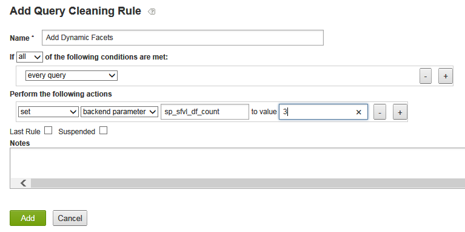
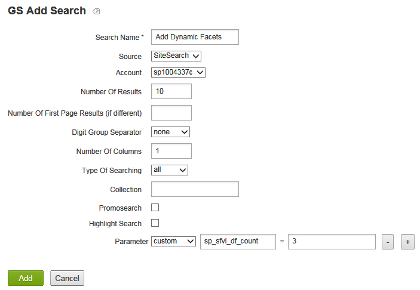

# 동적 패싯 정보{#about-dynamic-facets}

동적 패싯을 사용하여 검색 시 자동으로 새로운 범위 선택 사항을 만들 수 있습니다. 원할 경우, 각 동적 패싯 필드를 Adobe Search&amp;Promote 계정에서 최대 하나의 테이블 이름과 연결할 수 있습니다. 검색과 관련된 모든 동적 패싯 필드에 대해 검색 시 이러한 테이블 관계를 적용합니다.

## 동적 패싯 사용 {#concept_E65A70C9C2E04804BF24FBE1B3CAD899}

>[!NOTE]
>
>이 기능은 기본적으로 에서 활성화되어 있지 [!DNL Adobe Search&Promote]않습니다. 해당 기능을 활성화하려면 기술 지원 센터에 문의하십시오.

동적 패싯을 사용하지 않으면 관련 속성을 &quot;slots&quot;로 병합하고 지정된 검색에 대해 동질적이었던 슬롯만 표시해야 했습니다. 즉, &quot;신발 크기&quot; 또는 &quot;링 크기&quot;와 같은 하나의 논리적 속성 값만 포함할 수 있습니다. 이 메서드는 고유한 속성 집합을 많이 사용하여 적절한 검색 시간 성능을 제공했습니다.

그러나 Dynamic Faceting을 사용하면 핵심 검색이 효율적으로 추적할 수 있는 패싯 수에 제한이 없습니다. 수백 개의 동적 패싯을 정의할 수 있습니다. 이 패싯은 주어진 검색에 대해 &quot;상위 `N` 동적 패싯&quot;을 반환할 수 있습니다. `N` 이 패싯은 일반적으로 10-20 이하의 작은 값입니다. 이 방법을 사용하면 속성을 샘플링할 필요가 없습니다. 이제 웹 사이트 전체에서 속성에 대한 고유한 동적 패싯을 만들 수 있습니다.

## 역동적으로 만들어야 하는 부분은 무엇입니까? {#section_254EE034BCAD4250A5D09FBF6158C4A5}

웹 사이트 전체에서 드물게 채워지고 검색의 하위 세트에 대해서만 나타나는 패싯은 다이내믹하게 만드는 좋은 후보자입니다. 예를 들어 &quot;forefoot width&quot;라는 패싯은 신발 또는 부츠를 검색할 때만 채울 수 있습니다. 반면 &quot;Roman&quot; 및 &quot;Arabic&quot;의 가능한 값을 가진 &quot;Face Numeral Style&quot;이라는 다른 패싯은 시계 또는 시계를 검색할 때만 나타날 수 있습니다.

계정에 많은 수의 패싯이 있는 경우 모든 검색에 대해 가능한 패싯의 전체 세트를 항상 선택하는 대신 다이내믹한 패싯을 사용할 수 있도록 검색 성능이 향상됩니다. 일반적으로 모든 검색 결과와 함께 표시하는 데 적합한 &quot;SKU&quot; 또는 &quot;브랜드&quot;와 같은 일반적인 패싯은 일반적으로 동적 패싯으로 적합하지 않습니다.

## 패싯과 메타 태그 필드의 관계 {#section_2869E5FCDA8B431A87BC6E5573F2B0A0}

패싯은 메타 태그 필드 위에 만들어집니다. 메타 태그 필드는 의 하위 레벨 핵심 검색 레이어 기능입니다 [!DNL Adobe Search&Promote]. 반면 패싯은 GS(Guided Search)의 일부로 Adobe Search&amp;Promote의 고급 프레젠테이션 레이어입니다. 패싯은 고유한 메타 태그 필드를 가지지만, 메타 태그 필드는 패싯에 대해 아무 것도 알지 못합니다. 다이내믹 패싯을 구성할 때 먼저 패싯을 추가한 다음, 식별된 패싯을 동적으로 설정하려면 다이내믹 패싯 옵션을 사용하여 메타 태그 필드를 추가합니다.

>[!NOTE]
>
>에 &quot;동적 패싯&quot; 설정이 없습니다 **[!UICONTROL Design > Navigation > Facets]**. 패싯을 &quot;동적&quot;으로 만드는 것은 기본 &quot;메타 태그 필드&quot;가 설정된 대로 동적인 **[!UICONTROL Settings > Metadata > Definitions]**&#x200B;것입니다.

## 동작의 동적 패싯 예 {#section_BC699A05E2E742EF94D41679163ACE84}

&quot;boots&quot;에 대한 검색 후 표시되는 동적 패싯의 예:


&quot;watches&quot;를 검색한 후 표시되는 동적 패싯의 또 다른 예:


 

* [백엔드 검색 CGI 매개 변수](../c-appendices/c-cgiparameters.md#reference_582E85C3886740C98FE88CA9DF7918E8)
* [프레젠테이션 템플릿 태그](../c-appendices/c-templates.md#reference_F1BBF616BCEC4AD7B2548ECD3CA74C64)
* [전송 템플릿 태그](../c-appendices/c-templates.md#reference_227D199F5A7248049BE1D405C0584751)

## 동적 패싯 구성 {#task_D17F484130E448258100BAC1EEC53F39}

Search&amp;Promote에서 동적 패싯 설정.

<!-- 

t_configuring_dynamic_facets.xml

 -->

>[!NOTE]
>
>이 기능은 기본적으로 Adobe Search&amp;Promote에서 활성화되지 않습니다. 해당 기능을 활성화하려면 기술 지원 센터에 문의하십시오.

다이내믹 패싯의 효과가 고객에게 표시되기 전에 사이트 색인을 다시 구성해야 합니다.

 

* [백엔드 검색 CGI 매개 변수](../c-appendices/c-cgiparameters.md#reference_582E85C3886740C98FE88CA9DF7918E8)
* [프레젠테이션 템플릿 태그](../c-appendices/c-templates.md#reference_F1BBF616BCEC4AD7B2548ECD3CA74C64)
* [전송 템플릿 태그](../c-appendices/c-templates.md#reference_227D199F5A7248049BE1D405C0584751)

**동적 패싯을 구성하려면**

1. 이미 패싯을 추가했는지 확인합니다.

   새 [패싯](../c-about-design-menu/c-about-facets.md#task_FC07BFFA62CA4B718D6CBF4F2855C89B)추가를 참조하십시오.
1. 패싯이 추가된 후, 새 사용자 정의 메타 태그 필드에 패싯을 추가해야 합니다.

   새 [메타 태그 필드](../c-about-settings-menu/c-about-metadata-menu.md#task_6DF188C0FC7F4831A4444CA9AFA615E5)추가를 참조하십시오.
1. 제품 메뉴에서 > **[!UICONTROL Settings]** > **[!UICONTROL Metadata]** > **[!UICONTROL Definitions.]**
1. 페이지의 [!DNL Definitions] 표에서 [!DNL User-defined fields] [!DNL Actions] 열에서 동적으로 만들 패싯과 연결된 메타 태그 필드 이름의 행에 있는 연필 아이콘(편집)을 클릭합니다.
1. 페이지에서 [!DNL Edit Field] 확인하십시오 **[!UICONTROL Dynamic Facet]**.

   새 메타 태그 필드 [추가의 옵션 표를](../c-about-settings-menu/c-about-metadata-menu.md#task_6DF188C0FC7F4831A4444CA9AFA615E5)참조하십시오.
1. 클릭 **[!UICONTROL Save Changes]**.
1. 파란색 상자에서 스테이지된 사이트 인덱스를 **** 다시 생성하여 스테이지된 웹 사이트 인덱스를 신속하게 다시 만들 수 있습니다.

   라이브 [또는 스테이지 웹사이트의](../c-about-index-menu/c-about-regenerate-index.md#task_B28DE40C0E9A475ABCBCBC4FF993AACD)인덱스 재생성을 참조하십시오.
1. 지정된 검색에 대해 선택할 동적 패싯 수를 결정합니다. 다음 중 하나를 수행하여 이 작업을 수행합니다.

   * 원하는 조건이 있는 질의 정리 규칙을 만들어 작업을 수행하고, `set``backend parameter`값을 `sp_sfvl_df_count` 지정합니다. 여기서 는 검색 시 요청할 동적 패싯의 `X`원하는 개수입니다. 그런 다음 `X` **[!UICONTROL Add]**&#x200B;을 클릭합니다.
   

   쿼리 [정리 규칙](../c-about-rules-menu/c-about-query-cleaning-rules.md#task_47F43988D3D9485F8AE1DFDA7E00BF54)추가를 참조하십시오.

   자세한 내용은 [표의 백엔드 검색 CGI 매개 변수](../c-appendices/c-cgiparameters.md#reference_582E85C3886740C98FE88CA9DF7918E8)40행을 참조하십시오 `sp_sfvl_df_count`.

   * 검색을 추가하고 &quot;사용자 지정&quot; `sp_sfvl_df_count` 매개 변수를 원하는 값으로 설정한 다음 **[!UICONTROL Add]**&#x200B;을 클릭합니다.
   

   새 [검색 정의](../c-about-settings-menu/c-about-searching-menu.md#task_98D3A168AB5D4F30A1ADB6E0D48AB648)추가를 참조하십시오.

   자세한 내용은 [표의 백엔드 검색 CGI 매개 변수](../c-appendices/c-cgiparameters.md#reference_582E85C3886740C98FE88CA9DF7918E8)40행을 참조하십시오 `sp_sfvl_df_count`.

1. 해당 전송 템플릿을 편집하여 핵심 검색이 반환하는 동적 패싯을 출력합니다.

   프레젠테이션 [또는 전송 템플릿](../c-about-design-menu/c-about-templates.md#task_800E0E2265C34C028C92FEB5A1243EC3)편집을 참조하십시오.

   예를 들어 전송 템플릿의 이름이 `guided.tpl`지정되어 있다고 가정합니다. 이 경우 제품 메뉴에서 을 클릭합니다 **[!UICONTROL Design > Templates]**. 페이지에서 [!DNL Templates] 표에서 `guided.tpl` 찾습니다. 그런 다음 이름의 맨 **[!UICONTROL Edit]** 오른쪽에 있는 을 클릭합니다. 편집 페이지에서 다음 코드 블록을 `</facets>`끝에 추가합니다.JSON 출력:

   ```
   ... 
   }<search-dynamic-facet-fields>, 
           { 
               "name" : "<search-dynamic-facet-field-name>", 
               "dynamic-facet" : 1, 
               "values" : [<search-field-value-list quotes="yes" commas="yes" data="values" sortby="values" encoding="json" />], 
               "counts" : [<search-field-value-list quotes="yes" commas="yes" data="results" sortby="values" />] 
   
           }</search-dynamic-facet-fields> 
   ...
   ```

1. 적절한 프레젠테이션 템플릿 또는 템플릿을 편집하여 동적 패싯을 출력합니다.

   프레젠테이션 [또는 전송 템플릿](../c-about-design-menu/c-about-templates.md#task_800E0E2265C34C028C92FEB5A1243EC3)편집을 참조하십시오.

   예를 들어 시뮬레이터에서 컨텐츠를 출력하는 데 사용되는 이름이 `sim.tmpl` 있는 템플릿이 있다고 가정합니다. 해당 템플릿을 편집하려면 제품 메뉴에서 을 클릭합니다 **[!UICONTROL Design > Templates]**. 페이지에서 [!DNL Templates] 표에서 `sim.tmpl` 찾습니다. 그런 다음 이름의 맨 **[!UICONTROL Edit]** 오른쪽에 있는 을 클릭합니다. 편집 페이지에서 템플릿의 패싯 표시 영역 내에 다음을 추가합니다.

   ```
   <h6>DF RAIL</h6> 
   <guided-facet-rail gsname="__dynamic_facets"> 
               <guided-facet ><!-- behavior=Normal --> 
               <div class="facet-block" id="facet"> 
               <p><b><guided-facet-display-name /></b></p> 
               <ul> 
                   <guided-facet-values> 
                       <guided-if-facet-value-equals-length-threshold> 
               </ul> 
               <ul id="brand" style="display:none"> 
                       </guided-if-facet-value-equals-length-threshold> 
                       <guided-if-facet-value-selected> 
                           <li><guided-facet-value> [<guided-lt>a href="<guided-facet-value-undo-path />"<guided-gt>X</a>]</li> 
                       <guided-else-facet-value-selected> 
                           <li><guided-facet-link><guided-facet-value></guided-facet-link> (<guided-facet-count>) </li> 
                       </guided-if-facet-value-selected> 
                   </guided-facet-values> 
               </ul> 
               <guided-if-facet-long> 
                 <br /><guided-lt />a href="#" onclick="moreless(this,'brand');return false;" <guided-gt /><button style="font-size:10px;">VIEW MORE</button></a> 
               </guided-if-facet-long> 
               </div> 
               </guided-facet> 
   </guided-facet-rail> 
   <h6>/DF RAIL</h6>
   ```

   필요에 따라 다른 프레젠테이션 템플릿과 유사한 수정을 `json.tmpl`수행합니다.

   태그에 에 `__dynamic_facets` 대해 지정해야 `gsname` 합니다 `guided-facet-rail` . 이 태그는 지정된 검색에 대해 반환되는 동적 패싯을 출력하기 위해 예약되어 있는 사전 정의된 패싯 레일입니다.

   또한 규칙 > 비즈니스 규칙을 통해 그리고 아래에서 보듯이 고급 규칙 빌더를 사용하여 이 특수 패싯 레일을 선택적으로 편집할 수도 있습니다.

   

   새 [비즈니스 규칙 추가를 참조하십시오.](../c-about-rules-menu/c-about-business-rules.md#task_BD3B31ED48BB4B1B8F1DCD3BFA2528E7)
