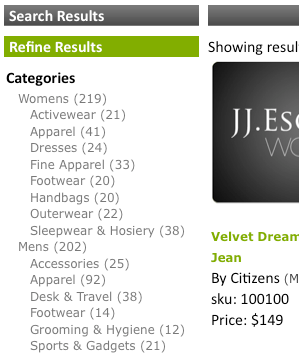

# 패싯 정보{#about-facets}

패싯을 사용하여 프레젠테이션 레이어를 사용자 정의하고 사용자에게 검색 결과를 드릴다운할 수 있는 검색 안내 검색을 제공할 수 있습니다.

## 패싯 사용 {#concept_FA912B3B41EE493DB2F492D188457FF5}

예를 들어 도구를 판매하는 웹 사이트 방문자가 렌치 검색을 한다고 가정합니다. 회사는 다음과 같은 두 가지 단면들을 사용할 수 있습니다.하나는 찾은 렌치의 모든 브랜드를 지정하고 두 번째 것은 모든 렌치 크기를 지정하는 것입니다. 고객은 적절한 패싯 내의 브랜드 또는 크기를 클릭하여 결과를 좁히고 필요한 올바른 렌치를 신속하게 찾을 수 있습니다.

기존 메타데이터 정의를 기반으로 패싯을 만들 수 있습니다. 패싯이 메타데이터에 날짜 유형으로 정의되면 날짜 범위 패싯으로 표시됩니다.

[!DNL Staged Facets] 페이지의 표에는 추가된 각 패싯을 구성하는 설정에 대한 일반 개요가 표시됩니다. 새 패싯을 추가하고 기존 패싯을 편집하거나 삭제할 수 있습니다. 페이지의 오른쪽 위 모서리 근처에 있는 **[!UICONTROL History]**&#x200B;을 사용하여 패싯에 대한 변경 사항을 되돌릴 수 있습니다.

패싯 설정은 변경 사항을 라이브로 푸시하기 전에 테스트할 수 있도록 기본적으로 수행됩니다.

[스테이징 ](../c-about-staging.md#concept_08B8F3CA1F4241108F14BA7FC7806CA7) 정보를 참조하십시오.

**[!UICONTROL View Live Settings]**&#x200B;을 사용하여 스테이지된 설정을 현재 라이브 설정과 비교할 수 있습니다. **[!UICONTROL View Staged Settings]**&#x200B;을(를) 사용하여 스테이징 영역으로 돌아갑니다. 스테이징된 항목의 경우 설정의 라이브 버전은 읽기 전용입니다. 따라서 단계 설정을 실시간으로 푸시하여 조작합니다. 스테이지된 단면화에 대한 변경 내용이 마음에 들면 **[!UICONTROL Push Live]**&#x200B;을 클릭하여 해당 단면들을 라이브로 푸시합니다.

## 날짜 범위 패싯 {#section_FEFFF6B5B6534456913189FEF559BA58}

메타데이터에 날짜 유형으로 정의된 패싯은 다른 패싯과 다르게 처리됩니다. 값 집합으로 간주되는 대신 시작 날짜, 종료 날짜 또는 둘 다로 날짜 범위로 처리됩니다.

날짜 범위 패싯에는 시작 날짜 값이 있고 그 뒤에 &quot;BTW&quot;(&quot;사이&quot;)가 있으며 그 뒤에 종료 날짜가 옵니다. 날짜는 다음 두 가지 형식으로 되어 있습니다.

mm-dd-yyyy

yyyy/mm/dd

4자리 연도를 입력해야 합니다. 시작 날짜 또는 종료 날짜 중 적어도 하나가 있어야 하지만, 둘 다 필수는 아닙니다. 예를 들어 &quot;12/1/2007BTW1/4/2009&quot;은 2007년 12월 1일부터 2009년 1월 4일 사이의 모든 날짜를 의미합니다. 그러나 &quot;1-1-2005BTW&quot;라 함은 2005년 1월 1일 이후 모든 날짜를 의미합니다.

프레젠테이션 템플릿 태그 `<guided-facet-value/>`을 사용하여 표준 패싯과 같이 날짜 범위 패싯 값을 가져올 수 있습니다. 현재, 사용자가 검색할 날짜 범위를 입력할 수 있도록 하려면 JavaScript가 필요합니다. 예를 들어 시작 날짜와 종료 날짜에 대해 두 입력 필드에서 입력을 가져올 수 있습니다. 그런 다음 입력의 유효성을 확인하고 새 패싯의 값(두 개의 입력 필드에서 작성)과 패싯 이름을 기존 URL에 추가할 수 있습니다.

[프레젠테이션 템플릿 태그](../c-appendices/c-templates.md#reference_F1BBF616BCEC4AD7B2548ECD3CA74C64)를 참조하십시오.

다음 코드 샘플은 페이지에 날짜 범위를 표시하는 방법에 대한 예입니다. 기존 날짜 범위가 선택된 경우 표시됩니다.그렇지 않으면 간단한 입력 양식이 표시됩니다. 양식이 제출되면 간단한 유효성 검사를 수행합니다. 그런 다음 2개의 새 매개 변수를 포함하는 새 URL로 브라우저를 전송합니다.

* `q#` - 두 개의 입력 필드에서 어셈블된 선택한 날짜 범위를 나타냅니다.
* `x#` - 패싯의 이름을 지정합니다. 이 예에서 날짜 범위 패싯의 이름은 &quot;수정됨&quot;입니다.

Apache는 보안상의 이유로 URL 경로에 `%2F`을(를) 허용하지 않으며 SEO URL을 사용할 때 URL 경로에 쿼리가 있으므로 코드의 `replace(/%2F/ig, '~2F')` 부분이 필요합니다. 따라서 `/`은(는) 일반적으로 URL에 있는 것처럼 `%2F` 대신 `~2F`로 인코딩됩니다.

```
<div class="date_range"> 
 <p>Date Range</p> 
 <guided-if-facet-selected gsname="modified"> 
  <guided-facet-values gsname="modified"> 
   <script> 
   var modified_daterange= '<guided-facet-value />'.split(/BTW/) ; 
   if (modified_daterange[0]=='') modified_daterange[0]= '--/--/----' ; 
   if (modified_daterange[1]=='') modified_daterange[1]= '--/--/----' ; 
   document.write('From: ' + modified_daterange[0]) ; 
   document.write('<br>To: ' + modified_daterange[1]) ; 
   </script> 
  </guided-facet-values> 
 
 <guided-else-facet-selected> 
  <form action="#"> 
   From: <input name="dateFrom" size=10> 
   <br>To: <input name="dateTo" size=10> 
   <br><input type="button" value="Go" onclick="goClick(this.form)"> 
  </form> 
  <script> 
  function goClick(f) { 
   if (f.dateFrom.value=='' && f.dateTo.value=='') { 
    alert('You must enter either a From: date or a To: date.') ; 
    return ; 
   } 
   if ( f.dateFrom.value!='' && !f.dateFrom.value.match(/^\d+[\/\-]\d+[\/\-]\d\d\d\d$/) ) { 
    alert('From: date must be in "mm/dd/yyyy" or "mm-dd-yyyy" format.') ; 
    return ; 
   } 
   if ( f.dateTo.value!='' && !f.dateTo.value.match(/^\d+[\/\-]\d+[\/\-]\d\d\d\d$/) ) { 
    alert('To: date must be in "mm/dd/yyyy" or "mm-dd-yyyy" format.') ; 
    return ; 
   } 
   // Note that "/" is encoded as "~2F" instead of "%2F" to avoid Apache 404 error. 
   var new_url= '<guided-current-path />&<guided-query-param-name gsname="q#" offset="0" />=' 
    + encodeURIComponent(f.dateFrom.value).replace(/%2F/ig, '~2F') + 'BTW' 
    + encodeURIComponent(f.dateTo  .value).replace(/%2F/ig, '~2F') 
    + '&<guided-query-param-name gsname="x#" offset="0" />=modified' ; 
   location.href= new_url ; 
  } 
  </script> 
 </guided-if-facet-selected> 
</div>
```

## 중첩 패싯 정보 {#section_6BC77F38DE9F43D5B6911F8CECB15DFC}

중첩 패싯은 다음과 같이 여러 카테고리 레벨을 표시하는 패싯입니다.



Womens 및 Mens 카테고리는 상위 또는 상위 패싯에 있습니다. 액세서리 및 신발 등의 하위 카테고리는 하위 또는 하위 패싯에 있습니다.

현재 지원되는 중첩 단면 심도는 2이지만 드릴다운 목록을 따라 아무 곳에나 있을 수 있습니다.

다음은 다양한 유형의 중첩 단면에서의 동작입니다.

<table> 
 <thead> 
  <tr> 
   <th colname="col1" class="entry"> <p>중첩된 단면화 유형의 동작 </p> </th> 
   <th colname="col2" class="entry"> <p>동작 </p> </th> 
  </tr> 
 </thead>
 <tbody> 
  <tr> 
   <td colname="col1"> <p>표준 </p> </td> 
   <td colname="col2"> <p>일반적인 중첩 단면화의 동작은 다른 단면이 검색을 좁히면 축소된다는 것입니다. </p> <p>중첩 단면화를 선택하면 선택한 영역으로 축소됩니다. 상위 패싯을 선택하면 해당 상위 패싯만 나머지 하위 패싯과 함께 표시됩니다. 하위 패싯을 선택하면 패싯은 선택한 상위 패싯과 선택한 하위 패싯만 표시합니다. </p> </td> 
  </tr> 
  <tr> 
   <td colname="col1"> <p>고정 </p> </td> 
   <td colname="col2"> <p>고정 중첩 단면화의 동작은 다른 단면이나 검색 기준의 상태에 따라 단면화를 가능한 한 열어 두려는 것입니다. 하위 패싯을 선택하면 고정 깊이로 카운트됩니다. </p> </td> 
  </tr> 
  <tr> 
   <td colname="col1"> <p>다중 선택 </p> </td> 
   <td colname="col2"> <p>다중 선택 패싯의 동작은 패싯을 열린 상태로 유지한다는 것입니다. 패싯이 카테고리 중첩 패싯의 "상위"가 아닌 한 새로운 선택 사항은 다른 단면화 선택 영역을 모두 지우는 것입니다. 이 경우 "상위"는 중첩된 패싯의 최상위 카테고리가 아니라 카테고리 패싯을 참조합니다. </p> </td> 
  </tr> 
  <tr> 
   <td colname="col1"> <p>카테고리 다중 선택 </p> </td> 
   <td colname="col2"> <p>좋아요 다음 예외를 제외하고 중첩 단면 유형을 다중 선택 중첩 </p> 
    <ul id="ul_D5AB6AF3169A483E8F3FC6D2A2EA3A28"> 
     <li id="li_9308156EF2FF43CE9DFB933F13786C58">이 패싯을 처음으로 선택한 경우 이전에 선택한 다른 패싯은 선택 취소됩니다. </li> 
     <li id="li_DD96D6802A9C479283212A0FD68C6F85">이전에 선택한 다른 패싯은 상위 패싯이나 다른 상위 패싯의 형제 패싯을 클릭하지 않고 고객이 하위 패싯으로 바로 드릴다운하는 경우에도 선택 취소됩니다. </li> 
     <li id="li_8BF58F10969B4743986D5D0E0086AD6C">카테고리 측면에는 부모가 있다는 의미에서 부모가 있을 수 있다. 이 동작을 모든 중첩 패싯과 함께 찾은 부모-자식 관계와 혼동하지 마십시오. </li> 
    </ul> </td> 
  </tr> 
 </tbody> 
</table>

[패싯 레일 정보](../c-about-design-menu/c-about-facet-rails.md#concept_1FDC8BCDFFC84A0889DA670F63D5F6DB)를 참조하십시오.

## 새 패싯 {#task_FC07BFFA62CA4B718D6CBF4F2855C89B} 추가

패싯을 추가하여 프레젠테이션 레이어를 사용자 정의하고 검색 결과를 드릴다운할 수 있는 검색 안내 기능을 고객에게 제공할 수 있습니다.

<!-- 

t_adding_a_new_facet.xml

 -->

[!DNL Facets] 페이지의 패싯 테이블에는 단일 패싯을 구성하는 설정의 발췌문이 표시됩니다. 새 패싯을 추가하고 기존 패싯을 편집하거나 삭제할 수 있습니다. 패싯에 대한 모든 변경 사항은 내역 기능을 사용하여 되돌릴 수 있습니다.

>[!NOTE]
>
>프레젠테이션 템플릿이 웹 사이트에서 표시되도록 하려면 해당 패싯을 참조해야 합니다.

[패싯 레일 정보](../c-about-design-menu/c-about-facet-rails.md#concept_1FDC8BCDFFC84A0889DA670F63D5F6DB)를 참조하십시오.

**새 패싯을 추가하려면**

1. 새 패싯을 추가하려면 다음 단계로 진행하기 전에 이미 다음 작업을 수행했는지 확인하십시오.

   * 일부 메타 태그 필드가 이미 정의되어 있어야 합니다.

      [새 메타 태그 필드 추가](../c-about-settings-menu/c-about-metadata-menu.md#task_6DF188C0FC7F4831A4444CA9AFA615E5)를 참조하십시오.
   * 색인에 메타데이터를 삽입합니다.
[필드 삽입 정의 추가](../c-about-settings-menu/c-about-metadata-menu.md#task_E86566FA1FF74CF68115C0ADA05172AE)를 참조하십시오.

1. 제품 메뉴에서 **[!UICONTROL Design]** > **[!UICONTROL Navigation]** > **[!UICONTROL Facets.]**&#x200B;를 클릭합니다.
1. [!DNL Facets] 페이지에서 **[!UICONTROL Add New Facet]**&#x200B;을 클릭합니다.
1. [!DNL Add Facet] 페이지에서 원하는 옵션을 설정합니다.

   이러한 설정은 패싯의 동작과 기본 표시 모두에 영향을 줍니다. 프레젠테이션 템플릿의 설정을 통해 이러한 설정 중 일부를 재정의할 수 있습니다.

   패싯이 메타데이터에 날짜 유형으로 정의된 경우 날짜 범위로 표시됩니다.

   [날짜 범위 패싯](../c-about-design-menu/c-about-facets.md#section_FEFFF6B5B6534456913189FEF559BA58)을 참조하십시오.

   선택한 패싯 옵션에 따라 일부 옵션을 사용할 수 없습니다.

   <!-- 
   r_add_facet_options.xml
   -->

   <table> 
    <thead> 
      <tr> 
      <th colname="col1" class="entry"> <p>옵션 </p> </th> 
      <th colname="col2" class="entry"> <p>설명 </p> </th> 
      </tr> 
    </thead>
    <tbody> 
      <tr> 
      <td colname="col1"> <p>패싯 이름 </p> </td> 
      <td colname="col2"> <p>지정된 패싯의 이름을 식별합니다. </p> <p> <p>참고: 기존 사용자 정의 메타데이터를 기반으로 하는 패싯만 가질 수 있습니다. 드롭다운 목록에서 사용할 수 있는 패싯이 없는 경우 먼저 일부 메타데이터를 정의해야 합니다. </p> </p> <p><a href="../c-about-settings-menu/c-about-metadata-menu.md#task_6DF188C0FC7F4831A4444CA9AFA615E5" type="task" format="dita" scope="local"> 새 메타 태그 필드 </a> 추가를 참조하십시오. </p> <p>필드 테이블을 기반으로 패싯을 만들려면 사용자 지정 패싯 이름을 사용하고 필드 테이블 이름을 지정합니다. </p> </td> 
      </tr> 
      <tr> 
      <td colname="col1"> <p>표시 레이블 </p> </td> 
      <td colname="col2"> <p>메타데이터 필드 이름(<span class="codeph"> &lt;guided-breadcrumb-label&gt; </span> 태그 사용) 대신 탐색 경로에서 사용할 수 있는 패싯의 레이블을 설정하거나, 독립 실행형 값(<span class="codeph"> &lt;guided-facet-display-name&gt; </span> 태그 사용)이 사용됩니다. </p> </td> 
      </tr> 
      <tr> 
      <td colname="col1"> <p>동작 </p> </td> 
      <td colname="col2"> <p>3개의 단면화 동작 중 하나를 설정합니다. </p> <p> 
      <ul id="ul_67C19E1C16224B9990F04A0D05BD3D05"> 
      <li id="li_6B232C11A61840B68CA59E1F593405A0"> <span class="uicontrol"> 표준 </span> <p>고객이 비헤이비어가 <span class="uicontrol"> 일반 </span>으로 설정된 패싯을 클릭하면 해당 항목에 대한 검색 결과로 드릴다운됩니다. 여기에서 고객은 검색 결과 수를 세분화하고 좁힐 수 있습니다. </p> </li> 
      <li id="li_7D7C43A7F7AB4B84A9B0FEF34627605A"> <span class="uicontrol"> 카테고리 </span> <p>카테고리 패싯은 탐색 요소와 같은 역할을 합니다. 이러한 패싯은 일반적으로 특성 옵션이 있는 패싯을 표시하기 전에 드릴다운하는 최상위 패싯입니다. 다른 패싯을 선택하고 열린 상태로 두면 카테고리 패싯이 좁아지지 않습니다. 카테고리 패싯 내의 다른 값을 클릭하면 해당 카테고리 패싯의 부모를 제외한 페이지의 다른 모든 패싯이 선택 취소됩니다. </p> </li> 
      <li id="li_01255993D71F40DBA8870AA3FEA7D304"> <span class="uicontrol"> 카테고리 다중 선택  </span> <p>패싯은 항목이 "ORed"인 패싯에서 여러 항목 선택을 지원하는 카테고리 패싯입니다. </p> </li> 
      </ul> 
      <ul id="ul_683F6D3FC8524E65AF303453ADDB6001"> 
        <li id="li_81F504D1D1294666BBBC5EA43B34B712"> <span class="uicontrol"> 고정 </span> <p>고객이 비헤이비어가 <span class="uicontrol"> 고정 </span>으로 설정된 패싯을 클릭하면 선택한 옵션이 포함된 패싯이 드릴다운 동안 열린 상태로 유지됩니다. 이 옵션은 고객이 이전 선택을 변경할 때 유용합니다. </p> </li> 
      </ul> 
      <ul id="ul_8E871D63B09445268C600C8ABC20F6A4"> 
        <li id="li_F88AC5528B0C4751BC4CFE7FA9525857"> <span class="uicontrol"> 다중 선택  </span> <p>패싯 내의 항목이 "ORed"인 패싯에서 여러 항목을 선택할 수 있습니다. 이 옵션은 색상과 같은 작은 속성을 표시할 수 있고 고객이 "내 크기의 빨간색 또는 검은색의 구두를 표시"할 수 있는 쿼리를 작성할 수 있도록 하려는 패싯에 유용합니다. </p> </li> 
      </ul> </p> </td> 
      </tr> 
      <tr> 
      <td colname="col1"> <p>항상 표시 </p> </td> 
      <td colname="col2"> <p>일반적인 패싯 또는 고정 패싯의 경우 언제든지 고객이 볼 수 있도록 패싯을 설정합니다. </p> <p>이 옵션은 <span class="uicontrol"> 동작 </span> 드롭다운 목록에서 <span class="uicontrol"> 표준 </span>, <span class="uicontrol"> 범주 </span> 또는 <span class="uicontrol"> 고정 </span>을 선택한 경우에만 사용할 수 있습니다. </p> </td> 
      </tr> 
      <tr> 
      <td colname="col1"> <p>패싯 부모 </p> </td> 
      <td colname="col2"> <p>이 옵션은 <span class="uicontrol"> 동작 </span> 드롭다운 목록에서 <span class="uicontrol"> 범주 </span> 또는 <span class="uicontrol"> 범주 다중 선택 </span>을 선택한 경우에만 사용할 수 있습니다. </p> <p>카테고리 패싯의 상위 항목을 나타냅니다. 카테고리 상위 패싯에서 선택한 항목은 현재 카테고리 패싯 내에서 사용할 수 있는 선택 사항의 범위를 좁히는 데 사용됩니다. 고객이 카테고리 패싯과 상호 작용할 때 상위 패싯은 선택 취소되지 않습니다. 쉼표로 구분된 부모를 여러 개 지정할 수 있습니다. </p> </td> 
      </tr> 
      <tr> 
      <td colname="col1"> <p>고정 깊이 </p> </td> 
      <td colname="col2"> <p>이 옵션은 <span class="uicontrol"> 동작 </span> 드롭다운 목록에서 <span class="uicontrol"> 고정 </span>을 선택한 경우에만 사용할 수 있습니다. </p> <p>드릴다운 동안 열려 있는 상태로 유지되는 옵션 수를 설정합니다. </p> </td> 
      </tr> 
      <tr> 
      <td colname="col1"> <p>길이 임계값 </p> </td> 
      <td colname="col2"> <p>항목 수에 정의된 패싯의 세로 길이(1-9999)를 설정합니다. </p> <p>프레젠테이션 템플릿이 적절하게 설정된 경우 이 설정을 사용하여 "자세히 보기..."를 제공할 수 있습니다. 를 클릭하거나, 패싯을 스크롤 가능 div에 던질 시기 등을 결정합니다. </p> </td> 
      </tr> 
      <tr> 
      <td colname="col1"> <p>길이 임계값 자르기 </p> </td> 
      <td colname="col2"> <p>지정된 임계값 후에 패싯의 항목 수를 자릅니다. </p> <p>일부 구현에는 수천 개의 항목이 포함된 단면이 있습니다. 모든 데이터를 전송하려면 비용이 많이 들 수 있습니다. 이 설정을 사용하여 패싯을 관리 가능한 수준으로 트리밍할 수 있습니다. 패싯은 정렬 후 잘립니다. </p> </td> 
      </tr> 
      <tr> 
      <td colname="col1"> <p>최대 값 너비 </p> </td> 
      <td colname="col2"> <p>단면화 값 문자열 길이 제한(1-999)을 지정합니다. </p> <p>이 옵션은 단면화를 고정 폭 레이아웃에 배치하고 문자열을 줄바꿈하지 않도록 하려는 경우에 유용합니다. 기본적으로 이 문자열은 임계값보다 3자 더 작은 것으로 설정되어 줄임표를 추가할 수 있습니다. </p> </td> 
      </tr> 
      <tr> 
      <td colname="col1"> <p>값 확장 </p> </td> 
      <td colname="col2"> <p>패싯 값이 잘렸음을 나타내는 데 사용할 문자열을 지정합니다. 기본적으로 문자열 "..." 가 사용됩니다. </p> </td> 
      </tr> 
      <tr> 
      <td colname="col1"> <p>구분 기호 </p> </td> 
      <td colname="col2"> <p>단면화에 적용되는 구분된 값 목록에 사용할 구분 기호를 지정합니다. </p> <p>사용되는 구분 기호는 단면화를 기반으로 하는 메타데이터에 정의된 구분 기호와 같습니다. 기본 구분 기호는 쉼표입니다. 그러나 XML 호환 값을 사용할 수 있습니다. </p> </td> 
      </tr> 
      <tr> 
      <td colname="col1"> <p>정렬 </p> </td> 
      <td colname="col2"> <p>웹 사이트에서 패싯을 정렬할 방법을 지정합니다. 다음을 기준으로 패싯을 정렬할 수 있습니다. 원하는 경우 최대 5개의 정렬을 조합할 수 있습니다. </p> 
      <ul id="ul_12987F4DC7B34C63ABC906B59688A174"> 
      <li id="li_3206C96013DF431D90119F594D93D85D"> <span class="uicontrol"> 알파  </span> <p>구두점 문자를 포함하여 사전순(0-9, A-Z) 값을 정렬합니다. </p> </li> 
      <li id="li_304E4A518FBE48D18D9E9EA7339A3481"> <span class="uicontrol"> alpha(영숫자만)  </span> <p>구두점 문자를 무시하고 사전순(0-9, A-Z) 값을 정렬합니다. </p> </li> 
      <li id="li_CADB888CC514455F9CA379C8EEE490AA"> <span class="uicontrol"> 알파(대/소문자 구분 안 함)  </span> <p>알파벳순(0-9, A-Z) 값을 정렬하고, 알파벳순 문자의 대/소문자를 무시하고, 구두점 문자를 포함합니다. </p> </li> 
      <li id="li_F61122E79AB5413792DA31F8AB1414BD"> <span class="uicontrol"> alpha(대/소문자 구분 안 함, 영숫자만)  </span> <p>알파벳순(0-9, A-Z) 값을 정렬하고, 알파벳의 대/소문자를 무시하고, 구두점 문자를 무시합니다. </p> </li> 
      <li id="li_F50CC298ABF046D0A39D5AE5B1261823"> <span class="uicontrol"> count  </span> <p>각 패싯 값과 가장 큰 값에서 가장 작은 값까지의 결과 수를 기준으로 정렬합니다. </p> </li> 
      <li id="li_32B6AF39E9534762B39B15181DC5AD01"> <span class="uicontrol"> 숫자  </span> <p>값을 숫자로 정렬합니다. 숫자를 정렬할 때 이 옵션은 알파 정렬보다 우수합니다. 알파 정렬을 사용할 경우 2보다 10이 먼저 표시되기 때문입니다. </p> </li> 
      <li id="li_CF8E76A7B1184E0C8DCC11B53E31A1DC"> <span class="uicontrol"> split </span> <p>목록을 카운트 임계값에 따라 두 개의 개별 목록으로 구분합니다. 임계값 위의 패싯 값은 맨 위로 이동됩니다. 임계값 아래의 카운트가 있는 패싯 값은 아래로 이동합니다. 특정 범위의 값이 항상 맨 위에 있도록 하려면 분할 임계값이 필요합니다. </p> </li> 
      <li id="li_4AB8276577384B1099CBA895898205AD"> <span class="uicontrol"> break  </span> <p>특정 값을 목록의 상단 또는 하단에 강제 적용합니다. 예를 들어 항상 "기타"라는 용어가 목록 하단에 표시되도록 할 수 있습니다. 정렬 맨 위나 맨 아래에 있어야 하는 명확한 값을 식별하기 위해 나누기 정렬을 사용할 때는 상위 값이나 아래쪽 값이 필요합니다. </p> </li> 
      <li id="li_227E96CFED2044FCA2F10B6913B03CFB"> <span class="uicontrol"> ordered  </span> <p>패싯 값은 항상 고정 순서(아래에 설명된 <span class="uicontrol"> 순서 </span> 옵션에 정의된 구분 기호 구분 값 목록)여야 합니다. </p> </li> 
      </ul> </td> 
      </tr> 
      <tr> 
      <td colname="col1"> <p>패싯의 별칭 </p> </td> 
      <td colname="col2"> <p>패싯 별칭을 사용하여 기존 매개 변수 이름을 수정하도록 매핑하거나 다른 이름으로 패싯을 만들 수 있으므로, 기존에 검색 URL을 지원할 수 있습니다. 별칭은 들어오는 요청에만 적용되며 패싯 링크를 만드는 데 사용되지 않습니다. </p> </td> 
      </tr> 
      <tr> 
      <td colname="col1"> <p>패싯 레일 이름 </p> </td> 
      <td colname="col2"> <p>패싯을 알파벳순, 카운트 또는 사용자 지정 방법으로 정렬하기로 결정한 경우 패싯 레일의 이름입니다. </p> <p><a href="../c-about-design-menu/c-about-facet-rails.md#concept_1FDC8BCDFFC84A0889DA670F63D5F6DB" format="dita" scope="local">단면 레일 정보</a>를 참조하십시오 . </p> </td> 
      </tr> 
      <tr> 
      <td colname="col1"> <p>주문 </p> </td> 
      <td colname="col2"> <p>이 옵션은 <span class="uicontrol"> 정렬 </span> 드롭다운 목록에서 <span class="uicontrol"> 주문된 </span>을 선택한 경우에만 사용할 수 있습니다. </p> <p>사용할 순서를 지정하는 구분된 값 목록을 정의할 수 있습니다. </p> </td> 
      </tr> 
      <tr> 
      <td colname="col1"> <p>추가 항목 추가 </p> </td> 
      <td colname="col2"> <p>이 옵션은 <span class="uicontrol"> 정렬 </span> 드롭다운 목록에서 <span class="uicontrol"> 주문된 </span>을 선택한 경우에만 사용할 수 있습니다. </p> <p>값이 순차 목록에 없는 경우 값이 끝에 추가됩니다. </p> </td> 
      </tr> 
      <tr> 
      <td colname="col1"> <p>고스트 표시 </p> </td> 
      <td colname="col2"> <p>이 옵션은 <span class="uicontrol"> 정렬 </span> 드롭다운 목록에서 <span class="uicontrol"> 주문된 </span>을 선택한 경우에만 사용할 수 있습니다. </p> <p>순서가 지정된 목록에 의해 지정된 값이 없는 경우 이 옵션은 패싯에 있는 각 누락된 항목을 "고스트"로 플래그를 지정하여 항목이 다르게 표시됩니다. </p> </td> 
      </tr> 
      <tr> 
      <td colname="col1"> <p>중첩 단면화 </p> </td> 
      <td colname="col2"> <p>중첩된 단면에는 카테고리와 하위 카테고리가 표시됩니다. 두 카테고리의 깊이만 표시할 수 있지만 드릴다운 시 어느 위치에나 표시할 수 있습니다. </p> <p>이 단면화에 대한 데이터는 2가지 카테고리 수준을 설명하는 규칙을 따라야 합니다. 예를 들어 패싯 값은 상위 카테고리가 'shoes'이고 하위 카테고리는 'boots'인 'shoes:boots'일 수 있습니다. ':'은 구분 기호로 구분됩니다. </p> <p>구분 기호 변경에 대한 자세한 내용은 아래 중첩 구분 기호를 참조하십시오. </p> <p>이 형식으로 데이터를 생성하려면 필터 스크립트를 사용하여 기존 2개의 카테고리를 결합할 수 있습니다. 표준, 카테고리 및 고정 비헤이비어를 중첩 패싯과 결합할 수 있습니다. </p> </td> 
      </tr> 
      <tr> 
      <td colname="col1"> <p>중첩된 상위 이름 </p> </td> 
      <td colname="col2"> <p>이 드롭다운 목록은 <span class="uicontrol"> 중첩 패싯 </span>을 선택한 경우에만 사용할 수 있습니다. </p> <p>상위 범주를 나타내는 필드를 선택할 수 있습니다. 이 필드는 일치하는 상위 카테고리에서 검색 시간 동안 사용됩니다. </p> </td> 
      </tr> 
      <tr> 
      <td colname="col1"> <p>중첩된 자식 이름 </p> </td> 
      <td colname="col2"> <p>이 드롭다운 목록은 <span class="uicontrol"> 중첩 패싯 </span>을 선택한 경우에만 사용할 수 있습니다. </p> <p>하위 범주를 나타내는 필드를 선택할 수 있습니다. 이 필드는 하위 카테고리와 일치하는 검색 시간에 사용됩니다. </p> </td> 
      </tr> 
      <tr> 
      <td colname="col1"> <p>중첩 단면화 구분 기호 </p> </td> 
      <td colname="col2"> <p>이 옵션은 <span class="uicontrol"> 중첩 패싯 </span>을 선택한 경우에만 사용할 수 있습니다. </p> <p>여기에 입력한 문자는 상위 카테고리와 하위 카테고리를 데이터에서 분석하는 데 사용됩니다. </p> <p>예를 들어 ':'이 구분 기호로 사용되고 부모가 'shoes'이고 자식이 'boots'인 경우 데이터 형식이 'shoes:boots'로 예상됩니다. </p> </td> 
      </tr> 
      <tr> 
      <td colname="col1"> <p>분할 임계값 </p> </td> 
      <td colname="col2"> <p>이 옵션은 <span class="uicontrol"> 정렬 </span> 드롭다운 목록에서 <span class="uicontrol"> </span> 분할을 선택한 경우에만 사용할 수 있습니다. </p> <p>분할 정렬 사용 시 분할 임계값은 단면화를 두 개의 개별 목록으로 분할할 횟수를 정의합니다. 임계값보다 크거나 같은 값이 맨 위에 있는 반면 임계값 아래의 값은 맨 아래로 이동합니다. </p> </td> 
      </tr> 
      <tr> 
      <td colname="col1"> <p>상위 값 </p> </td> 
      <td colname="col2"> <p>이 옵션은 <span class="uicontrol"> 정렬 </span> 드롭다운 목록에서 <span class="uicontrol"> </span>을 선택한 경우에만 사용할 수 있습니다. </p> <p>구분되는 이 값 목록은 항상 목록 맨 위에 배치됩니다. 정규 표현식을 사용할 수 있지만 중괄호 또는 중괄호로 묶어야 합니다. 예를 들면 다음과 같습니다.{^New .*?},{^Very New.*} </p> </td> 
      </tr> 
      <tr> 
      <td colname="col1"> <p>하위 값 </p> </td> 
      <td colname="col2"> <p>이 옵션은 <span class="uicontrol"> 정렬 </span> 드롭다운 목록에서 <span class="uicontrol"> </span>을 선택한 경우에만 사용할 수 있습니다. </p> <p>나누기 정렬을 사용할 때 구분 기호로 구분된 값의 목록은 항상 목록 맨 아래에 배치됩니다. 정규 표현식을 사용할 수 있지만 다음 예와 같이 중괄호나 중괄호로 묶어야 합니다.{^Old .*?},{^Very Old.*} </p> </td> 
      </tr> 
    </tbody> 
    </table>

1. 클릭 **[!UICONTROL Add]**.
1. (선택 사항) [!DNL Facets] 페이지에서 다음 중 하나를 수행합니다.

   * **[!UICONTROL History]**&#x200B;을 클릭하여 변경한 내용을 되돌립니다.

      [작업 내역 옵션 사용](../t-using-the-history-option.md#task_70DD3F87A67242BBBD2CB27156F43002)을 참조하십시오.

   * 클릭 **[!UICONTROL Live]**.

      [라이브 설정 보기](../c-about-staging.md#task_401A0EBDB5DB4D4CA933CBA7BECDC10F)를 참조하십시오.

   * 클릭 **[!UICONTROL Push Live]**.

      [스테이지 설정 라이브 푸시](../c-about-staging.md#task_44306783B4C0408AAA58B471DAF2D9A4)를 참조하십시오.

## 중첩된 단면화 추가 중 {#task_A132FA7EB7494A6B88E443F2C3FABBBA}

중첩된 단면화를 추가하여 여러 수준의 카테고리를 표시할 수 있습니다.

<!-- 

t_adding_a_nested_facet.xml

 -->

중첩 단면화를 만들 때는 다음 사항에 주의하십시오.

* 각 중첩 패싯에는 사용자 정의 메타 태그 필드가 1개 필요합니다.
* 중첩 패싯은 상위 패싯과 하위 패싯이라는 두 개의 다른 패싯으로 구성됩니다. 단일 값 패싯 또는 다중 값 패싯이 될 수 있습니다. 단일 값 패싯과 다중 값 패싯의 혼합은 허용되지 않습니다.
* 검색 필드 테이블에서 이 패싯을 사용할지 여부를 결정해야 합니다. 필드 테이블에는 중첩된 단면화 자체 및 합성 패싯이 필요합니다.
* JSON을 사용하여 중첩된 패싯을 구현해 보십시오.훨씬 쉬워요

* [작업 1 - 메타 태그 추가](../c-about-design-menu/c-about-facets.md#task_6944558325204E749C725DCFEF17EF3D)
* [작업 2 - 필터링 스크립트를 추가하여 서식이 미리 지정된 데이터 생성](../c-about-design-menu/c-about-facets.md#task_2DFED8BCB87B4067A6CE280945D7CAF4)
* [작업 3 - 새 패싯 추가](../c-about-design-menu/c-about-facets.md#task_3C11A4159FC44B9494D48594941AF8CF)
* [작업 4 - 검색 안내 편집](../c-about-design-menu/c-about-facets.md#task_E50EFD7BBD0F45729C15759EA4F548D8)
* [작업 5 - 전송 템플릿 만들기](../c-about-design-menu/c-about-facets.md#task_C1FEDEF11D2549DEB1A9C09BFBA64381)
* [작업 6 - 프레젠테이션 템플릿 만들기](../c-about-design-menu/c-about-facets.md#task_4B2ABB37B9CD4F3F8AF8E6874227A995)
* [작업 7 - 탐색 표시 편집](../c-about-design-menu/c-about-facets.md#task_5E22409528EC4DA284821F82FDCE3438)

>[!NOTE]
>
>이 항목은 중첩 단면화를 패싯 n1로 참조합니다.

## 작업 1 - 메타 태그 {#task_6944558325204E749C725DCFEF17EF3D} 추가

중첩 패싯에 대한 날짜 보관을 위한 전용 새 메타 태그 필드를 추가합니다. 다중 값 필드이거나 단일 값 필드일 수 있습니다.

1. 제품 메뉴에서 **[!UICONTROL Settings]** > **[!UICONTROL Metadata]** > **[!UICONTROL Definitions]**&#x200B;를 클릭합니다.
1. [!DNL Definitions] 페이지에서 **[!UICONTROL Add New Field]**&#x200B;을 클릭합니다.
1. [!DNL Add Field] 페이지에서 원하는 옵션을 설정합니다.

   [새 메타 태그 필드 추가](../c-about-settings-menu/c-about-metadata-menu.md#task_6DF188C0FC7F4831A4444CA9AFA615E5)를 참조하십시오.
1. 클릭 **[!UICONTROL Add]**.
1. (선택 사항) 결과를 미리 보려는 경우 스테이지된 사이트 인덱스를 다시 작성합니다.

   스테이지된 웹 사이트[의 증분 인덱스 구성을 참조하십시오.](../c-about-index-menu/c-about-incremental-index.md#task_46A367B0786C4C90BFFA5D3F95FD86C0)

   나머지 작업은 이 메타 태그 필드를 **n1**&#x200B;로 참조합니다.

## 작업 2 - 필터링 스크립트를 추가하여 사전 서식이 지정된 데이터 {#task_2DFED8BCB87B4067A6CE280945D7CAF4} 생성

1. 필터링 스크립트를 추가하여 원래 패싯을 다음 형식으로 결합합니다.`<parent_value><nested_delimiter><child_value>`.

   [필터링 스크립트 추가](../c-about-settings-menu/c-about-filtering-menu.md#task_0AB84FD1133F47F9AA069A79BEA13A22)를 참조하십시오.

   다음은 위의 형식을 사용하는 메타 태그 필드 n1의 값 예입니다.

   `Womens:Handbags`

   `Womens:Dresses`

   `Mens:Accessories`

   `Mens:Footwear`
1. 필터링 스크립트를 만들거나 편집한 후 스크립트를 테스트합니다. 올바르게 표시되면 적절한 경우 계정을 다시 색인화합니다. [!DNL Index Overview]을 사용하여 인덱스를 확인할 수 있습니다.

   다음 예제에서는 필터링 스크립트 초기화에 일부 표준 컨설팅 라이브러리가 포함되어 있다고 가정합니다. 모든 계정이 다르므로 필터링 스크립트는 계정에 필요한 요구 사항을 반영해야 합니다.

   **다중 값 필터링 스크립트의 예**

   ```
   my $doc; 
   { 
   # Slurp all the data into $doc 
   local $/; 
   undef $/; 
   $doc = <>; 
   } 
    # Create n1 field 
    if ( $doc =~ m{<meta\s+name="t1"\s+content="([^\"]*)"}is ) 
    { 
     my @t1arr = split(/\|/, $1); 
     if (scalar @t1arr > 0) 
     { 
      if ( $doc =~ m{<meta\s+name="t2"\s+content="([^\"]*)"}is ) 
      { 
       my @t2arr = split(/\|/, $1); 
   
       if ( scalar @t2arr > 0 ) 
       { 
        my $max = ((scalar @t1arr) < (scalar @t2arr)) ? (scalar @t1arr) : (scalar @t2arr); 
        for (my $i = 0; $i < $max; $i++) 
        { 
         $t1arr[$i] .= ":" . $t2arr[$i]; 
        } 
       } 
      } 
      my $output = join( '|', @t1arr ); 
      $doc =~ s{</head>}{<meta name="n1" content="$output" />\b</head>}is; 
     } 
    } 
    # END: n1 field
   ```

   **단일 값 필터링 스크립트의 예**

   ```
   # This is a complete example. 
   # This script is designed for index connector where each record 
   # in the XML file is converted into a fake HTML page filled with 
   # meta data tags.  
   my $doc; 
   { 
   # Slurp all the data 
   local $/; 
   undef $/; 
   $doc = <>; 
   } 
   # All legitimate index connector data has key in its URL. 
   # Process the page if and only if it is coming from index connector and 
   # it is not the first entry point page.  Entry point pages don't have key 
   # in the URL. 
   if ($main::search_url =~ /\?key=/) { 
    my $meta = {}; 
    # Mine and scrape the meta fields from the page 
    my @lines = split(/\n/,$doc); 
    foreach my $line (@lines) 
    { 
     if ($line =~ m{<meta name="(.*?)" content="(.*?)" />}) 
     { 
      $meta->{lc($1)} = $2; 
     } 
    } 
    # Combined t1,t2 and t2,t3, and t3,t4 together. 
    # Assign them respectively to n1, n2, and n3. 
    my ($t1, $t2, $t3, $t4); 
    my %meta2; 
    $t1 = $meta->{'t1'}; 
    $t2 = $meta->{'t2'}; 
    $t3 = $meta->{'t3'}; 
    $t4 = $meta->{'t4'}; 
    if (defined $t1 && $t1) { 
     $meta2{'n1'} = $t1; 
     if (defined $t2 && $t2) { 
      $meta2{'n1'} .= ":" . $t2; 
      $meta2{'n2'} = $t2; 
      if (defined $t3 && $t3) { 
      $meta2{'n2'} .= ":" . $t3; 
       $meta2{'n3'} = $t3; 
       if (defined $t4 && $t4) { 
        $meta2{'n3'} .= ":" . $t4; 
       } 
      } 
     } 
    } 
    foreach my $stuff ( keys %meta2 ) 
    { 
     my $v = $meta2{$stuff}; 
     $doc =~ s{</head>}{<meta name="$stuff" content="$v" />\n</head>}; 
    } 
   } 
   
   # Do some ranking stuff here 
   ws_insert_static_rank_meta_tag(\$doc, "RANK"); 
   
   # Prints the entire page back out. 
   print $doc;
   ```

## 작업 3 - 새 패싯 {#task_3C11A4159FC44B9494D48594941AF8CF} 추가

1. 제품 메뉴에서 **[!UICONTROL Design]** > **[!UICONTROL Navigation]** > **[!UICONTROL Facets]**&#x200B;를 클릭합니다.
1. [!DNL Facets] 페이지에서 **[!UICONTROL Add New Facet]**&#x200B;을 클릭합니다.
1. [!DNL Add Facet] 페이지에서 다음 옵션을 설정합니다.

   * [!DNL Facet Name] 드롭다운 목록에서 작업 1에 정의한 메타 태그 필드를 선택합니다. 검색 필드 테이블을 사용하는 경우 드롭다운 목록에서 **[!UICONTROL custom]**&#x200B;을 선택한 다음 패싯의 사용자 정의 이름을 입력합니다.

   * 중첩된 패싯을 &quot;켜기&quot;하려면 **[!UICONTROL Nested Facet]**&#x200B;를 선택합니다.
   * [!DNL Nested Parent Name] 및 [!DNL Nested Child Name] 드롭다운 목록에서 사용할 수 있는 메타 태그 필드를 선택합니다. 검색 필드 테이블을 사용하는 경우 **[!UICONTROL custom]**&#x200B;을 선택하고 패싯의 사용자 정의 이름을 입력합니다.

   * [!DNL Nested Facet Delimiter] 필드에서 &quot;:&quot;(콜론)과 같이 사용할 구분 기호를 지정합니다. 다중 값 구분 기호와 혼동하지 마십시오. 두 구분 기호는 서로 달라야 합니다.
   * 패싯의 동작 **[!UICONTROL Category]**&#x200B;을 설정하는 경우 패싯의 부모를 지정할 수 있습니다(상위와 중첩된 패싯 상위를 혼동하지 않음). 일반적으로 다른 중첩 패싯의 이름을 카테고리 상위로 사용하지 마십시오. 대신 해당 중첩 단면화를 구성하는 개별 패싯을 사용합니다.
   * 원하는 다른 패싯 옵션을 설정합니다.

   [새 패싯 추가](../c-about-design-menu/c-about-facets.md#task_FC07BFFA62CA4B718D6CBF4F2855C89B)를 참조하십시오.
1. 클릭 **[!UICONTROL Add]**.

## 작업 4 - 검색 안내 편집 {#task_E50EFD7BBD0F45729C15759EA4F548D8}

1. 제품 메뉴에서 **[!UICONTROL Settings]** > **[!UICONTROL Searching]** > **[!UICONTROL Searches]**&#x200B;를 클릭합니다.
1. [!DNL Searches] 페이지에서 업데이트할 검색 유형 이름의 **[!UICONTROL Edit]**&#x200B;을 클릭합니다.
1. `sp_field_table`에는 n1, t1 및 t2 필드가 필요합니다.

   필드 테이블을 사용하는 경우 `sp_field_table` 매개 변수를 편집해야 합니다. 또는 쿼리 정리 규칙 또는 사전 검색 규칙을 사용하여 다른 곳에서 이 작업을 수행할 수 있습니다.

   [쿼리 정리 규칙 추가](../c-about-rules-menu/c-about-query-cleaning-rules.md#task_47F43988D3D9485F8AE1DFDA7E00BF54)를 참조하십시오.

   [새 사전 검색 규칙 추가](../c-about-rules-menu/c-about-pre-search-rules.md#task_182B95918462490D8BDA7F16A81CAC11)를 참조하십시오.
1. 클릭 **[!UICONTROL Save Changes]**.

## 작업 5 - 전송 템플릿 {#task_C1FEDEF11D2549DEB1A9C09BFBA64381} 만들기

1. 제품 메뉴에서 **[!UICONTROL Design]** > **[!UICONTROL Templates]**&#x200B;을 클릭합니다.
1. [!DNL Templates] 페이지에서 **[!UICONTROL Add New Template]**&#x200B;을 클릭합니다.
1. [!DNL Add Template] 대화 상자에서 전송 템플릿 파일의 이름을 지정합니다.
1. [!DNL New Template Type] 드롭다운 목록에서 **[!UICONTROL Transport]**&#x200B;을 선택합니다.
1. 클릭 **[!UICONTROL Add]**.
1. [!DNL Templates] 페이지에서 방금 추가한 전송 템플릿 파일 이름의 이름을 클릭합니다.
1. 전송 템플릿의 [!DNL Template Editor] 페이지에 필드 n1에서 가져오는 데이터를 포함합니다. 다음 예를 참조하십시오.

   **중첩 패싯 데이터 반환의 XML** 예제XML 예제에서는 패싯 값 사이의 구분 기호로 사용할 문자를 지정해야 합니다. 이 경우 파이프(|)입니다.

   ```
   <facet name="n1"> 
     <values delimiter="|"><search-field-value-list name="n1" quotes="no" separator="|" sortby="values" data="values" /></values> 
     <counts><search-field-value-list name="n1" quotes="no" sortby="values" data="results" /></counts> 
   </facet>
   ```

   **중첩된 패싯 데이터 반환의 JSON 예**

   ```
   { 
      "name" : "n1", 
      "values" : [ <search-field-value-list name="n1" quotes="yes" sortby="values" data="values" encoding="json"/>], 
      "counts" : [<search-field-value-list name="n1" quotes="no" sortby="values" data="results" />] 
   },
   ```

## 작업 6 - 프레젠테이션 템플릿 {#task_4B2ABB37B9CD4F3F8AF8E6874227A995} 만들기

1. 제품 메뉴에서 **[!UICONTROL Design]** > **[!UICONTROL Templates]**&#x200B;을 클릭합니다.
1. [!DNL Templates] 페이지에서 **[!UICONTROL Add New Template]**&#x200B;을 클릭합니다.
1. [!DNL Add Template] 대화 상자에서 프레젠테이션 템플릿 파일의 이름을 지정합니다.
1. [!DNL New Template Type] 드롭다운 목록에서 **[!UICONTROL Presentation]**&#x200B;을 선택합니다.
1. 클릭 **[!UICONTROL Add]**.
1. [!DNL Templates] 페이지에서 방금 추가한 프레젠테이션 템플릿 파일 이름의 이름을 클릭합니다.
1. 프레젠테이션 템플릿의 [!DNL Template Editor] 페이지에서 원하는 출력과 통합되는 HTML 마크업을 추가합니다.

   다음 태그를 사용하여 하위 태그를 표시할 수 있습니다.

* **하위 존재 태그** `<guided-if-facet-value-has-children><guided-else-facet-value-selected></guided-if-facet-value-has-children>`

* **하위 값 태그** `<guided-facet-value-children></guided-facet-value-children>`

   하위 값 태그는 일반 안내 패싯 값 태그처럼 작동하지 않습니다. are wrapper 태그로 인해 모든 포함 `<guided-facet-value>` 태그가 부모 패싯 값 대신 하위 패싯 값을 반복하여 적용되었습니다. 마찬가지로 실행 취소 태그와 같은 다른 안내 패싯 태그도 동일하게 따릅니다. 이러한 태그는 `<guided-if-facet-value-has-children>` 태그 내에서 가장 잘 사용됩니다.

   다음은 HTML 마크업이 있는 프레젠테이션 템플릿의 예입니다.

   ```
   <guided-facet gsname="n1"> 
   <guided-if-facet-selected> 
    <guided-facet-values> 
    <guided-if-facet-value-selected> 
     <li><span class="selected"><guided-facet-value /></span><guided-facet-value-undo-link gsname="n1">X</guided-facet-value-undo-link></li> 
     <guided-if-facet-value-has-children> 
      <ul> 
      <guided-facet-value-children> 
      <guided-if-facet-value-selected> 
       <li><span class="selected"><guided-facet-value /></span><guided-facet-value-undo-link gsname="n1">X</guided-facet-value-undo-link></li> 
      <guided-else-facet-value-selected> 
       <li><guided-facet-link title='<guided-facet-value />'><guided-facet-value /> (<guided-facet-count />)</guided-facet-link> </li> 
      </guided-if-facet-value-selected> 
      </guided-facet-value-children> 
      </ul> 
     </guided-if-facet-value-has-children> 
    <guided-else-facet-value-selected> 
     <li><guided-facet-link title='<guided-facet-value />'><guided-facet-value /> (<guided-facet-count />)</guided-facet-link> </li> 
     <guided-if-facet-value-has-children> 
      <ul> 
      <guided-facet-value-children> 
       <li><guided-facet-link title='<guided-facet-value />'><guided-facet-value /> (<guided-facet-count />)</guided-facet-link> </li> 
      </guided-facet-value-children> 
      </ul> 
     </guided-if-facet-value-has-children> 
    </guided-if-facet-value-selected> 
    </guided-facet-values> 
   <guided-else-facet-selected>  
    <guided-facet-values> 
    <guided-if-facet-value-selected> 
     <li><span class="selected"><guided-facet-value /></span><guided-facet-value-undo-link gsname="n1">X</guided-facet-value-undo-link></li> 
     <guided-if-facet-value-has-children> 
      <ul> 
      <guided-facet-value-children> 
       <li><guided-facet-link title='<guided-facet-value />'><guided-facet-value /> (<guided-facet-count />)</guided-facet-link> </li> 
      </guided-facet-value-children> 
      </ul> 
     </guided-if-facet-value-has-children> 
    <guided-else-facet-value-selected> 
     <li><guided-facet-link title='<guided-facet-value />'><guided-facet-value /> (<guided-facet-count />)</guided-facet-link> </li> 
     <guided-if-facet-value-has-children> 
      <ul> 
      <guided-facet-value-children> 
       <li><guided-facet-link title='<guided-facet-value />'><guided-facet-value /> (<guided-facet-count />)</guided-facet-link> </li> 
      </guided-facet-value-children> 
      </ul> 
     </guided-if-facet-value-has-children> 
    </guided-if-facet-value-selected> 
    </guided-facet-values> 
   </guided-if-facet-selected> 
   </guided-facet>
   ```

## 작업 7 - 탐색 표시 {#task_5E22409528EC4DA284821F82FDCE3438} 편집

검색에서 탐색 표시를 사용하는 경우 동작을 **이동**&#x200B;으로 설정해야 합니다.

1. 제품 메뉴에서 **[!UICONTROL Design]** > **[!UICONTROL Navigation]** > **[!UICONTROL Breadcrumbs]**&#x200B;를 클릭합니다.
1. [!DNL Breadcrumbs] 페이지에서 업데이트할 비헤이비어의 탐색 표시 이름에 있는 **[!UICONTROL Edit]**&#x200B;을 클릭합니다.
1. [!DNL Edit Breadcrumb] 페이지의 [!DNL Behavior] 드롭다운 목록에서 **이동**&#x200B;을 선택합니다.
1. 클릭 **[!UICONTROL Save Changes]**.

## 패싯 편집 {#task_457EDC49983F4F7781873703AF574DA5}

추가한 모든 패싯의 설정을 편집할 수 있습니다.

<!-- 

t_editing_a_facet.xml

 -->

>[!NOTE]
>
>프레젠테이션 템플릿이 웹 사이트에서 표시되도록 하려면 해당 패싯을 참조해야 합니다.

**패싯을 편집하려면**

1. 제품 메뉴에서 **[!UICONTROL Design]** > **[!UICONTROL Navigation]** > **[!UICONTROL Facets.]**&#x200B;를 클릭합니다.
1. [!DNL Facets] 페이지에서 패싯 이름의 맨 오른쪽에 있는 **[!UICONTROL Edit]**&#x200B;을 클릭합니다.
1. [!DNL Edit Facet] 페이지에서 원하는 옵션을 설정합니다.

   [새 패싯 추가](../c-about-design-menu/c-about-facets.md#task_FC07BFFA62CA4B718D6CBF4F2855C89B)의 옵션 표를 참조하십시오.
1. 클릭 **[!UICONTROL Save Changes]**.
1. (선택 사항) [!DNL Facets] 페이지에서

   * **[!UICONTROL History]**&#x200B;을 클릭하여 변경한 내용을 되돌립니다.

      [작업 내역 옵션 사용](../t-using-the-history-option.md#task_70DD3F87A67242BBBD2CB27156F43002)을 참조하십시오.

   * 클릭 **[!UICONTROL Live]**.

      [라이브 설정 보기](../c-about-staging.md#task_401A0EBDB5DB4D4CA933CBA7BECDC10F)를 참조하십시오.

   * 클릭 **[!UICONTROL Push Live]**.

      [스테이지 설정 라이브 푸시](../c-about-staging.md#task_44306783B4C0408AAA58B471DAF2D9A4)를 참조하십시오.

## 패싯 {#task_17756FD66BCC49629325B2217F821BDD} 삭제

추가한 모든 단면화를 삭제할 수 있습니다.

<!-- 

t_deleting_a_facet.xml

 -->

**패싯을 삭제하려면**

1. 제품 메뉴에서 **[!UICONTROL Design]** > **[!UICONTROL Navigation]** > **[!UICONTROL Facets]**&#x200B;를 클릭합니다.
1. [!DNL Facets] 페이지에서 패싯 이름의 맨 오른쪽에 있는 **[!UICONTROL Delete]**&#x200B;을 클릭합니다.
1. [!DNL Confirmation] 대화 상자에서 **[!UICONTROL OK]**&#x200B;을 클릭합니다.
1. 다음 중 하나를 수행하십시오.

   * **[!UICONTROL History]**&#x200B;을 클릭하여 변경한 내용을 되돌립니다.

      [작업 내역 옵션 사용](../t-using-the-history-option.md#task_70DD3F87A67242BBBD2CB27156F43002)을 참조하십시오.

   * 클릭 **[!UICONTROL Live]**.

      [라이브 설정 보기](../c-about-staging.md#task_401A0EBDB5DB4D4CA933CBA7BECDC10F)를 참조하십시오.

   * 클릭 **[!UICONTROL Push Live]**.

      [스테이지 설정 라이브 푸시](../c-about-staging.md#task_44306783B4C0408AAA58B471DAF2D9A4)를 참조하십시오.

