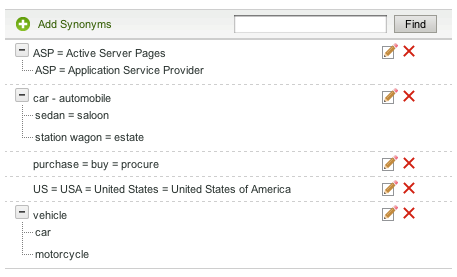

# 사전 정보{#about-dictionaries}

사전을 사용하여 사전 모음과 연관된 동의어 및 HYPIREW를 관리할 수 있습니다.

## 사전 사용 {#concept_B8028B71EC8144669614C64578EDB034}

동의어는 바지, 청바지, 바지, 바지, 바지, 바지 등 동일하거나 유사한 의미를 갖거나, 구매, 구입, 구입, 주문 등을 포함하는 단어입니다.

HYPIREW는 단방향 동의어이며 동의어가 부적절할 때 해결 방법을 제공합니다. 예를 들어 의류 소매 사이트의 상위 검색어는 &quot;팬츠&quot;입니다. 하지만 청바지는 검색 결과에 표시되지 않습니다. 이러한 경우, 최면 이의어를 사용하여 청바지와 바지를 연결할 수 있지만 청바지만 반환할 수 있도록 청바지를 검색할 수 있습니다. 또한 HYPIREE을 사용하여 중단된 제품 또는 경쟁 조건과 일치하는 제품을 제공합니다. 이 전략은 다른 검색 결과에 미치는 영향을 최소화합니다. 예를 들어 &quot;S2000&quot; 제품이 단종되고 &quot;S3000&quot;이 그 후속 제품인 경우 &quot;S3000&quot;에 대한 검색 결과에 &quot;S2000&quot; 결과가 포함되지 않도록 동의어 대신 최음 이의어를 사용합니다.

동의어 및 HYPIREE은 고객이 웹 페이지에 존재하지 않는 부정확한 일치 용어를 입력할 때 관련 검색 결과를 찾을 수 있도록 도와줍니다. 예를 들어 웹 사이트 전체에서 &quot;pants&quot;라는 단어를 사용하는 경우 &quot;pants&quot; 및 &quot;bars&quot;를 함께 묶는 동의어를 만들 수 있습니다. 이 경우 고객이 &quot;바지&quot;를 검색하면 바지와 관련된 검색 결과가 반환됩니다.

동의어와 hypierear는 도메인 사전으로 그룹화됩니다. 특정 테마나 목적에 맞게 만든 특별한 사전입니다.

[사전 메뉴] 페이지에는 계정이 현재 정의한 모든 도메인 사전이 나열됩니다. 이 기본 페이지에서 도메인 사전의 이름을 변경하거나 편집, 삭제 또는 활성화 및 비활성화할 수 있습니다.

## 동의어 및 최면 표기법 이해 {#section_B459CCB850974F4FB16A14E489BBBEC0}

다음 이미지는 동의어와 동어 관계를 모두 가진 용어 그룹의 예입니다.

6개의 기본 동의어 관계는 명시적으로 정의됩니다. 각 용어는 등호(=)로 구분됩니다.

* &#39;차&#39;는 자동차의 동의어이다.
* 세단이란 살론의 동의어다.
* &#39;스테이션 웨건&#39;은 &#39;땅&#39;의 동의어다.
* &quot;ASP&quot;는 활성 서버 페이지 및 응용 프로그램 서비스 공급자의 동의어입니다.
* &quot;구매&quot;, &quot;구매&quot; 및 &quot;조달&quot;은 서로 동의어이다.
* &quot;미국&quot;, &quot;미국&quot; 그리고 &quot;미국&quot; 은 서로 동의어이다.

단일 단어가 포함된 행은 일반 동의어입니다. 확장 가능한 트리가 있는 행은 이음 가능한 관계를 형성합니다. 이 예에서 두 번째 트리는 세단, 세단, 사룬, 스테이션 웨건, 그리고 사유지를 차나 자동차의 차음이라고 정의한다. 반대로, 자동차와 자동차는 나무에 있는 나머지 용어에 지나치게 민감하다.

세 번째 나무는 자동차와 오토바이의 하이브리어로 자동차나 오토바이를 정의합니다.

위의 &quot;US&quot; 동의어 예에서 보듯이 각 동의어에 둘 이상의 동의어 및/또는 다중 단어 확장을 포함할 수 있습니다. 단어 또는 머리글에 여러 가지 의미가 있는 경우 위의 &quot;ASP&quot; 예제와 같이 각 의미에 대한 동의어를 만듭니다. 여러 동의어를 추가하면 예를 들어 &quot;응용 프로그램 서비스 공급자&quot;에 대한 검색에서 &quot;활성 서버 페이지&quot;에 대한 검색 결과를 반환하지 않습니다.

[HYPIRET]는 다른 암호와 함께 확장되지 않습니다. HYPIREW는 동의어를 사용하여 한 단계 더 확장한다. 예를 들어 &quot;vehicle&quot;을 검색하면 &quot;car&quot; 및 &quot;automobile&quot;에 대한 결과가 반환되지만 &quot;seged&quot; 및 &quot;station wager&quot;에 대한 결과는 반환되지 않습니다.

## 사전을 통한 용어 검색 정보 {#section_28E7F80CE68D4481BBF4F51EED237C67}

추가하는 모든 사전에서 HYPILE 및 동의어를 검색할 수 있습니다. 이 기능은 여러 사전에 존재할 수 있는 특정 용어를 편집하거나 삭제하는 데 유용합니다. 일치하는 결과가 있는 모든 사전은 일치하는 단어 세트와 함께 표시됩니다. 쿼리가 1,000개 이상의 세트 또는 트리를 반환하면 처음 1,000개만 표시됩니다.

[사전 검색](../c-about-linguistics-menu/c-about-dictionaries.md#task_8D2BACC6F9B4487FA82367CBEDEE306F)을 참조하십시오.

[사전 편집](../c-about-linguistics-menu/c-about-dictionaries.md#task_7B349B2D385048D7A06E754FAB75316A)을 참조하십시오.

## 사전을 형태소 사전 {#section_B859E2E957674F558AC6F8D05A0ED190} 구성 정보

여러 개의 엔딩이 있을 수 있는 단어의 루트를 검색할 수 있는 형태인 형태소 형태는 다음 세 가지 모드 중 하나로 작동할 수 있습니다.도메인 사전, 기본 대체 단어 Forms 및 없음

[단어 및 언어 정보](../c-about-linguistics-menu/c-about-words-and-language.md#concept_CEB4B9576F3C4E2EB87B352EEC738D79)를 참조하십시오.

다음 정보에서는 특정 도메인 사전을 시스템 소스로 구성할 수 있도록 계정에 **[!UICONTROL Alternative Word Forms]**&#x200B;이(가) **[!UICONTROL Domain Dictionaries]**&#x200B;로 설정되어 있다고 가정합니다.

모든 도메인 사전을 &quot;형태소 사전&quot;으로 변환할 수 있습니다. 동의어와 hypiered는 예상대로 계속 확장되지만, 추가적인 부작용이 있습니다. 다른 사전에서 발견되는 공통되는 용어나 심지어 그 자체로도 단어 그룹을 해당 동의어 또는 HYPI에 병합합니다. 당신은 이것을 또 다른 단어 확장이라고 생각할 수 있다.

문제 해결 없이, 동의어 및 HYPIREE은 자세한 내용과 완료되어야 하며 각 관련 단어를 구성원으로 나열해야 합니다.

다음은 동의어의 예이며 형태소 노출을 보여 주는 예입니다.

* 동의어:jog = 실행
* &quot;jog&quot;에 대한 쿼리는 &quot;running&quot; 및 &quot;jog&quot;라는 단어가 있는 문서를 생성합니다.
* &quot;실행 중&quot;에 대한 쿼리는 &quot;조그&quot;와 동일한 문서를 생성합니다.
* &quot;jog&quot; 및 &quot;running&quot;이 없는 웹 페이지이지만 &quot;runs&quot; 및 &quot;run&quot;과 같은 다른 단어 양식이 쿼리 결과에서 누락됩니다.

이 예제에서 쿼리 단어는 특정 동의어 또는 최면에 속하는 멤버가 아니면 확장되지 않습니다.

다음은 동의어 및 형태소 분석의 예입니다.

* 동의어:jog = 실행
* 형태소 사전의 동의어 항목:runs = run
* &quot;jog&quot; 또는 &quot;running&quot;에 대한 쿼리는 &quot;runs&quot;, &quot;running&quot;, &quot;run&quot; 및 &quot;jog&quot;라는 단어가 있는 모든 웹 페이지를 반환합니다.
* &quot;runs&quot; 및 &quot;run&quot;에 대한 쿼리는 동일하거나 유사한 결과를 반환합니다.

이 예에서, 형태소 사전의 동의어는 최소한 하나의 용어가 공통적인 다른 사전에서 동등한 단어 그룹을 다른 동의어나 최면에 모두 병합할 수 있습니다.

단어가 너무 많은 사전을 지정하면 성과 파급력을 얻을 수 있습니다. 도메인 사전을 형태소 사전으로 제한적으로 지정해야 합니다. 형태소 분석은 검색 시간 동안 예상치 못한 단어 확장을 만들 수 있으며 디버깅 및 단어 확장 추적 프로세스를 복잡하게 만들 수 있습니다.

[사전 구성을 형태소 사전](../c-about-linguistics-menu/c-about-dictionaries.md#task_541E8453A12F4A8E89CF6F595469F074)으로 참조하십시오.

## 새 사전 {#task_F31AC6723E894C4F91D12AB2A4CEE9FB} 추가

고객이 관련 검색 결과를 찾는 데 도움이 되도록 동의어 및 HYPIERE의 새 사전을 추가할 수 있습니다. 이 기능은 고객이 웹 페이지에 존재하지 않을 수 있는 부정확한 일치 용어를 입력할 때 특히 유용합니다.

[새 비즈니스 규칙 추가](../c-about-rules-menu/c-about-business-rules.md#task_BD3B31ED48BB4B1B8F1DCD3BFA2528E7)를 참조하십시오.

**새 사전을 추가하려면**

1. 제품 메뉴에서 **[!UICONTROL Linguistics]** > **[!UICONTROL Dictionaries]**&#x200B;을 클릭합니다.
1. **[!UICONTROL Dictionary Menu]** 페이지에서 **[!UICONTROL Add New Dictionary]**&#x200B;을 클릭합니다.
1. **[!UICONTROL Dictionary]** 페이지의 **[!UICONTROL Name]** 필드에 새 사전의 이름을 입력합니다.
1. 클릭 **[!UICONTROL Add Synonyms]**.
1. **[!UICONTROL Add Terms]** 대화 상자에서 다음 중 하나를 수행합니다.

   * 동의어를 추가하려면 기본 텍스트 필드에 등호(=)로 각 단어나 구를 구분하여 두 개 이상의 용어를 입력합니다. 예를 들어, pants = bars = slack.
   * HYPIERYRE를 추가하려면 주 텍스트 필드에 하이퍼링크 용어를 입력합니다. **[!UICONTROL Add Hyponym]**&#x200B;을 클릭한 다음 입력한 하이퍼위와 관련된 키워드어를 입력합니다. 예를 들어, &quot;세단&quot;, &quot;saloon&quot;, &quot;스테이션 wagon&quot; 및 &quot;estate&quot;는 아래에서 보듯이 &quot;car&quot; 및 &quot;automobiles&quot;(둘 다 하이퍼닉스)의 하이프레임을 사용할 수 있습니다.

      

      키워드어 항목도 &quot;세단&quot; 및 &quot;사룬&quot;과 같은 동의어를 만들 수 있습니다.

1. 클릭 **[!UICONTROL Save]**.
1. 다음 중 하나를 수행하십시오.

   * 4-6단계를 반복하여 더 많은 동의어 및 HYPIERE를 추가합니다.
   * 다음 단계.

1. 변경 결과를 미리 보려면 **[!UICONTROL regenerate your staged site index]**&#x200B;을 클릭하여 스테이지된 웹 사이트 인덱스를 다시 작성합니다.

   라이브 또는 스테이징된 웹 사이트의 전체 인덱스 실행...을 참조하십시오.](../c-about-index-menu/c-about-full-index.md#task_F7FE04D8A1654A7787FCCA31B45EB42D).[

   라이브 또는 스테이징된 웹 사이트의 증분 인덱스 실행 중...을 참조하십시오.](../c-about-index-menu/c-about-incremental-index.md#task_9BFB6157F3884B2FAECB7E0E9CA318CB).[
1. (선택 사항) 제품 메뉴에서 **[!UICONTROL Linguistics]** > **[!UICONTROL Dictionaries]**&#x200B;을 클릭한 다음 다음 다음 중 하나를 수행합니다.

   * **[!UICONTROL History]**&#x200B;을 클릭하여 변경한 내용을 되돌립니다.

      [작업 내역 옵션 사용](../t-using-the-history-option.md#task_70DD3F87A67242BBBD2CB27156F43002)을 참조하십시오.

   * 클릭 **[!UICONTROL Live]**.

      [라이브 설정 보기](../c-about-staging.md#task_401A0EBDB5DB4D4CA933CBA7BECDC10F)를 참조하십시오.

   * 클릭 **[!UICONTROL Push Live]**.

      [스테이지 설정 라이브 푸시](../c-about-staging.md#task_44306783B4C0408AAA58B471DAF2D9A4)를 참조하십시오.

## 사전 {#task_EC282EA0846942F6913918EA8218220B} 활성화 또는 비활성화

각 단어의 관계는 웹 사이트를 색인화할 때 생성됩니다. 다음 인덱싱 작업 전에 추가한 모든 사전을 켜거나 끌 수 있습니다.

**사전을 활성화 또는 비활성화하려면**

1. 제품 메뉴에서 **[!UICONTROL Linguistics]** > **[!UICONTROL Dictionaries]**&#x200B;을 클릭합니다.
1. **[!UICONTROL Dictionary Menu]** 페이지의 테이블의 **[!UICONTROL Enabled]** 열에서 다음 중 하나를 수행합니다.

   * 활성화할 사전 상자에서 색인을 설정합니다.
   * 비활성화할 사전의 상자를 선택 취소하고 인덱싱하지 마십시오.

1. 클릭 **[!UICONTROL Save Changes]**.
1. 변경 결과를 미리 보려면 **[!UICONTROL regenerate your staged site index]**&#x200B;을 클릭하여 스테이지된 웹 사이트 인덱스를 다시 작성합니다.

   라이브 또는 스테이징된 웹 사이트의 전체 인덱스 실행...을 참조하십시오.](../c-about-index-menu/c-about-full-index.md#task_F7FE04D8A1654A7787FCCA31B45EB42D).[

   라이브 또는 스테이징된 웹 사이트의 증분 인덱스 실행 중...을 참조하십시오.](../c-about-index-menu/c-about-incremental-index.md#task_9BFB6157F3884B2FAECB7E0E9CA318CB).[
1. (선택 사항) 제품 메뉴에서 **[!UICONTROL Linguistics]** > **[!UICONTROL Dictionaries]**&#x200B;을 클릭한 다음 다음 다음 중 하나를 수행합니다.

   * **[!UICONTROL History]**&#x200B;을 클릭하여 변경한 내용을 되돌립니다.

      [작업 내역 옵션 사용](../t-using-the-history-option.md#task_70DD3F87A67242BBBD2CB27156F43002)을 참조하십시오.

   * 클릭 **[!UICONTROL Live]**.

      [라이브 설정 보기](../c-about-staging.md#task_401A0EBDB5DB4D4CA933CBA7BECDC10F)를 참조하십시오.

   * 클릭 **[!UICONTROL Push Live]**.

      [스테이지 설정 라이브 푸시](../c-about-staging.md#task_44306783B4C0408AAA58B471DAF2D9A4)를 참조하십시오.

## 사전 편집 {#task_7B349B2D385048D7A06E754FAB75316A}

특정 사전을 구성하는 동의어 및 동음 이의어 그룹을 편집하거나 삭제할 수 있습니다.

<!-- 

t_editing_a_dictionary.xml

 -->

또한 **[!UICONTROL Find]**&#x200B;을 사용하여 모든 사전을 편집하거나 삭제할 특정 동의어와 HYPIERYRE를 찾을 수도 있습니다.

**사전을 편집하려면**

1. 제품 메뉴에서 **[!UICONTROL Linguistics]** > **[!UICONTROL Dictionaries]**&#x200B;을 클릭합니다.
1. 다음 중 하나를 수행하십시오.

   * [!DNL Dictionary Menu] 페이지의 표에서 용어를 편집하거나 삭제할 단일 사전의 하이퍼링크된 이름을 클릭합니다.
   * [!DNL Dictionary Menu] 페이지의 **[!UICONTROL Find]** 텍스트 필드에 모든 사전에서 찾을 용어를 입력한 다음 **[!UICONTROL Find]**&#x200B;를 클릭합니다.

      [!DNL Find in Dictionaries] 페이지에서 함께 제공되는 드롭다운 목록을 사용하여 원하는 구체화 옵션을 설정합니다.

      <table> 
      <thead> 
        <tr> 
        <th colname="col1" class="entry"> 
옵션 
 </th> 
        <th colname="col2" class="entry"> 
설명 
 </th> 
        </tr> 
      </thead>
      <tbody> 
        <tr> 
        <td colname="col1"> 
찾기 
 </td> 
        <td colname="col2"> 
모든 사전에서 검색할 용어를 입력할 수 있습니다. 
 </td> 
        </tr> 
        <tr> 
        <td colname="col1"> 
일치 드롭다운 목록 
 </td> 
        <td colname="col2"> 
다음 4가지 일치 유형 중에서 선택할 수 있습니다. 
        <ul id="ul_D656F159677946938050115F610EEF4B"> 
        <li id="li_2D6B302E021A4CE7A47F028812633EDC">  정확히 일치   
쿼리는 동음이의어 또는 동의어와 정확히 일치해야 합니다. 
 </li> 
        <li id="li_30AD5976E43041E98190F4757E821092">  텍스트 포함   
쿼리에는 하위 문자열 일치만 필요합니다.동음이의어 안의 일치. 
 </li> 
        <li id="li_9BF911EFB54345BB82679BDE51DDF8AF">  다음으로 시작  
쿼리는 각 동음이의어 및 동의어의 시작 부분에만 대응됩니다. 
 </li> 
        <li id="li_CB791C7F5B5A4496B329ED505E7D97BC">  단어 일치   
쿼리는 동의어 또는 최언어의 각 단어와 비교되지만, 정확히 일치해야 합니다. 
 </li> 
        </ul> 
 </td> 
        </tr> 
        <tr> 
        <td colname="col1"> 
활성화된 사전/비활성화된 사전 드롭다운 목록 
 </td> 
        <td colname="col2"> 
다음 옵션 중에서 선택할 수 있습니다. 
        <ul id="ul_EBBD3F3A2D854952A35CBDDBECB40958"> 
        <li id="li_7F5654C284BE485EAC9B000A663C6C60">  사용 및 사용 안 함 사전   
활성화된 사전 및 비활성화된 사전 모두에서 지정된 용어를 검색합니다. 
 </li> 
        <li id="li_4A83EECF38044287A923EC0AAF639079">  활성화된 사전만   
활성화된 사전을 검색하는 것은 현재 색인을 디버깅하는 데만 유용합니다. 
 </li> 
        </ul> 
 
<a href="../c-about-linguistics-menu/c-about-dictionaries.md#task_EC282EA0846942F6913918EA8218220B" type="task" format="dita" scope="local"> 사전 </a> 활성화 또는 비활성화하기를 참조하십시오. 
 </td> 
        </tr> 
        <tr> 
        <td colname="col1"> 
단계/라이브 드롭다운 목록 
 </td> 
        <td colname="col2"> 
다음 옵션 중에서 선택할 수 있습니다. 
        <ul id="ul_BD0733A30E6B470E942B21F499A4373B"> 
        <li id="li_F9A8C39C22EA4FBF86536F5924ED973C">  스테이지/라이브 사전   
단계 및 라이브 사전에서 지정된 용어를 검색합니다. 그러나 사전 단계 버전이 있는 경우에만 해당 사전 단계 버전을 검색합니다. 단계 버전이 없는 경우 사전의 라이브 버전을 검색합니다. 
 </li> 
        <li id="li_DB0944DB18564269AA10676BDFDB0460">  라이브 사전   
라이브 사전에서 지정된 용어만 검색합니다. 
 </li> 
        </ul> 
 </td> 
        </tr> 
      </tbody> 
      </table>

1. 테이블에서 다음 중 하나를 수행합니다.

   * 업데이트할 용어와 연결된 을 클릭합니다. **[!UICONTROL Edit Terms]** 대화 상자에서 원하는 용어를 변경합니다. 완료되면 **[!UICONTROL Save]**&#x200B;을 클릭합니다.

   * 제거할 용어와 연결된 을 클릭합니다. **[!UICONTROL Delete Terms]** 대화 상자에서 **[!UICONTROL Delete]**&#x200B;을 클릭합니다. 올바른 용어를 삭제해야 합니다.삭제 확인 대화 상자가 없습니다.

1. 변경 결과를 미리 보려면 **[!UICONTROL regenerate your staged site index]**&#x200B;을 클릭하여 스테이지된 웹 사이트 인덱스를 다시 작성합니다.

   라이브 또는 스테이징된 웹 사이트의 전체 인덱스 실행...을 참조하십시오.](../c-about-index-menu/c-about-full-index.md#task_F7FE04D8A1654A7787FCCA31B45EB42D).[

   라이브 또는 스테이징된 웹 사이트의 증분 인덱스 실행 중...을 참조하십시오.](../c-about-index-menu/c-about-incremental-index.md#task_9BFB6157F3884B2FAECB7E0E9CA318CB).[
1. (선택 사항) 제품 메뉴에서 **[!UICONTROL Linguistics]** > **[!UICONTROL Dictionaries]**&#x200B;을 클릭한 다음 다음 다음 중 하나를 수행합니다.

   * **[!UICONTROL History]**&#x200B;을 클릭하여 변경한 내용을 되돌립니다.

      [작업 내역 옵션 사용](../t-using-the-history-option.md#task_70DD3F87A67242BBBD2CB27156F43002)을 참조하십시오.

   * 클릭 **[!UICONTROL Live]**.

      [라이브 설정 보기](../c-about-staging.md#task_401A0EBDB5DB4D4CA933CBA7BECDC10F)를 참조하십시오.

   * 클릭 **[!UICONTROL Push Live]**.

      [스테이지 설정 라이브 푸시](../c-about-staging.md#task_44306783B4C0408AAA58B471DAF2D9A4)를 참조하십시오.

## 사전 이름 바꾸기 {#task_7F1F372B337B4853BFA2A60AD267B092}

추가한 사전의 이름을 변경할 수 있습니다.

<!-- 

t_renaming_a_dictionary.xml

 -->

**[!UICONTROL Alternate Word Forms]** 옵션을 **[!UICONTROL Words & Language]**&#x200B;에서 **[!UICONTROL Domain Dictionaries]**&#x200B;으로 설정하면 **[!UICONTROL Rename]** 대신 **[!UICONTROL Configure]** 옵션이 사용됩니다.

[단어 및 언어 정보](../c-about-linguistics-menu/c-about-words-and-language.md#concept_CEB4B9576F3C4E2EB87B352EEC738D79)를 참조하십시오.

**사전의 이름을 변경하려면**

1. 제품 메뉴에서 **[!UICONTROL Linguistics]** > **[!UICONTROL Dictionaries]**&#x200B;을 클릭합니다.
1. **[!UICONTROL Dictionary Menu]** 페이지의 테이블의 **[!UICONTROL Actions]** 열에서 다음 중 하나를 수행합니다.

   * 이름을 변경할 연관된 사전의 경우 **[!UICONTROL Rename]**&#x200B;을 클릭합니다.

      **[!UICONTROL Rename Dictionary]** 대화 상자에서 다음을 수행합니다. **[!UICONTROL Name]** 필드에 사전의 새 이름을 입력합니다.

      클릭 **[!UICONTROL Rename File]**.

   * 이름을 변경할 연관된 사전의 경우 **[!UICONTROL Configure]**&#x200B;을 클릭합니다.

      **[!UICONTROL Configure Dictionary]** 대화 상자에서 다음을 수행합니다. **[!UICONTROL Name]** 필드에 사전의 새 이름을 입력합니다.

      클릭 **[!UICONTROL Save Configuration]**.

1. (선택 사항) 다음 중 하나를 수행합니다.

   * **[!UICONTROL History]**&#x200B;을 클릭하여 변경한 내용을 되돌립니다.

      [작업 내역 옵션 사용](../t-using-the-history-option.md#task_70DD3F87A67242BBBD2CB27156F43002)을 참조하십시오.

   * 클릭 **[!UICONTROL Live]**.

      [라이브 설정 보기](../c-about-staging.md#task_401A0EBDB5DB4D4CA933CBA7BECDC10F)를 참조하십시오.

   * 클릭 **[!UICONTROL Push Live]**.

      [스테이지 설정 라이브 푸시](../c-about-staging.md#task_44306783B4C0408AAA58B471DAF2D9A4)를 참조하십시오.

## 사전을 형태소 사전 {#task_541E8453A12F4A8E89CF6F595469F074}으로 구성

검색에서 단어 형태소 분석을 활용하도록 사전을 고급 형태소 분석 모드로 설정할 수 있습니다.

<!-- 

t_configuring_a_dictionary_as_a_stemming_dictionary.xml

 -->

이러한 모드는 고객이 검색하는 것과 변형이 일치하는 웹 페이지를 반환합니다.

[사전 정보](../c-about-linguistics-menu/c-about-dictionaries.md#concept_B8028B71EC8144669614C64578EDB034)를 참조하십시오.

[단어 및 언어 정보](../c-about-linguistics-menu/c-about-words-and-language.md#concept_CEB4B9576F3C4E2EB87B352EEC738D79)를 참조하십시오.

**사전을 형태소 사전으로 구성하려면**

1. 제품 메뉴에서 **[!UICONTROL Linguistics]** > **[!UICONTROL Words & Language]**&#x200B;을 클릭합니다.
1. [!DNL Words & Languages] 페이지의 **[!UICONTROL Alternate Words Forms]** 드롭다운 목록에서 **[!UICONTROL Domain Dictionaries]**&#x200B;를 선택합니다.

   형태소 사전(아래 7단계 참조)으로 설정된 모든 도메인 사전은 대체 단어 양식의 소스로 사용됩니다.

1. 클릭 **[!UICONTROL Save Changes]**.
1. 제품 메뉴에서 **[!UICONTROL Linguistics]** > **[!UICONTROL Dictionaries]**&#x200B;을 클릭합니다.
1. [!DNL Dictionaries Menu] 페이지의 테이블의 **[!UICONTROL Actions]** 열에서 스테밍 사전으로 설정할 연관된 사전의 **[!UICONTROL Configure]**&#x200B;를 클릭합니다.
1. **[!UICONTROL Configure Dictionary]** 대화 상자의 **[!UICONTROL Advanced Stemming Mode]** 드롭다운 목록에서 **[!UICONTROL Yes]**&#x200B;를 선택합니다.
1. 클릭 **[!UICONTROL Save Configuration]**.
1. **[!UICONTROL regenerate your staged site index]**&#x200B;을 클릭하여 스테이지된 웹 사이트 인덱스를 다시 작성합니다.

   라이브 또는 스테이징된 웹 사이트의 전체 인덱스 실행...을 참조하십시오.](../c-about-index-menu/c-about-full-index.md#task_F7FE04D8A1654A7787FCCA31B45EB42D).[

   라이브 또는 스테이징된 웹 사이트의 증분 인덱스 실행 중...을 참조하십시오.](../c-about-index-menu/c-about-incremental-index.md#task_9BFB6157F3884B2FAECB7E0E9CA318CB).[
1. (선택 사항) 제품 메뉴에서 **[!UICONTROL Linguistics]** > **[!UICONTROL Dictionaries]**&#x200B;을 클릭한 다음 다음 다음 중 하나를 수행합니다.

   * **[!UICONTROL History]**&#x200B;을 클릭하여 변경한 내용을 되돌립니다.

      [작업 내역 옵션 사용](../t-using-the-history-option.md#task_70DD3F87A67242BBBD2CB27156F43002)을 참조하십시오.

   * 클릭 **[!UICONTROL Live]**.

      [라이브 설정 보기](../c-about-staging.md#task_401A0EBDB5DB4D4CA933CBA7BECDC10F)를 참조하십시오.

   * 클릭 **[!UICONTROL Push Live]**.

      [스테이지 설정 라이브 푸시](../c-about-staging.md#task_44306783B4C0408AAA58B471DAF2D9A4)를 참조하십시오.

## 사전 검색 중 {#task_8D2BACC6F9B4487FA82367CBEDEE306F}

사이트 검색/머천다이징에 추가된 모든 사전에서 HYPILE 및 동의어를 검색할 수 있습니다.

<!-- 

t_searching_across_dictionaries.xml

 -->

이 기능은 여러 사전에 존재할 수 있는 특정 용어를 편집하거나 삭제하는 데 유용합니다. 일치하는 결과가 있는 모든 사전은 일치하는 단어 세트와 함께 표시됩니다. 쿼리가 1,000개 이상의 세트 또는 트리를 반환하면 처음 1,000개만 표시됩니다.

[사전 편집](../c-about-linguistics-menu/c-about-dictionaries.md#task_7B349B2D385048D7A06E754FAB75316A)을 참조하십시오.

**사전을 검색하려면**

1. 제품 메뉴에서 **[!UICONTROL Linguistics]** > **[!UICONTROL Dictionaries]**&#x200B;을 클릭합니다.
1. [!DNL Dictionary Menu] 페이지의 **[!UICONTROL Find]** 텍스트 필드에 모든 사전에서 찾을 용어를 입력한 다음 **[!UICONTROL Find]**&#x200B;를 클릭합니다.
1. [!DNL Find in Dictionaries] 페이지에서 함께 제공되는 드롭다운 목록을 사용하여 원하는 세부 사항 옵션을 설정합니다.

   [사전 편집](../c-about-linguistics-menu/c-about-dictionaries.md#task_7B349B2D385048D7A06E754FAB75316A)을 참조하십시오.
1. (선택 사항) **[!UICONTROL Show]** 드롭다운을 사용하여 페이지당 표시할 최대 결과 수를 지정합니다.

## 사전 삭제 중 {#task_DBAAEE624BC14D2590444B0B7869ECCA}

더 이상 필요하거나 사용하지 않는 사전을 삭제할 수 있습니다.

<!-- 

t_deleting_a_dictionary.xml

 -->

라이브인 사전을 삭제하는 경우 삭제하도록 스테이징됩니다. 스테이징된 사전을 삭제하면 즉시 삭제됩니다.

더 이상 필요 없는 사전을 삭제해야 합니다.삭제를 되돌릴 수 있는 기록 기능이 없습니다.

**사전을 삭제하려면**

1. 제품 메뉴에서 **[!UICONTROL Linguistics]** > **[!UICONTROL Dictionaries]**&#x200B;을 클릭합니다.
1. [!DNL Dictionary Menu] 페이지의 테이블의 **[!UICONTROL Actions]** 열에서 제거할 연관된 사전의 **[!UICONTROL Delete]**&#x200B;를 클릭합니다.
1. **[!UICONTROL Delete Dictionary]** 대화 상자에서 다음을 수행합니다. **[!UICONTROL Yes]**&#x200B;을 클릭하여 삭제를 확인합니다.
1. (선택 사항) 라이브 사전을 삭제한 경우 다음 중 하나를 수행합니다.

   * 클릭 **[!UICONTROL Live]**.

      [라이브 설정 보기](../c-about-staging.md#task_401A0EBDB5DB4D4CA933CBA7BECDC10F)를 참조하십시오.

   * 클릭 **[!UICONTROL Push Live]**.

      [스테이지 설정 라이브 푸시](../c-about-staging.md#task_44306783B4C0408AAA58B471DAF2D9A4)를 참조하십시오.

