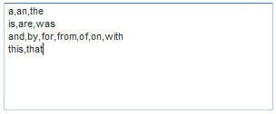
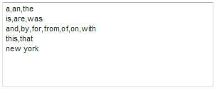

# 제외된 단어 정보{#about-excluded-words}

제외된 단어를 사용하여 검색 결과 밖으로 나가려는 자주 사용하는 구문 및 일반 단어(예: &quot;a&quot; 및 &quot;the&quot;)를 지정할 수 있습니다.

## 제외된 단어 사용 {#concept_9DB67BD2F0DC43AC88741003D9F39812}

[검색 정보](../c-about-settings-menu/c-about-searching-menu.md#concept_207105CF26B1448F8A3D223787C56AB8)도 참조하십시오.

제외된 단어 없이 이러한 단어가 포함된 검색으로 인해 관련이 없는 수많은 결과가 식별될 수 있습니다. 단어 및 구를 제외하는 경우 지정한 제외된 용어와 일치하는 검색 결과가 생략됩니다. 검색 쿼리에 제외된 단어가 포함되어 있으면 문서를 찾는 데 제외되지 않은 단어만 사용됩니다.

제외된 검색어는 검색 결과에 강조 표시되지 않습니다. 하지만 각 결과의 관련성 점수는 제외된 단어의 영향을 받습니다. 즉, 문서를 찾을 때 제외되는 단어는 무시되지만 검색 결과 페이지에서 문서의 등급을 매길 때에도 여전히 사용됩니다. 고객이 제외된 단어 설정(또는 이러한 설정에 대한 변경)의 효과를 사용할 수 있으려면 먼저 사이트 색인을 다시 만들어야 합니다.

검색 결과에서 제외할 단어를 입력하면 단어 또는 구를 쉼표로 구분합니다. 한 줄에 하나 이상의 제외 단어를 입력할 수 있습니다. 다음은 각 줄에 제외되고 쉼표로 구분되는 제외되는 단어의 예입니다.

고객이 &quot;미국의 미국&quot;을 검색하는 경우 위에서 제외된 단어 목록의 예를 사용하면 &quot;the&quot; 및 &quot;of&quot; 단어가 검색에서 제외됩니다. 대신 &quot;united&quot;, &quot;states&quot; 및 &quot;america&quot;라는 단어가 포함된 모든 페이지를 검색합니다. 단어 &quot;of&quot; 또는 &quot;the&quot;만 포함된 페이지는 표시되지 않습니다.

일부 사이트에는 대부분의 페이지에 특정 구문이 포함되어 있습니다. 예를 들어 New York City 관광 관련 웹 사이트에는 모든 페이지의 제목에 New York이라는 단어가 포함될 수 있습니다. 제외 목록에 이 구문 및 이와 비슷한 다른 구문을 추가하는 것이 좋습니다.

구문이 제외되면 해당 구문을 구성하는 개별 단어가 여전히 검색어로 사용됩니다. 방문자가 정확한 단어를 검색하는 경우에만 제외된 구문의 정확한 순서로 검색 결과에서 제외된 구문입니다. 위의 예를 사용하여 고객이 &quot;뉴욕 발레&quot;를 검색하면 &quot;the&quot; 및 &quot;new york&quot; 구문은 제외됩니다.&quot;ballet&quot;이라는 단어가 포함된 페이지만 검색 결과로 반환됩니다. 반면 &#39;새 건물&#39;이나 &#39;뉴욕 공작&#39;은 여전히 &#39;뉴욕&#39;이나 &#39;요크&#39;라는 단어가 들어 있는 페이지들을 찾습니다.

## 제외된 단어 구성 {#task_60BF6BB7A66C48479D2BBB32C0F38CDE}

자주 사용하는 구문 및 일반 단어를 검색 결과에서 제외할 수 있습니다.

한 줄에 하나 이상의 단어를 입력할 수 있습니다. 다음 예제와 같이 각 단어는 쉼표로 구분합니다.

고객의 검색에 있는 모든 단어가 제외되는 단어를 선택한 경우 검색 결과를 표시하도록 선택할 수 있습니다. 예를 들어 단어 &quot;the&quot;를 제외하고 고객이 &quot;the&quot;만 검색하도록 선택한 경우 검색 결과에 &quot;the&quot;라는 단어가 포함된 페이지가 표시됩니다. &quot;the&quot; 단어가 제외되어도 이 결과는 그대로 유지됩니다. 이 옵션을 선택하지 않으면 고객은 검색 결과를 얻지 못합니다. 검색에 제외되지 않은 단어가 하나 이상 포함된 경우 이 설정은 적용되지 않습니다.

**제외된 단어를 구성하려면**

1. 제품 메뉴에서 **[!UICONTROL Linguistics]** > **[!UICONTROL Excluded Words]**&#x200B;을 클릭합니다.
1. [!DNL Excluded Words] 페이지의 **[!UICONTROL Words and Phrases]** 텍스트 필드에 검색 결과에서 제외할 단어를 입력합니다.
1. (선택 사항) **[!UICONTROL Show results when all words in the query are excluded words]**&#x200B;을 클릭합니다.

   고객의 검색에서 모든 단어가 제외 단어인 경우 검색을 수행하는 데 모든 단어가 함께 사용됩니다.
1. 클릭 **[!UICONTROL Save Changes]**.
1. 변경 결과를 미리 보려면 **[!UICONTROL regenerate your staged site index]**&#x200B;을 클릭하여 스테이지된 웹 사이트 인덱스를 다시 작성합니다.

   라이브 또는 스테이징된 웹 사이트의 전체 인덱스 실행...을 참조하십시오.[.](../c-about-index-menu/c-about-full-index.md#task_F7FE04D8A1654A7787FCCA31B45EB42D)

   라이브 또는 스테이징된 웹 사이트의 증분 인덱스 실행 중...을 참조하십시오.[.](../c-about-index-menu/c-about-incremental-index.md#task_9BFB6157F3884B2FAECB7E0E9CA318CB)
1. (선택 사항) 제품 메뉴에서 **[!UICONTROL Linguistics]** > **[!UICONTROL Excluded Words]**&#x200B;을 클릭한 다음 다음 다음 중 하나를 수행합니다.

   * **[!UICONTROL History]**&#x200B;을 클릭하여 변경한 내용을 되돌립니다.

      [작업 내역 옵션 사용](../t-using-the-history-option.md#task_70DD3F87A67242BBBD2CB27156F43002)을 참조하십시오.

   * 클릭 **[!UICONTROL Live]**.

      [라이브 설정 보기](../c-about-staging.md#task_401A0EBDB5DB4D4CA933CBA7BECDC10F)를 참조하십시오.

   * 클릭 **[!UICONTROL Push Live]**.

      [스테이지 설정 라이브 푸시](../c-about-staging.md#task_44306783B4C0408AAA58B471DAF2D9A4)를 참조하십시오.

