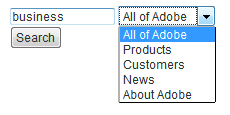
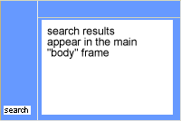

# 양식 검색{#search-forms}

## 검색 양식에서 컬렉션 사용 {#reference_5A079AEEEFB84457892EF0870D0605C3}

컬렉션을 통해 고객은 웹 사이트의 특정 영역을 검색할 수 있습니다. 드롭다운 목록 구현 또는 확인란 목록에 따라 고객이 단일 컬렉션 또는 여러 컬렉션을 검색할 수 있도록 할 수 있습니다.

컬렉션 [정보를 참조하십시오](../c-about-settings-menu/c-about-searching-menu.md#concept_62E42ACE53D54EEE9273433B86259127).

다음 예제는 4개의 서로 다른 컬렉션 이름과 이들이 다루는 웹 사이트의 관련 영역을 보여줍니다.

<table> 
 <thead> 
  <tr> 
   <th colname="col1" class="entry"> <p>컬렉션 이름 </p> </th> 
   <th colname="col2" class="entry"> <p> </p> </th> 
  </tr> 
 </thead>
 <tbody> 
  <tr> 
   <td colname="col1"> <p>제품 </p> </td> 
   <td colname="col2"> <p> 
     <ul id="ul_7AE70789C0914EBFBCCC7695C6F53B9E"> 
      <li id="li_72525BAA34E2442D86152F2FD8CA83D5"> https://www.mycompany.com/products.htm </li> 
      <li id="li_5CA4152239124BDBB251E6C94B15D45B"> https://www.mycompany.com/publish/ </li> 
      <li id="li_6E266736B3494696A3AFD841C4AFEC57"> https://www.mycompany.com/search/ </li> 
     </ul> </p> </td> 
  </tr> 
  <tr> 
   <td colname="col1"> <p>고객 </p> </td> 
   <td colname="col2"> <p>https://www.mycompany.com/customers/ </p> </td> 
  </tr> 
  <tr> 
   <td colname="col1"> <p>뉴스 </p> </td> 
   <td colname="col2"> <p>https://www.mycompany.com/news/ </p> </td> 
  </tr> 
  <tr> 
   <td colname="col1"> <p>Adobe 정보 </p> </td> 
   <td colname="col2"> <p>https://www.mycompany.com/company/ </p> </td> 
  </tr> 
 </tbody> 
</table>

드롭다운 검색 양식 인터페이스를 사용하면 하나의 컬렉션을 선택할 수 있으며 다음과 같이 표시됩니다.



드롭다운 검색 양식은 다음 HTML 코드로 생성됩니다.

```
<select name="sp_k"> 
<option value="">All of Adobe</option> 
<option value="Products">Products</option> 
<option value="Customers">Customers</option> 
<option value="News">News</option> 
<option value="About Adobe">About Adobe</option> 
</select>
```

또는 방문자가 여러 컬렉션을 선택할 수 있도록 검색 양식에서 확인란 그룹을 사용할 수 있습니다.


확인란 검색 양식이 다음과 같은 HTML 코드로 생성됩니다.

```
<input type="checkbox" name="sp_k" value="">All of Adobe<br> 
<input type="checkbox" name="sp_k" value="Products">Products<br> 
<input type="checkbox" name="sp_k" value="Customers">Customers<br> 
<input type="checkbox" name="sp_k" value="News">News<br> 
<input type="checkbox" name="sp_k" value="About Adobe">About Adobe<br>
```

## Search results {#section_BBDD5B44E2B349BC88D937F44583D350}

검색 템플릿 태그는 검색 결과에서 컬렉션 목록 상자 HTML을 `<search-input-collections>` 생성하고 검색에 지정된 컬렉션을 자동으로 선택합니다. 대신 확인란을 생성하려면 다음과 같이 `<search-input>` `<input>` 태그 대신 태그를 사용하십시오.

```
<search-input type="checkbox" name="sp_k" value="">All of Adobe<br> 
<search-input type="checkbox" name="sp_k" value="Products">Products<br> 
<search-input type="checkbox" name="sp_k" value="Customers">Customers<br> 
<search-input type="checkbox" name="sp_k" value="News">News<br> 
<search-input type="checkbox" name="sp_k" value="About Adobe">About Adobe<br>
```

이 `<search-input>` 태그는 `<input>` 태그를 출력하며, 검색에 컬렉션이 지정된 경우 이 `checked` 속성을 포함합니다.

## 양식에 프레임 사용 {#reference_82CDDDA1E37042E4849EBF7EA05407C5}

프레임세트를 구성하여 사이트 검색/머천다이징을 사용할 수 있습니다.

HTML 프레임 및 HTML 프레임세트 요소에 대한 자세한 내용은 다음 URL을 참조하십시오.

[https://www.w3schools.com/html/html_frames.asp](https://www.w3schools.com/html/html_frames.asp)

사이트에서 프레임을 사용하는 경우 검색 결과 링크에 대한 대상 프레임을 지정할 수 있습니다. 기본 대상은 _self로, 현재 프레임 또는 브라우저 창에서 링크를 엽니다. 대신 사이트별 또는 브라우저 예약 대상을 지정할 수 있습니다.

* _top (browser-reserved) 결과 현재 브라우저 창에서 열려 현재 프레임을 모두 바꿉니다.
* _blank(browser-reserved) 결과 새 브라우저 창에 열립니다.
* _parent(browser-reserved) 결과 현재 프레임의 부모 프레임에서 열립니다.
* frame2(사이트별)는 &quot;frame2&quot;라는 프레임에서 열립니다. 프레임의 이름을 값으로 지정할 수 있습니다(예: main 또는 content).

사이트에서 프레임을 사용하지 않는 경우 기본 대상 이름을 변경하지 않을 가능성이 높습니다.

웹 사이트에 대한 사용자 지정 검색 결과 템플릿을 만드는 경우 태그의 `target` 속성을 사용하여 지정된 설정을 재정의할 수 `<search-link>` 있습니다.

프레임세트 구성 프로세스는 다음과 같습니다.

<table> 
 <thead> 
  <tr> 
   <th colname="col1" class="entry"> <p>프로세스 단계 </p> </th> 
   <th colname="col02" class="entry"> <p>프로세스 설명 </p> </th> 
   <th colname="col2" class="entry"> <p>링크 </p> </th> 
  </tr> 
 </thead>
 <tbody> 
  <tr> 
   <td colname="col1"> <p>1 </p> </td> 
   <td colname="col02"> <p>웹 페이지에서 원하는 프레임에 양식을 추가합니다. </p> </td> 
   <td colname="col2"> <p> <a href="#section_BAA8A502BB2243F8B5FF9783CDF2BFFD" type="section" format="dita" scope="local"> 검색 양식 코드를 프레임에 추가하는 중... </a> </p> </td> 
  </tr> 
  <tr> 
   <td colname="col1"> <p>2 </p> </td> 
   <td colname="col02"> <p>검색 결과 페이지의 대상 프레임을 설정합니다. </p> </td> 
   <td colname="col2"> <p> <a scope="local" href="#section_532CACB90888467093D95EACB64FDFA1" type="section" format="dita"> 검색 결과 페이지의 대상 프레임 설정 </a> </p> </td> 
  </tr> 
  <tr> 
   <td colname="col1"> <p>3 </p> </td> 
   <td colname="col02"> <p>검색 결과 페이지에서 만든 링크에 대한 대상을 설정합니다. </p> </td> 
   <td colname="col2"> <p> <a scope="local" href="#section_523248C5AC424D878321C21A23A5CD66" type="section" format="dita"> 검색 결과로 만든 링크의 대상을 설정하는 중... </a> </p> </td> 
  </tr> 
  <tr> 
   <td colname="col1"> <p>4 </p> </td> 
   <td colname="col02"> <p>내비게이션 프레임 페이지를 편집하여 색인이 되지 않도록 합니다. </p> </td> 
   <td colname="col2"> <p> <a scope="local" href="#section_C62E5F0EE1294D5EBD97E123E54433FC" type="section" format="dita"> 내비게이션 프레임 페이지를 편집하면 해당 페이지가 </a> </p> </td> 
  </tr> 
  <tr> 
   <td colname="col1"> <p>5 </p> </td> 
   <td colname="col02"> <p>검색 양식을 테스트합니다. </p> </td> 
   <td colname="col2"> <p> <a scope="local" href="../c-appendices/c-searchforms.md#section_43D8D4A7BF524DC480DFE5442F6A2E3C" type="section" format="dita"> 검색 양식 테스트 </a> </p> </td> 
  </tr> 
 </tbody> 
</table>

## 웹 페이지의 프레임에 검색 양식 코드 추가 {#section_BAA8A502BB2243F8B5FF9783CDF2BFFD}

1. 제품 메뉴에서 > **[!UICONTROL Design]** > **[!UICONTROL Auto-Complete]** > **[!UICONTROL Form Source]**&#x200B;을 클릭합니다.

   HTML 검색 양식 코드는 다음과 비슷합니다.

   ```
   <!-- Adobe Target HTML for [your customer name] --> 
   <form method="get" action="https://search.atomz.com/search/"> 
   <input size=15 name="sp_q"><br> 
   <input type=submit value="Search"> 
   <input type=hidden name="sp_a" value="[your account number]"> 
   </form>
   ```

1. 페이지에서 텍스트 필드에 표시되는 HTML 검색 양식 코드를 선택하고 복사합니다. [!DNL Standard Form Source]
1. 검색 양식 코드를 프레임세트에서 원하는 프레임에 붙여 넣습니다.

   아래 예에서 검색 양식 코드는 화면의 왼쪽에 있는 좁은 세로 프레임인 탐색 프레임에 붙여집니다.

   

## 검색 결과 페이지의 대상 프레임 설정 {#section_532CACB90888467093D95EACB64FDFA1}

검색 양식 코드를 위와 같이 세로 탐색 프레임에 삽입한 경우 큰 기본 프레임에 검색 결과를 표시할 수 있습니다. 이 예제에서는 기본 프레임 &quot;body&quot;를 호출하고 대상 프레임으로 설정합니다.



1. 결과 페이지의 대상 프레임을 지정하려면 다음 검색 양식 코드에서 다음 줄을 변경하여 대상 및 값을 양식에 추가합니다.

   `<form method="get" action="https://search.atomz.com/search/">`

   to the following:

   `<form target="body" method="get" action="https://search.atomz.com/search/">`

   양식 대상 값에 따옴표를 붙여야 합니다.

고객이 웹 사이트 검색을 수행하면 웹 페이지의 &quot;본문&quot; 프레임에 검색 결과가 나타납니다.

## 검색 결과 페이지에서 만든 링크에 대한 대상 설정 {#section_523248C5AC424D878321C21A23A5CD66}

템플릿을 직접 편집하여 대상 프레임을 설정할 수 있습니다.

검색 결과가 &quot;본문&quot; 프레임에도 나타날 경우 링크를 &quot;본문&quot; 프레임에서도 열도록 할 수 있습니다. 기본 설정인 대상 값이 동일한 프레임이므로 변경할 `"_self"` 필요가 없습니다.

결과 링크의 대상 프레임을 설정할 수도 있습니다. 다음은 수행할 수 있는 작업의 몇 가지 예입니다.

* 검색 결과 및 해당 링크에 대해 서로 다른 프레임을 지정하여 클릭한 각 결과가 별도의 프레임에서 열리는 동안 검색 결과가 자체 프레임에서 활성 상태로 유지됩니다.
* 검색 결과가 새 빈 창에 열리게 지정하여 이전 창이 원래 컨텐츠와 함께 활성 상태로 유지되도록 하고 검색 결과도 보존하도록 합니다.

대상 이름은 HTML에 지정된 프레임의 이름이거나 다음 HTML 기본값 중 하나일 수 있습니다.

* `target="_blank"` 이름이 지정되지 않은 새 창에서 링크를 엽니다.

* `target="_self"` 기본값. 검색 결과가 있는 동일한 창에서 링크를 엽니다. 이 경우 원래 검색 결과 창이 열립니다. 전역적으로 할당된 기본 대상을 무시하려면 이 옵션을 사용합니다.

* `target="_parent"` 링크 페이지의 상위 프레임세트에서 링크를 엽니다. 문서에 부모가 없는 경우 기본적으로 이 기능이 작동합니다. `"_self"`

* `target="_top"` 전체 창에서 링크를 엽니다. 문서가 이미 맨 위에 있는 경우 이 기능은 `"_self"` 기본적으로 작동합니다. 이 옵션을 사용하여 임의 심층 프레임 중첩에서 벗어나십시오.

예를 들어 `_blank` 대상 프레임을 설정하려면 다음과 같은 방법으로 템플릿을 편집할 수 있습니다.

1. 제품 메뉴에서 **[!UICONTROL Design]** > **[!UICONTROL Templates]**&#x200B;을 클릭합니다.

1. 페이지의 [!DNL Staged Templates] 표에서 대상 프레임이 있는 템플릿 이름을 클릭합니다.
1. 태그를 `<search-link>` 찾습니다. 기본 `<search-link>` 태그는 다음과 유사해야 합니다.

   `<search-link><search-title length=100></search-link>`

1. 프레임 대상을 `<search-link>` 태그에 추가합니다. 위의 예에서 를 입력합니다 `target="_blank"`. 대상 값에 밑줄과 따옴표를 포함해야 합니다.

   이제 `<search-link>` 태그가 다음과 같이 표시됩니다.

   `<search-link target="_blank"><search-title length=100></search-link>`

사이트 방문자가 검색 결과 링크를 선택하면 링크된 페이지가 새 빈 창으로 열립니다.

## 내비게이션 프레임 페이지를 편집하여 색인이 되지 않도록 합니다. {#section_C62E5F0EE1294D5EBD97E123E54433FC}

일반적으로 탐색 프레임을 검색 결과로 인덱스화할 수 없도록 제외할 수 있습니다. 이 기능을 수행하려면 해당 페이지에 `noindex` 메타 태그를 추가할 수 있습니다.

1. 탐색 프레임에 대한 HTML 페이지 소스를 엽니다.
1. HTML의 `<head>` 섹션 내에 다음 메타 태그를 추가합니다.

   `<meta name="robots" content="noindex">`

   예:

   ```
   <html> 
   <head> 
   <title>This page is a frameset that I do not want indexed</title> 
   <meta http-equiv="Content-Type" content="text/html; charset=iso-8859-1"> 
   <meta name="robots" content="noindex"> 
   </head>
   ```

## 검색 양식 테스트 {#section_43D8D4A7BF524DC480DFE5442F6A2E3C}

1. 웹 사이트로 이동하여 양식을 탐색합니다.
1. 검색 필드에서 몇 개의 검색어를 입력한 다음 을 클릭합니다 **[!UICONTROL Search]**.

   다음은 사실이다.

   * 검색 결과 페이지가 지정된 대상 프레임에 나타납니다.
   * 검색 결과의 링크는 지정된 대상 프레임에 있습니다.
   * 탐색 프레임 결과가 나타나지 않습니다.
   검색 양식을 테스트한 후 프레임에 문제가 발생하면 고객 지원에 문의하십시오.

## 고급 검색 양식 샘플 {#reference_82E1051918744EBA88A01E9E6AE42C4A}

디자인 및 컨텐츠 요구 사항에 맞게 고급 양식 코드를 편집하거나 추가 검색 매개 변수를 추가하거나 제거할 수 있습니다.

홈 페이지는 많은 고객이 검색 기능을 찾으려 하기 때문에 고급 검색 양식을 삽입하는 데 적합합니다. 검색 양식과 기타 유용한 정보가 포함된 HTML 페이지를 만든 다음 웹 사이트 전체에서 해당 페이지로 링크할 수도 있습니다.

보안 컨텐츠를 인덱싱하는 경우 보안 검색 웹 서버에서 검색 결과를 제공할 수 있습니다. 검색 양식 작업 속성의 URL을 다음으로 변경합니다.action=&quot;https://search.atomz.com/search/&quot; to do this.

>[!NOTE]
>
>일부 HTML 편집기는 다른 애플리케이션에서 HTML 코드를 붙여넣는 데 문제가 있습니다. HTML 코드가 웹 페이지에 텍스트로 표시되면 검색 코드를 복사하여 Windows의 메모장 또는 Mac의 단순 텍스트와 같은 간단한 텍스트 편집기에 붙여 넣은 다음 간단한 텍스트 편집기에서 HTML 편집기로 다시 복사하여 붙여 넣습니다.

검색 매개 변수는 고급 검색 양식 코드에서 고객이 개별 검색을 사용자 지정하는 데 사용할 수 있는 라디오 단추, 확인란 및 목록 상자를 만드는 데 사용됩니다. 고객은 표시된 검색 결과 수 또는 날짜 범위, 또는 고급 검색 양식에 표시되는 검색 결과-전체 옵션을 사용하여 요약이 표시되는지 여부를 지정할 수 있습니다.

다음 샘플 고급 검색 양식을 사용하여 이 항목의 나머지 부분에서는 검색 매개 변수를 사용하여 양식의 각 옵션을 만드는 방법을 보여 줍니다.


위의 샘플의 전체 고급 검색 양식 HTML 코드를 볼 수 있습니다.

고급 [검색 양식 HTML 코드를](../c-appendices/c-searchforms.md#reference_9AAD4A46B68D4D48865508982CB86DB9)참조하십시오.

자동 [완성 CSS 구성을 참조하십시오](../c-about-auto-complete.md#task_EECE35DEB6C94F4A8A5B42B4DED76D96).

검색 [양식의 HTML 코드 복사를 참조하십시오.](../c-about-auto-complete.md#task_A3A01EA800F24C0AA33902387E0362C7).

<table> 
 <thead> 
  <tr> 
   <th colname="col2" class="entry"> <p>양식의 위치 </p> </th> 
   <th colname="col1" class="entry"> <p>매개 변수 </p> </th> 
   <th colname="col3" class="entry"> <p>HTML 코드 </p> </th> 
   <th colname="col4" class="entry"> <p>설명 </p> </th> 
  </tr> 
 </thead>
 <tbody> 
  <tr> 
   <td colname="col2"> <p>고급 검색 양식 옵션 사용(숨김 필드) </p> </td> 
   <td colname="col1"> <p> <span class="codeph"> sp_advanced </span> </p> </td> 
   <td colname="col3"> <p> <span class="syntax html codeph"> &lt;input type=hidden name="sp_advanced" value=1&gt; </span> </p> </td> 
   <td colname="col4"> <p>고급 검색 옵션을 활성화하거나 비활성화합니다. 예를 들어, 고급 양식이 포함된 두 번째 페이지로 연결되는 링크가 있는 표준 검색 양식을 홈 페이지에 배치할 수 있습니다. 이 경우 표준 양식의 사본을 <span class="codeph"> &lt;search-if-not-advanced&gt; 내에 넣습니다....&lt;/search-if-not-advanced&gt; </span> 템플릿 태그. </p> <p>표준 양식에서 검색을 수행하는 고객은 검색 결과가 표시될 때 표준 검색 양식을 보게 됩니다. 고급 검색 양식 화면에서 다른 고급 양식 옵션과 함께 <span class="codeph"> &lt;input type=hidden name="sp_advanced" value=1&gt; </span> 태그를 포함합니다. </p> <p>또한 &lt;search-if-advanced&gt; 내에 고급 검색 양식의 복사본을 포함합니다...&lt;/search-if-advanced&gt; 템플릿 태그. 고급 검색 양식에서 검색을 수행하는 고객은 검색 결과가 표시될 때 고급 검색 양식을 보게 됩니다. </p> </td> 
  </tr> 
  <tr> 
   <td colname="col2"> <p> 임의, 모두 또는 구 일치 </p> </td> 
   <td colname="col1"> <p> <span class="codeph"> sp_p </span> </p> <p> </p> </td> 
   <td colname="col3"> <p> <code class="syntax html"> &lt;!--&nbsp;Allow&nbsp;"any,"&nbsp;"all,"&nbsp;or&nbsp;"phrase"&nbsp;--&gt; 
      &lt;input&nbsp;type=radio&nbsp;name="sp_p"&nbsp;value="any"&gt;Any&nbsp;word 
      &lt;input&nbsp;type=radio&nbsp;name="sp_p"&nbsp;value="all"&nbsp;checked&gt;All&nbsp;words 
      &lt;input&nbsp;type=radio&nbsp;name="sp_p"&nbsp;value="phrase"&gt;Exact&nbsp;phrase </code> </p> </td> 
   <td colname="col4"> <p>고객이 일치하는 문서에 대해 "모든 단어", "모든 단어" 또는 "정확한 구문"을 포함하도록 지정할 수 있습니다. sp_p <span class="codeph"> </span> 매개 변수가 지정되면 고객은 검색 쿼리에서 "+" 또는 "-" 또는 둘 다를 사용할 필요가 없습니다. </p> <p> sp_p <span class="codeph"> </span> 매개 변수가 생략되거나 "" 또는 "any"로 설정된 경우 고객은 여전히 "+" 및 "-" 지정자를 사용할 수 있습니다. sp_p <span class="codeph"> </span> 매개 변수가 "all" 또는 "phrase"로 설정된 경우 지정된 "+" 및 "-"가 무시됩니다. </p> <p>검색에서 "+" 및 "-"를 사용하는 방법에 대해 자세히 알아볼 수 있습니다. </p> <p><a href="../c-about-settings-menu/c-about-searching-menu.md#concept_207105CF26B1448F8A3D223787C56AB8" type="concept" format="dita" scope="local">검색 정보</a>를 참조하십시오 . </p> </td> 
  </tr> 
  <tr> 
   <td colname="col2"> <p> 유사 일치 </p> </td> 
   <td colname="col1"> <p> <span class="codeph"> sp_w </span> </p> <p>및 </p> <p> <span class="codeph"> sp_w_control </span> </p> <p> </p> </td> 
   <td colname="col3"> <p> <code class="syntax html"> &lt;!--&nbsp;Checkbox&nbsp;enables&nbsp;sound-alike&nbsp;matching&nbsp;--&gt; 
      &lt;input&nbsp;type=hidden&nbsp;name="sp_w_control"&nbsp;value=1&gt; 
      &lt;input&nbsp;type=checkbox&nbsp;name="sp_w"&nbsp;value="alike"&gt;&nbsp;Sound-alike&nbsp;matching </code> </p> </td> 
   <td colname="col4"> <p>고객이 유사한 일치를 활성화하거나 비활성화할 수 있습니다. 유사 사운드 일치를 사용하면 철자가 틀린 검색 쿼리를 통해 문서에서 "비슷한" 단어를 찾을 수 있습니다. </p> <p>sp_w_control <span class="codeph"> 매개 변수가 1로 설정되어 있고 </span> sp_w <span class="codeph"> </span> 매개 변수가 "동일함"으로 설정되면 생성된 확인란이 선택되어 기본적으로 사운드와 유사한 일치를 활성화합니다. </p> <p>sp_w <span class="codeph"> </span> 매개 변수가 ""로 설정된 경우 확인란이 선택되지 않습니다. </p> <p>가장 최근의 인덱싱 작업 중에 사운드 유사 일치를 활성화하지 않은 경우 사운드 유사 일치를 사용할 수 없으며 <span class="codeph"> sp_w </span> 매개 변수가 무시됩니다. 유사한 일치를 활성화하려면 제품 메뉴에서 언어학 &gt; 단어 및 언어 <span class="uicontrol"> &gt; </span><span class="uicontrol"> 음성-동일 일치 </span> 기능을 <span class="uicontrol"> 클릭합니다 </span>. </p> <p>다음 방법으로 <span class="codeph"> sp_w </span> 및 <span class="codeph"> sp_w_control </span> 매개 변수를 할당할 수도 있습니다. </p> <p> <code class="syntax html"> &lt;!--&nbsp;Checkbox&nbsp;disables&nbsp;sound-alike&nbsp;matching&nbsp;--&gt; 
      &lt;input&nbsp;type=hidden&nbsp;name="sp_w_control"&nbsp;value=0&gt; 
      &lt;input&nbsp;type=checkbox&nbsp;name="sp_w"&nbsp;value="exact"&gt; 
      No&nbsp;sound-alike&nbsp;matching </code> </p> <p>이 경우 <span class="codeph"> sp_w_control </span> 매개 변수가 0으로 설정되고 <span class="codeph"> sp_w </span> 매개 변수가 "exact"로 설정되면 기본적으로 사운드-유사 일치를 사용하지 않도록 설정됩니다. sp_w <span class="codeph"> </span> 매개 변수가 ""로 설정된 경우, 유사한 사운드 일치를 사용할 수 있습니다. </p> </td> 
  </tr> 
  <tr> 
   <td colname="col2"> <p>날짜 범위 일치 </p> </td> 
   <td colname="col1"> <p> <span class="codeph"> sp_d </span> </p> <p> </p> </td> 
   <td colname="col3"> <p> <code class="syntax html"> &lt;!--Specifies&nbsp;type&nbsp;of&nbsp;date&nbsp;range&nbsp;searching&nbsp;to&nbsp;perform.--&gt; 
      &lt;input&nbsp;type=radio&nbsp;name="sp_d"&nbsp;value="custom"&nbsp;checked&gt; 
      &lt;input&nbsp;type=radio&nbsp;name="sp_d"&nbsp;value="specific"&gt; </code> </p> </td> 
   <td colname="col4"> <p>sp_d <span class="codeph"> </span> 매개 변수는 수행할 사용자 지정 데이터 범위 일치 또는 수행할 특정 날짜 범위 일치를 지정합니다. </p> <p>기본 고급 검색 양식에서는 이 옵션이 <span class="codeph"> sp_date_range </span> 매개 변수로 생성된 대로 "사용자 지정" 날짜 범위의 드롭다운 목록이 있는 라디오 단추 그룹으로 표시됩니다. 또한 <span class="codeph"> sp_start_day, </span>sp_start_start_month, sp_start_year, sp_start_ <span class="codeph"> start_year, sp_end_day, sp_ </span><span class="codeph"> </span><span class="codeph"> </span><span class="codeph"> </span><span class="codeph"> </span> end_month, end_month, sp_end_year 매개 변수를 사용하여 생성된 "특정" 시작 및 종료 날짜 그룹 및 종료 날짜를 포함합니다. </p> <p>"사용자 지정" 날짜 범위는 검색할 이름의 날짜 범위입니다. 예를 들어 "Anytime," "Today," "Within the last year" 등이 있습니다. </p> <p>"특정" 날짜 범위는 시작 날짜와 종료 날짜로 구성됩니다. 예를 들어 "2009년 9월 8일부터 2011년 10월 18일까지" </p> </td> 
  </tr> 
  <tr> 
   <td colname="col2"> <p>날짜 범위 일치:사용자 지정 날짜 범위 </p> </td> 
   <td colname="col1"> <p> <span class="codeph"> sp_date_range </span> </p> <p> </p> </td> 
   <td colname="col3"> <p> <code class="syntax html"> &lt;!--Selection&nbsp;list&nbsp;for&nbsp;custom&nbsp;date&nbsp;range.--&gt; 
      &lt;select&nbsp;name="sp_date_range"&nbsp;size=1&gt; 
      &lt;option&nbsp;value=-1&nbsp;selected&gt;Anytime&lt;/option&gt; 
      &lt;option&nbsp;value=7&gt;Within&nbsp;the&nbsp;last&nbsp;week&lt;/option&gt; 
      &lt;option&nbsp;value=14&gt;Within&nbsp;the&nbsp;last&nbsp;2&nbsp;weeks&lt;/option&gt; 
      &lt;option&nbsp;value=30&gt;Within&nbsp;the&nbsp;last&nbsp;30&nbsp;days&lt;/option&gt; 
      &lt;option&nbsp;value=60&gt;Within&nbsp;the&nbsp;last&nbsp;60&nbsp;days&lt;/option&gt; 
      &lt;option&nbsp;value=90&gt;Within&nbsp;the&nbsp;last&nbsp;90&nbsp;days&lt;/option&gt; 
      &lt;option&nbsp;value=180&gt;Within&nbsp;the&nbsp;last&nbsp;180&nbsp;days&lt;/option&gt; 
      &lt;option&nbsp;value=365&gt;Within&nbsp;the&nbsp;last&nbsp;year&lt;/option&gt; 
      &lt;option&nbsp;value=730&gt;Within&nbsp;the&nbsp;last&nbsp;two&nbsp;years&lt;/option&gt; 
      &lt;/select&gt; </code> </p> </td> 
   <td colname="col4"> <p>sp_date_range <span class="codeph"> </span> 매개 변수는 "사용자 지정" 날짜 범위를 만드는 데 사용됩니다. 예를 들어 "Anytime," "Today," "Within the last year" 등이 있습니다. </p> <p>0보다 크거나 같은 값은 오늘 전에 검색할 일 수를 지정합니다. 예를 들어 값이 0이면 "Today"를 지정하고, 값이 "1"이면 "Today and Yesterday"를, 값이 "30"이면 "Within the Last 30Days"를 지정하는 등의 작업을 지정합니다. 0보다 작은 값은 다음과 같이 사용자 지정 범위를 지정합니다. </p> <p> 
     <ul id="ul_E65DDE33883F441F9730F315E485AD98"> 
      <li id="li_83E9466AB9D7438A8544001F6B007186"> <p>-1 = "Anytime"으로, 날짜 범위를 지정하지 않는 것과 같습니다. </p> </li> 
      <li id="li_38AB8D97179A47F9B860A96EA09119BB"> <p>-2 = "이번 주"로, 현재 주의 일요일부터 토요일까지 검색합니다. </p> </li> 
      <li id="li_F4C3A8658428418A8A06FBAAB4733C68"> <p>-3 = "지난 주"로, 현재 주 전 주의 일요일부터 토요일까지 검색합니다. </p> </li> 
      <li id="li_DF2D0B043A4E4DE9BE8D82E69A76E793"> <p>-4 = "이번 달"이며 현재 월 내의 날짜를 검색합니다. </p> </li> 
      <li id="li_76BC4C2CED574E2A81448158828BFF1B"> <p>-5 = "지난 달"이며, 현재 월 이전 달 내의 날짜를 검색합니다. </p> </li> 
      <li id="li_17FF849384FB46D58AF6FF1D3BC408C8"> <p>-6 = "올해"로, 현재 연도 내의 날짜를 검색합니다. </p> </li> 
      <li id="li_E2B8B4DFF3914BBDB86D0EB77F52B305"> <p>-7 = "Last year"로, 이 값은 현재 연도 이전 연도 내의 날짜를 검색합니다. </p> </li> 
     </ul> </p> </td> 
  </tr> 
  <tr> 
   <td colname="col2"> <p>날짜 범위 일치:시작 날짜 </p> </td> 
   <td colname="col1"> <p> <span class="codeph"> sp_start_day, sp_start_month, sp_start_year </span> </p> <p> </p> </td> 
   <td colname="col3"> </td> 
   <td colname="col4"> <p>이 숫자 값의 세 번째 항목은 검색할 특정 날짜 범위의 시작 날짜를 지정합니다. 부분적으로 지정된 날짜가 무시되므로 세 값을 모두 지정해야 합니다. </p> <p>시작 날짜, 종료 날짜만 또는 시작 날짜와 종료 날짜를 모두 지정하는 것이 합법적입니다. 시작 날짜만 지정하면 시작 날짜 또는 이후 날짜가 지정된 일치하는 문서가 검색에 포함됩니다. 종료 날짜만 지정하면 종료 날짜 전이나 이전에 일치하는 문서가 검색됩니다. 시작 날짜와 종료 날짜가 모두 지정되면 시작 날짜부터 종료 날짜까지 일치하는 문서가 검색됩니다. </p> <p>모든 날짜는 그리니치 평균 시간과 관련하여 검색됩니다. </p> </td> 
  </tr> 
  <tr> 
   <td colname="col2"> <p> 날짜 범위 일치:종료 날짜 </p> </td> 
   <td colname="col1"> <p> <span class="codeph"> sp_end_day, sp_end_month, sp_end_year </span> </p> <p> </p> </td> 
   <td colname="col3"> </td> 
   <td colname="col4"> <p>이 숫자 값의 세 번째 항목은 검색할 특정 날짜 범위의 종료 날짜를 지정합니다. 부분적으로 지정된 날짜가 무시되므로 세 값을 모두 지정해야 합니다. </p> <p>시작 날짜, 종료 날짜만 또는 시작 날짜와 종료 날짜 모두를 지정하는 것이 합법적입니다. 시작 날짜만 지정하면 시작 날짜 또는 이후 날짜가 지정된 일치하는 문서가 검색에 포함됩니다. 종료 날짜만 지정하면 종료 날짜 전이나 이전에 일치하는 문서가 검색됩니다. 시작 날짜와 종료 날짜가 모두 지정되면 시작 날짜부터 종료 날짜까지 일치하는 문서가 검색됩니다. </p> <p>모든 날짜는 그리니치 평균 시간과 관련하여 검색됩니다. </p> </td> 
  </tr> 
  <tr> 
   <td colname="col2"> <p>검색 필드 내 </p> </td> 
   <td colname="col1"> <p> <span class="codeph"> sp_x </span> </p> </td> 
   <td colname="col3"> <p> <code class="syntax html"> &lt;!--&nbsp;List&nbsp;box&nbsp;selects&nbsp;the&nbsp;search&nbsp;field&nbsp;--&gt; 
      Within&nbsp;&lt;select&nbsp;name="sp_x"&nbsp;size=1&gt; 
      &lt;option&nbsp;value="any"&nbsp;selected&gt;Anywhere&lt;/option&gt; 
      &lt;option&nbsp;value="title"&gt;Title&lt;/option&gt; 
      &lt;option&nbsp;value="desc"&gt;Description&lt;/option&gt; 
      &lt;option&nbsp;value="keys"&gt;Keywords&lt;/option&gt; 
      &lt;option&nbsp;value="body"&gt;Body&lt;/option&gt; 
      &lt;option&nbsp;value="alt"&gt;Alternate&nbsp;text&lt;/option&gt; 
      &lt;option&nbsp;value="url"&gt;URL&lt;/option&gt; 
      &lt;option&nbsp;value="target"&gt;Target&lt;/option&gt; 
      &lt;option&nbsp;value="date"&gt;Date&lt;/option&gt;* 
      &lt;/select&gt; </code> </p> </td> 
   <td colname="col4"> <p>sp_x <span class="codeph"> </span> 목록 상자를 사용하면 고객이 쿼리 문자열을 검색할 필드를 지정할 수 있습니다. </p> <p>고객은 모든 필드, 제목, 문서 설명, 문서 키워드, 본문, 대체 텍스트, 문서의 URL, 날짜 또는 대상 키워드를 선택할 수 있습니다. </p> <p>sp_x <span class="codeph"> </span> 매개 변수를 사용하는 경우 고객은 검색 쿼리 문자열에서 "title:," "desc:" "keys:" "body:" "alt:", "url:" 및 "target:"을 지정할 필요가 없습니다. </p> <p>sp_x <span class="codeph"> </span> 매개 변수가 생략되거나 "" 또는 "any"로 설정된 경우 고객은 여전히 필드 지정자 문자열을 사용할 수 있습니다. sp_x 매개 변수가 <span class="codeph"> </span> 특정 필드로 설정된 경우 다른 모든 필드 지정자 문자열은 무시됩니다. </p> <p><a href="../c-about-settings-menu/c-about-searching-menu.md#concept_207105CF26B1448F8A3D223787C56AB8" type="concept" format="dita" scope="local">검색 정보</a>를 참조하십시오 . </p> </td> 
  </tr> 
  <tr> 
   <td colname="col2"> <p>결과 수 표시 </p> </td> 
   <td colname="col1"> <p> <span class="codeph"> sp_c </span> </p> </td> 
   <td colname="col3"> <p> <code class="syntax html"> &lt;!--&nbsp;List&nbsp;box&nbsp;selects&nbsp;number&nbsp;of&nbsp;results&nbsp;to&nbsp;show&nbsp;per&nbsp;page&nbsp;--&gt; 
      Show&nbsp;&lt;select&nbsp;name="sp_c"&nbsp;size=1&gt; 
      &lt;option&nbsp;value=5&gt;5&lt;/option&gt; 
      &lt;option&nbsp;value=10&nbsp;selected&gt;10&lt;/option&gt; 
      &lt;option&nbsp;value=25&gt;25&lt;/option&gt; 
      &lt;option&nbsp;value=50&gt;50&lt;/option&gt; 
      &lt;option&nbsp;value=100&gt;100&lt;/option&gt; 
      &lt;/select&gt;&nbsp;results </code> </p> </td> 
   <td colname="col4"> <p>고객이 각 검색 결과 페이지에 표시되는 검색 결과 수를 선택할 수 있도록 해줍니다. </p> <p>양식에서 원하는 만큼 선택할 수 있습니다. "value=" 값이 표시된 값과 일치하는지 확인합니다. </p> </td> 
  </tr> 
  <tr> 
   <td colname="col2"> <p>요약 표시 또는 숨기기 </p> </td> 
   <td colname="col1"> <p> <span class="codeph"> sp_m </span> </p> </td> 
   <td colname="col3"> <p> <code class="syntax html"> &lt;!--&nbsp;Show&nbsp;or&nbsp;hide&nbsp;summaries&nbsp;in&nbsp;search&nbsp;results&nbsp;--&gt; 
      &lt;select&nbsp;name="sp_m"&nbsp;size=1&gt; 
      &lt;option&nbsp;value=1&nbsp;selected&gt;with&lt;/option&gt; 
      &lt;option&nbsp;value=0&gt;without&lt;/option&gt; 
      &lt;/select&gt;&nbsp;summaries&nbsp; </code> </p> </td> 
   <td colname="col4"> <p>각 일치 항목에 대해 요약 텍스트를 표시할지 여부를 선택할 수 있습니다. </p> <p>요약을 표시하려면 값을 1로 설정합니다. 요약을 숨기려면 값을 0으로 설정합니다. 다음 예와 같이 라디오 단추 세트와 함께 매개 변수를 사용할 수도 있습니다. </p> <p> <code class="syntax html"> &lt;!--&nbsp;Show&nbsp;or&nbsp;hide&nbsp;summaries&nbsp;in&nbsp;search&nbsp;results&nbsp;--&gt; 
      &lt;input&nbsp;type=radio&nbsp;name="sp_m"&nbsp;value=1&nbsp;selected&gt;Show&nbsp;summaries 
      &lt;input&nbsp;type=radio&nbsp;name="sp_m"&nbsp;value=0&gt;Hide&nbsp;summaries </code> </p> </td> 
  </tr> 
  <tr> 
   <td colname="col2"> <p>결과별 정렬 </p> </td> 
   <td colname="col1"> <p> <span class="codeph"> sp_s </span> </p> </td> 
   <td colname="col3"> <p> <code class="syntax html"> &lt;!--&nbsp;Sort&nbsp;results&nbsp;by&nbsp;relevance&nbsp;or&nbsp;by&nbsp;date&nbsp;--&gt; 
      Sort&nbsp;by&nbsp;&lt;select&nbsp;name="sp_s"&nbsp;size=1&gt; 
      &lt;option&nbsp;value=0&nbsp;selected&gt;relevance&lt;/option&gt; 
      &lt;option&nbsp;value=1&gt;date&lt;/option&gt; 
      &lt;/select&gt; </code> </p> </td> 
   <td colname="col4"> <p>고객이 연관성 또는 날짜 순서로 결과를 나열할지 여부를 선택할 수 있습니다. </p> <p>이 값이 1로 설정되면 가장 최근에 변경된 문서에서 가장 최근에 변경된 문서로 결과가 나열됩니다. 값이 0으로 설정되면 가장 관련성이 낮은 결과가 표시됩니다. 다음 예와 같이 라디오 단추와 함께 이 매개 변수를 사용할 수도 있습니다. </p> <p> <code class="syntax html"> &lt;!--&nbsp;Sort&nbsp;results&nbsp;by&nbsp;relevance&nbsp;or&nbsp;by&nbsp;date&nbsp;--&gt; 
      &lt;input&nbsp;type=radio&nbsp;name="sp_s"&nbsp;value=0&nbsp;selected&gt;Sort&nbsp;by&nbsp;relevance 
      &lt;input&nbsp;type=radio&nbsp;name="sp_s"&nbsp;value=1&gt;Sort&nbsp;by&nbsp;date </code> </p> </td> 
  </tr> 
 </tbody> 
</table>

## 고급 검색 양식 HTML 코드 {#reference_9AAD4A46B68D4D48865508982CB86DB9}

샘플 고급 검색 양식 항목의 맨 위에 표시되는 고급 검색 양식을 만드는 데 사용되는 HTML 양식 코드입니다.

고급 [검색 양식](../c-appendices/c-searchforms.md#reference_82E1051918744EBA88A01E9E6AE42C4A)샘플링을 참조하십시오.

이 코드를 사용하는 경우 의 `sp_a` 값을 실제 계정 번호로 `sp99999999` 바꾸십시오.

계정 번호를 찾으려면 제품 메뉴에서 **[!UICONTROL Settings]** > **[!UICONTROL Account Options]** > **[!UICONTROL Account Settings]**&#x200B;을 클릭합니다.

```
<form method="get" action="https://search.atomz.com/search/"> 
<table cellspacing=0 cellpadding=0 border=0> 
<tr><td colspan=4> 
<b>Search For:</b><br> 
<input size=35 name="sp_q"> 
<!-- The "Search" button --> 
<input type=submit value="Search"> 
<input type=hidden name="sp_a" value="sp99999999"> 
<input type=hidden name="sp_f" value="ISO-8859-1"> 
</td></tr> 
<input type=hidden name="sp_advanced" value=1> 
<!-- Allow "any," "all," or "phrase" --> 
<tr><td valign=top> 
<b>Match: </b> 
</td><td colspan=4> 
<input type=radio name="sp_p" value="any">Any word 
<input type=radio name="sp_p" value="all" checked>All words 
<input type=radio name="sp_p" value="phrase">Exact phrase<br> 
<!-- Checkbox enables sound-alike matching --> 
<input type=hidden name="sp_w_control" value=1> 
<input type=checkbox name="sp_w" value="alike" checked> 
Sound-alike matching 
</td></tr> 
<!-- Date range criteria --> 
<tr><td><b>Dated:</b></td><td colspan=4> 
<input type=radio name="sp_d" value="custom" checked> 
<select name="sp_date_range" size=1> 
<option value=-1 selected>Anytime</option> 
<option value=7>Within the last week</option> 
<option value=14>Within the last 2 weeks</option> 
<option value=30>Within the last 30 days</option> 
<option value=60>Within the last 60 days</option> 
<option value=90>Within the last 90 days</option> 
<option value=180>Within the last 180 days</option> 
<option value=365>Within the last year</option> 
<option value=730>Within the last two years</option> 
</select> 
</td></tr> 
<tr><td></td><td rowspan=2> 
<input type=radio name="sp_d" value=specific> 
</td><td align=right>From:</td><td> 
<select name="sp_start_month" size=1> 
<option value=0 selected></option> 
<option value=1>January</option> 
<option value=2>February</option> 
<option value=3>March</option> 
<option value=4>April</option> 
<option value=5>May</option> 
<option value=6>June</option> 
<option value=7>July</option> 
<option value=8>August</option> 
<option value=9>September</option> 
<option value=10>October</option> 
<option value=11>November</option> 
<option value=12>December</option> 
</select> 
<select name="sp_start_day" size=1> 
<option value=0 selected></option> 
<option value=1>1</option> 
<option value=2>2</option> 
<option value=3>3</option> 
<option value=4>4</option> 
<option value=5>5</option> 
<option value=6>6</option> 
<option value=7>7</option> 
<option value=8>8</option> 
<option value=9>9</option> 
<option value=10>10</option> 
<option value=11>11</option> 
<option value=12>12</option> 
<option value=13>13</option> 
<option value=14>14</option> 
<option value=15>15</option> 
<option value=16>16</option> 
<option value=17>17</option> 
<option value=18>18</option> 
<option value=19>19</option> 
<option value=20>20</option> 
<option value=21>21</option> 
<option value=22>22</option> 
<option value=23>23</option> 
<option value=24>24</option> 
<option value=25>25</option> 
<option value=26>26</option> 
<option value=27>27</option> 
<option value=28>28</option> 
<option value=29>29</option> 
<option value=30>30</option> 
<option value=31>31</option> 
</select> 
<!--comma-->, 
<input size=4 name="sp_start_year"> 
</td></tr> 
<tr><td></td> 
<td align=right>To:</td><td> 
<select name="sp_end_month" size=1> 
<option value=0 selected></option> 
<option value=1>January</option> 
<option value=2>February</option> 
<option value=3>March</option> 
<option value=4>April</option> 
<option value=5>May</option> 
<option value=6>June</option> 
<option value=7>July</option> 
<option value=8>August</option> 
<option value=9>September</option> 
<option value=10>October</option> 
<option value=11>November</option> 
<option value=12>December</option> 
</select> 
<select name="sp_end_day" size=1> 
<option value=0 selected></option> 
<option value=1>1</option> 
<option value=2>2</option> 
<option value=3>3</option> 
<option value=4>4</option> 
<option value=5>5</option> 
<option value=6>6</option> 
<option value=7>7</option> 
<option value=8>8</option> 
<option value=9>9</option> 
<option value=10>10</option> 
<option value=11>11</option> 
<option value=12>12</option> 
<option value=13>13</option> 
<option value=14>14</option> 
<option value=15>15</option> 
<option value=16>16</option> 
<option value=17>17</option> 
<option value=18>18</option> 
<option value=19>19</option> 
<option value=20>20</option> 
<option value=21>21</option> 
<option value=22>22</option> 
<option value=23>23</option> 
<option value=24>24</option> 
<option value=25>25</option> 
<option value=26>26</option> 
<option value=27>27</option> 
<option value=28>28</option> 
<option value=29>29</option> 
<option value=30>30</option> 
<option value=31>31</option> 
</select> 
<!--comma-->, 
<input size=4 name="sp_end_year"> 
</td></tr> 
<!-- List box selects the search field --> 
<tr><td valign=top> 
<b>Within: </b> 
</td><td colspan=4><select name="sp_x" size=1> 
<option value="any" selected>Anywhere</option> 
<option value="title">Title</option> 
<option value="desc">Description</option> 
<option value="keys">Keywords</option> 
<option value="body">Body</option> 
<option value="alt">Alternate text</option> 
<option value="url">URL</option> 
<option value="target">Target</option> 
</select> 
</td></tr> 
<!-- List box selects number of results to show per page --> 
<tr><td valign=top> 
<b>Show: </b> 
</td><td colspan=4><select name="sp_c" size=1> 
<option value=5>5</option> 
<option value=10 selected>10</option> 
<option value=25>25</option> 
<option value=50>50</option> 
<option value=100>100</option> 
</select> results  
<!-- Show or hide summaries in search results --> 
<select name="sp_m" size=1> 
<option value=1 selected>with</option> 
<option value=0>without</option> 
</select> summaries<br> 
</td></tr> 
<!-- Sort results by relevance or by date --> 
<tr><td valign=top> 
<b>Sort by: </b> 
</td><td colspan=4><select name="sp_s" size=1> 
<option value=0 selected>relevance</option> 
<option value=1>date</option> 
</select> 
</td></tr> 
</table> 
</form>
```

## 고급 검색 양식 템플릿 코드 {#reference_D762C22E754E462DBEECD88D2C3FA579}

매개 변수에 대한 기본 선택이 이전 검색과 동일한 방식으로 고급 검색 양식 HTML 코드를 템플릿에 추가할 수 있습니다.

즉, 고객이 **[!UICONTROL Exact phrase]** 라디오 단추를 클릭하는 경우 검색 결과가 표시될 때 기본적으로 라디오 단추를 선택하도록 할 수 있습니다.

이 기능은 표준 HTML 태그에서 &quot;선택됨&quot; 또는 &quot;선택됨&quot; 지정자를 모두 제거한 다음 다음 다음 HTML 태그를 대체하여 수행됩니다.

* `<input>`
* `<select>`
* `<option>`
* `</option>`
* `</select>`

다음 해당 템플릿 태그로 채웁니다.

* `<search-input>`
* `<search-select>`
* `<search-option>`
* `</search-option>`
* `</search-select>`

이렇게 하려면 다음 코드를 검색 템플릿의 `<form>` 태그로 사용합니다.

```
<!-- Adobe Target results section.--> 
 
<!-- Show heading and logo graphic. --> 
<SEARCH-IF-RESULTS> 
<b>SEARCH RESULTS <SEARCH-LOWER> - <SEARCH-UPPER></b> 
of <SEARCH-TOTAL> total results for <b><SEARCH-QUERY></b><br> 
</SEARCH-IF-RESULTS> 
<SEARCH-IF-NOT-RESULTS> 
<b>SEARCH RESULTS</b> for <b><SEARCH-QUERY></b><br> 
</SEARCH-IF-NOT-RESULTS> 
<SEARCH-LOGO><br> 
 
<!-- Display Results. --> 
<SEARCH-RESULTS LENGTH=160> 
<p><b><SEARCH-LINK><SEARCH-TITLE LENGTH=160></SEARCH-LINK></b><br> 
<SEARCH-IF-SHOW-SUMMARIES> 
<SEARCH-IF-CONTEXT LENGTH=240><SEARCH-CONTEXT><br></SEARCH-IF-CONTEXT> 
<font size="-1"><SEARCH-URL LENGTH=60></font><br> 
</SEARCH-IF-SHOW-SUMMARIES> 
</SEARCH-RESULTS> 
 
<!-- If no results, show a message. --> 
<SEARCH-IF-NOT-RESULTS><p> 
Sorry, no matches were found containing <b><SEARCH-QUERY>.</b> 
</SEARCH-IF-NOT-RESULTS> 
<!-- Show By Relevance, By Date links, Show/Hide Summaries links. --> 
<SEARCH-IF-RESULTS><p> 
<SEARCH-IF-SORT-BY-DATE> 
<b><SEARCH-SORT-BY-SCORE COUNT=10>Sort By Relevance</SEARCH-SORT-BY-SCORE></b> 
</SEARCH-IF-SORT-BY-DATE> 
<SEARCH-IF-SORT-BY-SCORE> 
<b><SEARCH-SORT-BY-DATE COUNT=10>Sort By Date</SEARCH-SORT-BY-DATE></b> 
</SEARCH-IF-SORT-BY-SCORE> 
| <b> 
<SEARCH-IF-SHOW-SUMMARIES> 
<SEARCH-HIDE-SUMMARIES COUNT=20>Hide Summaries</SEARCH-HIDE-SUMMARIES> 
</SEARCH-IF-SHOW-SUMMARIES> 
<SEARCH-IF-HIDE-SUMMARIES> 
<SEARCH-SHOW-SUMMARIES COUNT=10>Show Summaries</SEARCH-SHOW-SUMMARIES> 
</SEARCH-IF-HIDE-SUMMARIES> 
</b><br> 
</SEARCH-IF-RESULTS> 
 
<!-- Display Prev & Next links. --> 
<SEARCH-IF-RESULTS> 
<SEARCH-IF-PREV-COUNT> 
<b><SEARCH-PREV>Prev <SEARCH-PREV-COUNT></SEARCH-PREV></b> 
<SEARCH-IF-NEXT-COUNT> | </SEARCH-IF-NEXT-COUNT> 
</SEARCH-IF-PREV-COUNT> 
<SEARCH-IF-NEXT-COUNT> 
<b><SEARCH-NEXT>Next <SEARCH-NEXT-COUNT></SEARCH-NEXT></b><br> 
</SEARCH-IF-NEXT-COUNT><p> 
</SEARCH-IF-RESULTS> 
 
<!-- Put up the next form. --> 
<form method="get" action="https://search.atomz.com/search/"> 
<SEARCH-IF-NOT-ADVANCED> 
<SEARCH-INPUT-ACCOUNT> 
<SEARCH-INPUT-GALLERY> 
<SEARCH-INPUT-QUERY SIZE=25> 
<SEARCH-INPUT type=hidden name=sp_p> 
<input type=submit value="New Search"> 
<SEARCH-IF-INPUT-COLLECTIONS> 
<br><SEARCH-INPUT-COLLECTIONS> 
</SEARCH-IF-INPUT-COLLECTIONS> 
</SEARCH-IF-NOT-ADVANCED> 
<SEARCH-IF-ADVANCED> 
<table cellspacing=0 cellpadding=0 border=0> 
<tr><td colspan=4> 
<b>Search For:</b><br> 
<SEARCH-INPUT-QUERY SIZE=35> 
 
<!-- The "Search" button --> 
<input type=submit value="New Search"> 
<SEARCH-INPUT-ACCOUNT> 
<SEARCH-INPUT-GALLERY> 
</td></tr> 
<SEARCH-IF-INPUT-COLLECTIONS> 
<!-- Collections --> 
<tr><td> 
<b>In: </b> 
</td><td colspan=4> 
<SEARCH-INPUT-COLLECTIONS> 
</td></tr> 
</SEARCH-IF-INPUT-COLLECTIONS> 
<input type=hidden name="sp_advanced" value=1> 
 
<!-- Allow "any," "all," or "phrase" --> 
<tr><td valign=top> 
<b>Match: </b> 
</td><td colspan=4> 
<SEARCH-INPUT type=radio name="sp_p" value="any">Any word 
<SEARCH-INPUT type=radio name="sp_p" value="all">All words 
<SEARCH-INPUT type=radio name="sp_p" value="phrase">Exact phrase<br> 
<!-- Checkbox enables sound-alike matching --> 
<input type=hidden name="sp_w_control" value=1> 
<SEARCH-INPUT type=checkbox name="sp_w" value="alike">Sound-alike matching 
</td></tr> 
 
<!-- Date range section --> 
<tr> 
<td><b>Dated:</b></td> 
<td colspan=3> 
<SEARCH-INPUT type=radio name="sp_d" value="custom"> 
<SEARCH-SELECT name="sp_date_range" size=1> 
<SEARCH-OPTION value=-1>Anytime</SEARCH-OPTION> 
<SEARCH-OPTION value=7>Within the last week</SEARCH-OPTION> 
<SEARCH-OPTION value=14>Within the last 2 weeks</SEARCH-OPTION> 
<SEARCH-OPTION value=30>Within the last 30 days</SEARCH-OPTION> 
<SEARCH-OPTION value=60>Within the last 60 days</SEARCH-OPTION> 
<SEARCH-OPTION value=90>Within the last 90 days</SEARCH-OPTION> 
<SEARCH-OPTION value=180>Within the last 180 days</SEARCH-OPTION> 
<SEARCH-OPTION value=365>Within the last year</SEARCH-OPTION> 
<SEARCH-OPTION value=730>Within the last two years</SEARCH-OPTION> 
</SEARCH-SELECT> 
</td></tr> 
<tr><td></td><td rowspan=2> 
<SEARCH-INPUT type=radio name="sp_d" value=specific></td> 
<td align=right>From:</td><td> 
<SEARCH-SELECT name="sp_start_month" size=1> 
<SEARCH-OPTION value=0></SEARCH-OPTION> 
<SEARCH-OPTION value=1>January</SEARCH-OPTION> 
<SEARCH-OPTION value=2>February</SEARCH-OPTION> 
<SEARCH-OPTION value=3>March</SEARCH-OPTION> 
<SEARCH-OPTION value=4>April</SEARCH-OPTION> 
<SEARCH-OPTION value=5>May</SEARCH-OPTION> 
<SEARCH-OPTION value=6>June</SEARCH-OPTION> 
<SEARCH-OPTION value=7>July</SEARCH-OPTION> 
<SEARCH-OPTION value=8>August</SEARCH-OPTION> 
<SEARCH-OPTION value=9>September</SEARCH-OPTION> 
<SEARCH-OPTION value=10>October</SEARCH-OPTION> 
<SEARCH-OPTION value=11>November</SEARCH-OPTION> 
<SEARCH-OPTION value=12>December</SEARCH-OPTION> 
</SEARCH-SELECT> 
<SEARCH-SELECT name="sp_start_day" size=1> 
<SEARCH-OPTION value=0></SEARCH-OPTION> 
<SEARCH-OPTION value=1>1</SEARCH-OPTION> 
<SEARCH-OPTION value=2>2</SEARCH-OPTION> 
<SEARCH-OPTION value=3>3</SEARCH-OPTION> 
<SEARCH-OPTION value=4>4</SEARCH-OPTION> 
<SEARCH-OPTION value=5>5</SEARCH-OPTION> 
<SEARCH-OPTION value=6>6</SEARCH-OPTION> 
<SEARCH-OPTION value=7>7</SEARCH-OPTION> 
<SEARCH-OPTION value=8>8</SEARCH-OPTION> 
<SEARCH-OPTION value=9>9</SEARCH-OPTION> 
<SEARCH-OPTION value=10>10</SEARCH-OPTION> 
<SEARCH-OPTION value=11>11</SEARCH-OPTION> 
<SEARCH-OPTION value=12>12</SEARCH-OPTION> 
<SEARCH-OPTION value=13>13</SEARCH-OPTION> 
<SEARCH-OPTION value=14>14</SEARCH-OPTION> 
<SEARCH-OPTION value=15>15</SEARCH-OPTION> 
<SEARCH-OPTION value=16>16</SEARCH-OPTION> 
<SEARCH-OPTION value=17>17</SEARCH-OPTION> 
<SEARCH-OPTION value=18>18</SEARCH-OPTION> 
<SEARCH-OPTION value=19>19</SEARCH-OPTION> 
<SEARCH-OPTION value=20>20</SEARCH-OPTION> 
<SEARCH-OPTION value=21>21</SEARCH-OPTION> 
<SEARCH-OPTION value=22>22</SEARCH-OPTION> 
<SEARCH-OPTION value=23>23</SEARCH-OPTION> 
<SEARCH-OPTION value=24>24</SEARCH-OPTION> 
<SEARCH-OPTION value=25>25</SEARCH-OPTION> 
<SEARCH-OPTION value=26>26</SEARCH-OPTION> 
<SEARCH-OPTION value=27>27</SEARCH-OPTION> 
<SEARCH-OPTION value=28>28</SEARCH-OPTION> 
<SEARCH-OPTION value=29>29</SEARCH-OPTION> 
<SEARCH-OPTION value=30>30</SEARCH-OPTION> 
<SEARCH-OPTION value=31>31</SEARCH-OPTION> 
</SEARCH-SELECT><!--comma-->, 
<SEARCH-INPUT size=4 name="sp_start_year"> 
</td></tr> 
<tr><td></td> 
<td align=right>To:</td><td> 
<SEARCH-SELECT name="sp_end_month" size=1> 
<SEARCH-OPTION value=0></SEARCH-OPTION> 
<SEARCH-OPTION value=1>January</SEARCH-OPTION> 
<SEARCH-OPTION value=2>February</SEARCH-OPTION> 
<SEARCH-OPTION value=3>March</SEARCH-OPTION> 
<SEARCH-OPTION value=4>April</SEARCH-OPTION> 
<SEARCH-OPTION value=5>May</SEARCH-OPTION> 
<SEARCH-OPTION value=6>June</SEARCH-OPTION> 
<SEARCH-OPTION value=7>July</SEARCH-OPTION> 
<SEARCH-OPTION value=8>August</SEARCH-OPTION> 
<SEARCH-OPTION value=9>September</SEARCH-OPTION> 
<SEARCH-OPTION value=10>October</SEARCH-OPTION> 
<SEARCH-OPTION value=11>November</SEARCH-OPTION> 
<SEARCH-OPTION value=12>December</SEARCH-OPTION> 
</SEARCH-SELECT> 
<SEARCH-SELECT name="sp_end_day" size=1> 
<SEARCH-OPTION value=0></SEARCH-OPTION> 
<SEARCH-OPTION value=1>1</SEARCH-OPTION> 
<SEARCH-OPTION value=2>2</SEARCH-OPTION> 
<SEARCH-OPTION value=3>3</SEARCH-OPTION> 
<SEARCH-OPTION value=4>4</SEARCH-OPTION> 
<SEARCH-OPTION value=5>5</SEARCH-OPTION> 
<SEARCH-OPTION value=6>6</SEARCH-OPTION> 
<SEARCH-OPTION value=7>7</SEARCH-OPTION> 
<SEARCH-OPTION value=8>8</SEARCH-OPTION> 
<SEARCH-OPTION value=9>9</SEARCH-OPTION> 
<SEARCH-OPTION value=10>10</SEARCH-OPTION> 
<SEARCH-OPTION value=11>11</SEARCH-OPTION> 
<SEARCH-OPTION value=12>12</SEARCH-OPTION> 
<SEARCH-OPTION value=13>13</SEARCH-OPTION> 
<SEARCH-OPTION value=14>14</SEARCH-OPTION> 
<SEARCH-OPTION value=15>15</SEARCH-OPTION> 
<SEARCH-OPTION value=16>16</SEARCH-OPTION> 
<SEARCH-OPTION value=17>17</SEARCH-OPTION> 
<SEARCH-OPTION value=18>18</SEARCH-OPTION> 
<SEARCH-OPTION value=19>19</SEARCH-OPTION> 
<SEARCH-OPTION value=20>20</SEARCH-OPTION> 
<SEARCH-OPTION value=21>21</SEARCH-OPTION> 
<SEARCH-OPTION value=22>22</SEARCH-OPTION> 
<SEARCH-OPTION value=23>23</SEARCH-OPTION> 
<SEARCH-OPTION value=24>24</SEARCH-OPTION> 
<SEARCH-OPTION value=25>25</SEARCH-OPTION> 
<SEARCH-OPTION value=26>26</SEARCH-OPTION> 
<SEARCH-OPTION value=27>27</SEARCH-OPTION> 
<SEARCH-OPTION value=28>28</SEARCH-OPTION> 
<SEARCH-OPTION value=29>29</SEARCH-OPTION> 
<SEARCH-OPTION value=30>30</SEARCH-OPTION> 
<SEARCH-OPTION value=31>31</SEARCH-OPTION> 
</SEARCH-SELECT><!--comma-->, 
<SEARCH-INPUT size=4 name="sp_end_year"> 
</td></tr> 
<!-- List box selects the search field --> 
<tr><td valign=top> 
<b>Within: </b> 
</td><td colspan=4><SEARCH-SELECT name="sp_x" size=1> 
<SEARCH-OPTION value="any">Anywhere</SEARCH-OPTION> 
<SEARCH-OPTION value="title">Title</SEARCH-OPTION> 
<SEARCH-OPTION value="desc">Description</SEARCH-OPTION> 
<SEARCH-OPTION value="keys">Keywords</SEARCH-OPTION> 
<SEARCH-OPTION value="body">Body</SEARCH-OPTION> 
<SEARCH-OPTION value="alt">Alternate text</SEARCH-OPTION> 
<SEARCH-OPTION value="url">URL</SEARCH-OPTION> 
<SEARCH-OPTION value="target">Target</SEARCH-OPTION> 
</SEARCH-SELECT></td></tr> 
<!-- List box selects number of results to show per page --> 
<tr><td valign=top> 
<b>Show:</b> 
</td><td colspan=4><SEARCH-SELECT name="sp_c" size=1> 
<SEARCH-OPTION value=5>5</SEARCH-OPTION> 
<SEARCH-OPTION value=10>10</SEARCH-OPTION> 
<SEARCH-OPTION value=25>25</SEARCH-OPTION> 
<SEARCH-OPTION value=50>50</SEARCH-OPTION> 
<SEARCH-OPTION value=100>100</SEARCH-OPTION> 
</SEARCH-SELECT> results  
<!-- Show or hide summaries in search results --> 
<SEARCH-SELECT name="sp_m" size=1> 
<SEARCH-OPTION value=1>with</SEARCH-OPTION> 
<SEARCH-OPTION value=0>without</SEARCH-OPTION> 
</SEARCH-SELECT> summaries<br></td></tr> 
<!-- Sort results by relevance or by date --> 
<tr><td valign=top> 
<b>Sort by: </b> 
</td><td colspan=4><SEARCH-SELECT name="sp_s" size=1> 
<SEARCH-OPTION value=0>relevance</SEARCH-OPTION> 
<SEARCH-OPTION value=1>date</SEARCH-OPTION> 
</SEARCH-SELECT></td></tr> 
</table> 
</SEARCH-IF-ADVANCED> 
</form>
```

